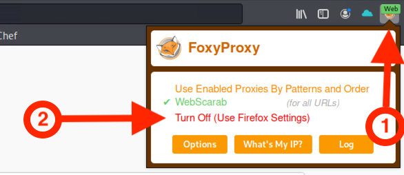

## Activity File: Executing Exploits

In this activity, you will continue in your role as a security analyst at DigiLink Inc.

- Your CISO has asked you to produce several short courses which will be used as learning tools in the company's security awareness program.

- You will use OWASP's Broken Web Apps to demonstrate the various ways a website can be exploited.

- Please note that in the the last activity the Kali machine will be acting as the attacker **and** the victim. 

---

### Instructions 

#### Setup

For the following activities, use Azure to launch the Web Vulnerabilities card and log in using the following credentials:

   - Username: `azadmin`
   - Password: `p4ssw0rd*`

Next power on and log into the following two VMs: 

   - Kali Linux VM
     - Use the credentials: `root:toor`
   - OWASP BWA VM
     - Use the credentials: `root:owaspbwa`

#### Parameter Tampering

1. Launch Kali Linux and owaspbwa (OWASP Broken Web Apps).

2. Our version of Kali comes pre-configured with Foxy Proxy already enabled. We'll discuss Foxy Proxy more in upcoming lectures, but for now, we'll need to disable it before we start our activities.
   
   - In the right hand corner of your Firefox browser, click on the **Web** icon's drop down menu, then click **Turn Off (Use Firefox Settings)**. 
   
 
   
3. In Kali, use a web browser and navigate to the owaspbwa webpage by typing the IP address of owaspbwa into the URL.
   
   - **Hint**: Use `ifconfig` in the OWASP BWA vm.
   
4. Once the owaspbwa webpage loads, select **Webgoat**.
   
    - Username: `guest`
    - Password: `guest`
      
- Do the following:
   - On the left-hand side of the webpage, click **Parameter Tampering**.
   - Click **Exploit Hidden Fields**.
      
5.  Download the [Firefox extension Hack The Form](https://addons.mozilla.org/en-US/firefox/addon/form-hack/). This will install an icon that looks like a dolphin on the Firefox toolbar.
   
6. Reveal the hidden form fields. 
   - What command do we need to use? 
   
7. Change the dollar amount to 0.99.
   
   - Did the sales price change?
   
8. What is one mitigation strategy you can deploy to defend against this type of attack?

   
#### Path or (Directory) Traversal
    
1. Launch Kali Linux and owaspbwa.

2. Acting as the attacker in Kali, use a web browser and navigate to the owaspbwa webpage by typing the IP address of owaspbwa into the URL.
   
3. Once the webpage loads, select **bWapp**.
   
   - Log into bWapp with the following credentials: 
   
      - Username: `bee`
      - Password: `bug`
   
4. In the  **Choose Your Bug** box window, scroll down and select **Directory Traversal - Files**, and press **Hack**.
      
   - You will see a message that says, "Try to climb higher Spidy!"
   
5. Modify the URL by injecting a dot-dot-slash.
      
6. Name one method that you could use to help mitigate this type of threat.

#### Cross-Site Scripting (Stored XSS)

1. Launch Kali Linux and owaspbwa.

##### Setup

2. Acting as the attacker in Kali, open a web browser and navigate to the owaspbwa webpage by typing the IP address of the web page into the URL.

3. Once the webpage loads, select **DVWA** and log in with the following credentials: 
   
   - Username: `admin`
   - Password: `admin`
   
4. Select **Setup** and click on **Create / Reset Database**.
   
      - Select **DVWA Security** and change the setting to **Low**.
   
      - Select **XSS Stored**.
   
5. Perform a test to see if the site is vulnerable to attack.
   
   - In the **Name** field, type `TEST`.
   
   - In the **Message** field, type a JavaScript code that will create a pop-up message when **Sign Guestbook** is clicked.
      
   - Click **Sign Guestbook**, then click **OK** on the box that pops up. 

##### Attack

6. Now that you know the attack is possible, you can move forward with the exploit.

   Acting as the attacker in Kali, steal the **session ID or cookie** of an unsuspecting user who visits the webpage infected with the malicious script.

   - In the **Name** field, type `Hacked!`
   
   - In the **Message** field, type the JavaScript code that will display cookie information when **Sign Guestbook** is clicked.
  
   - Click **Sign Guestbook**, then click **OK** on the box that pops up and says "Hello!"
               
   - Another pop-up window will display cookie information for Kali Linux.
   
      - This proves the hack worked and that the back end database is susceptible to this attack.
      
      - From now on, whenever a guest lands on this webpage and signs the guestbook, their cookie information will be displayed.

7. Using Kali to act on as the victim, navigate to the owaspbwa DVWM webpage and click on **XSS Stored**.

   -  Enter the name `Visitor` and the message `Glad to be here!`

      - Click **Sign Guestbook** and then click **OK** on the box that pops up and says "Hello!"
      
      - Did a new pop-up window display the cookie information of the victim's Kali machine? If so, what is the victim's SESSID? 
   
---

© 2020 Trilogy Education Services, a 2U, Inc. brand. All Rights Reserved.  
