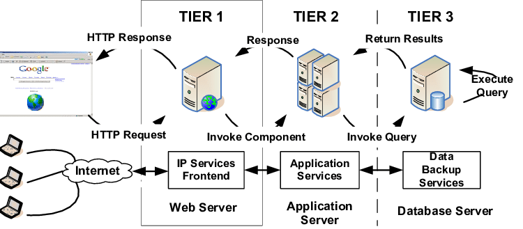

## 15.1 Student Guide: Introduction to Web Vulnerabilities and Hardening
 
### Overview

In today’s class, we will expand our knowledge of web application deployment to include the vulnerabilities that exist within web server architecture. Today’s class provides the foundation for you to build their knowledge of attack-defend methodologies, which they can use to mitigate a wide variety of web vulnerabilities. 

Throughout this unit, we will use examples of malicious attackers to show how various attacks and exploits work and how we can better defend against them. It is important to know that the skills we learn in offensive security units should only be used ethically and with permission. The actions and intents of  hacktivists, criminal hackers, and other malicious actors that we mimic for demonstrations are in no way condoned or encouraged. 


### Class Objectives

By the end of the lesson, you will be able to:

- Understand the attack-defend methodology for web vulnerabilities from a conceptual and practical standpoint.

- Explain how a URL can be manipulated and used to take advantage of web vulnerabilities.

- Identify and differentiate between client- and server-side attacks.

- Use social media, WHOIS, and Wafw00f to gather information that informs attack options. 

- Exploit three prevalent web vulnerabilities: parameter tampering, path traversal, and cross-site scripting.

- Provide mitigation strategies for each kind of attack. 

### Slideshow and Time Tracker

The lesson slides are available on Google Drive here: [15.1 Slides](https://docs.google.com/presentation/d/1ccqWHs75IPmL3ADGN3OQdUCh6SP11HyHFegp4gyHYsA/edit#slide=id.g4789b2c72f_0_6)


### 01. Introduction to Web Vulnerabilities and the OWASP Top 10

This unit will work towards building technical knowledge of web vulnerabilities and hardening in order to protect and defend critical web infrastructure.

In the previous unit, we covered the following:

- Machines involved in a multi-tier web application deployment.
- How these machines are arranged architecturally.
- The tasks and responsibilities that each machine serves in the larger scheme of the application. 

In today’s class, we will expand our knowledge of web application deployment to include the vulnerabilities that exist within the web server architecture. 

We will pair our knowledge of the cyber kill chain with a popular threat information resource known as the OWASP Top 10. Each day of this unit will focus on different stages of the kill chain and apply them to different threats featured in the OWASP Top 10.  

We'll take a moment to look at CyberSeek, a dynamic and intuitive tool designed to help job seekers analyze their career outlook within the information security field.

- According to CyberSeek:

    *"There are many opportunities for workers to start and advance their careers within cybersecurity. This interactive career pathway shows key jobs within cybersecurity, common transition opportunities between them, and detailed information about the salaries, credentials, and skill sets associated with each role."*


- Look over the following: cyberseek.org/pathway.html 

#### Attack-Defend Methodology and the Kill Chain

The lessons in this unit will revolve around the concept of the **cyber kill chain**. Recall that the cyber kill chain defines seven steps that an adversary must complete before being able to act on their objectives.

- The cyber kill chain is an "intelligence-driven defense framework" designed to identify and prevent cyber intrusions.

- This framework enhances visibility into an attack by improving a security analyst’s understanding of an adversary’s tactics, techniques, and procedures. It does this by allowing the observation of an attack as it progresses through each stage of the kill chain.

This week, we will use an attack-defend methodology of the hybrid kill chain, a derivative of Lockheed Martin’s cyber kill chain. 

- The hybrid kill chain has been adapted to apply more directly to web server infrastructure. It includes the following stages:

   - **Reconnaissance**: Information gathering stage against the target.

   - **Weaponization**: Preparation of offensive operations against specific targets using information gathered during reconnaissance. 

   - **Delivery**: Launch of the operation. Attacks carried out based on Red Team offensive strategies. 

   - **Exploitation**: Actively compromises adversary’s apps, servers, or network, and avert physical, logical, or administrative controls.

   - **Exfiltration**: Ultimate goal. The exfiltration of private, sensitive data that the target considers to be critically sensitive.

- As we progress through the unit, we will explore the various aspects of each stage from both a conceptual and practical standpoint. 

As security practitioners, we must be mindful of the concept, “offense informs defense.” We are better able to defend resources if we know how to compromise them. This may seem like a simple concept, but it covers a wide variety of web security methodologies, some of which we will discuss in this unit.

- This concept also explains why, in some scenarios, demos, and activities, we'll act out or observe the actions of hypothetical attackers. This is to become knowledgeable of how to better defend against them. The actions and intents of these types of actors can be illegal in certain cases, and are in no way condoned or encouraged. 

#### Web Vulnerabilities and the Business

As you may remember from the unit on GRC, cybersecurity is often viewed as an obstacle for business operations. This is because enforcing good cybersecurity practices can cause production delays and increase budgets.

- As network defenders, we face tough decisions that can impact an organization's financial stability and reputation.

- Because of this, we may find that as we fight for what we know is best for the organization, we are challenged by upper management. These are the people in the company who are often the most concerned with keeping costs low and maintaining efficiency. 

The results of complacency and relaxed security in order to maximize profit can include: 

- A defaced webpage containing malicious content or links to inappropriate sites, ultimately damaging a company’s reputation.

- A compromised web server used to download malicious software to anyone visiting the webpage.

- Compromised data used to commit fraudulent activities, leading to loss of business or lawsuits.

#### OWASP Top 10

The **OWASP Top 10** is widely considered to represent the most prevalent security risks facing web applications today. 

- The OWASP Top 10 is a platform for standardizing awareness of threats in web application development security. 

- It is vital that companies adopt and apply this framework to their business practices to reduce the risks associated with web applications. This tool can also be a tool for clarifying security priorities to upper management. 

Read over the featured threats: [OWASP Top 10](https://owasp.org/www-project-top-ten/).

- The current OWASP Top 10 includes: 

   1. Injection
   2. Broken Authentication 
   3. Sensitive Data Exposure
   4. XML External Entities (XXE)
   5. Broken Access Controls
   6. Security Misconfigurations
   7. Cross-Site Scripting (XSS)
   8. Insecure Deserialization
   9. Using Components with Known Vulnerabilities 
   10. Insufficient Logging and Monitoring

More about the OWASP Top 10: 

- It was created to educate  software developers, designers, architects, managers, and organizations about the consequences of web application security weaknesses. 

- It is developed through industry surveys completed by over 500 individuals from hundreds of organizations and over 100,000 real-world applications and APIs. 

- Selections are prioritized according to threat level prevalence data, in addition to consensus estimates of exploitability, detectability, and impact.
  
OWASP also developed a Cheat Sheet Series (OCSS) designed by application security professionals to provide a collection of significant information related to specific application security topics.

We’ll start our coverage with the Uniform Resource Locator (URL) and how it can be manipulated to compromise IT web infrastructure.

### 02. Instructor Do: The URL Cruise Missile 

The **Uniform Resource Locator (URL)**, also referred to as the Uniform Resource Identifer (URI), is the standardized naming convention for addressing documents that are accessible over the internet, intranets (closed network within a single organization), and extranets (closed network shared across groups or organizations).

- The URL includes domain names along with many other bits of detailed information. When combined, they create what we know as a web address. 

- The primary function of a web address is to direct a user’s web browser to specific online resources. 

- A web address is essentially a unique set of directions to an online resource.  

The URL is the gateway to the web. But the URL can also be used as a weapon to launch attacks. 

#### The Weaponization of the URL

Security administrators need to fully understand how the URL works in order to know how it can be used as a weapon against IT infrastructure.

- The strength of a weaponized URL depends on the web vulnerability that it exploits. The more vulnerable the web client or server, the more dangerous the attack can be.

   

#### URL Example

While each URL is unique, they all use the same architectural setup. 

- We'll first perform a high level overview of the typical web address as entered in the URL, then take a closer look by breaking it down into its individual components.

The following example is a typical web address that we see in a web browser's URL.

* http://example.com/add.asp?item=3478

Let's divide the URL into its distinct and separate components. 

**Various stages of a URL/URI**

| Protocol         | Host Name                 | Path                   | Parameters               |
| ---------------- | :-----------------------: | ---------------------- | ------------------------ |
| `http://`      | `www.example.com`   | `/add.asp`           | `?item=3478`     |
  
 
1. The **Protocol** indicates the protocol or application to use with the request, such as:
 
      - HTTP Hypertext Transfer Protocol: Used for transferring webpages.
      - FTP File Transfer Protocol: Used for file transfer requests (upload and download).
      - SPDY Speedy: Google’s version of HTTP, designed to speed up web content loading.
   
2. The **Host Name** identifies a specific web server for the request of web resources.
 
   - Domain Name: `example.com`, `google.com`, `facebook.com`, etc.
   - Sub-Domain: Typically used for specific sub-sites within a larger domain. The most common subdomain is `www`, which stands for World Wide Web. Some domains use this as an indication of publicly accessible resources and content.
 
3. The **Path** request indicates which web application will be used to provide resources to the client.

   - `/add.asp`: This is a directory, similar to a file or folder on your computer. This can also be a file or folder on a web server. Paths for many websites, such as retailers, show a long hierarchy of categories. For example:
`/books/non-fiction/computers/tutorials/internet/`.
   
   - `.asp`: (Active Server Page) A technology that enables designers to produce dynamic and interactive webpages. ASP uses server-side scripting to produce dynamic webpages that are not affected by the kind of web browser a visitor is using. 

   Another example includes: 

   - `addresses.html`: The resource name, which can be a file name or a page name.
      - `.html`: A file extension, indicative of the file type. Some other commonly used extensions for websites include .php and .asp.

   

   
4. **Parameters** are specifically formatted data that interact with back-end servers such as email and web databases.
 
   - `?item=3478`: An example of a parameter that is used to encode specific data into the URL, to be used by the server. In this case, it indicates that an item assigned the ID #3478 is being requested by the visitor (the client-side user).
   
   - Each parameter is made up of a few different parts: 
     - The question mark (`?`) indicates the beginning of a list of parameters.
     - Each individual parameter has a name and a value, separated by a hash (`#`). 
     - The name of this parameter is `item#` and the value is `3478`.
     - A URL can have multiple parameters. These will be separated by an ampersand symbol (`&`). For example: `?item# 3478&price=299`

As we’ve just seen, the URL is composed of several different layers designed to access various parts of a website: webpages, emails, or bank account information, for example. 

- Attackers can exploit weak web server infrastructure to manipulate URLs and infiltrate these various parts of the web server architecture.

#### Web Server Infrastructure

In the early days of the internet, webpages were mostly static and had long load times. Since then, the internet has made a drastic shift towards user experience, which includes instant response times. This shift meant that visually appealing web applications, which have longer load times than static pages, also had to be supported. 

- As web infrastructure advances, so do the attacks against it. 

- The URL/URI can be manipulated so that every level of the web architecture is impacted. 

The advancements that have improved user experience for web application users are the same ones that criminal hackers exploit. 

- Therefore, security administrators need to know how to harden such systems. 

We should start with a basic understanding of standard website infrastructure and its sub-components.

- Standard web server infrastructure consists primarily of five stages, as illustrated below.

|         | Stage 1        | Stage 2             | Stage 3                 | Stage 4              | Stage 5          |
|---------| :------------: | :-----------------: | :---------------------: | :------------------: | :--------------: |
|         | **Client**     | **Firewall**        | **Web Server**          | **Web Application**  | **Database**     |
|**Example** | Web Browser    | UFW / Firewalld     | IIS / Apache / Nginx    | Facebook / Google    | MySQL / MongoDB  |


- **Stage 1: Client**: A user who interacts with a web server using HTTP or FTP through either a web browser or file transfer software.

- **Stage 2: Firewall:**  A perimeter defense used to protect the web server sitting behind it.

- **Stage 3: Web Server**: A program such as Apache, Nginx, or IIS that responds to a client's requests for web resources.

- **Stage 4: Web Application:** The software that runs on a remote server, such as Facebook, Twitter, or Amazon.

- **Stage 5: Database**: Typically the innermost part of the web architecture, storing data such as customer names, addresses, account numbers, and credit card info. 

Web security involves some of the following processes:
   
   - **Input sanitation**: The process of cleaning and scrubbing user input to prevent it from exploiting security holes. This is ensured by, when necessary, changing the value input by the user. 
   
   - **Input validation**: The testing of input supplied by a user or application, designed to prevent malformed data from entering a data information system. This is done by verifying user input meets specific criteria.
   
   - **Secure Software Deployment Cycles (SDLC)**: A software development methodology that ensures secure programming at every stage of the software development process.
    
   
Web vulnerabilities exist because SDLC faces the following challenges: 

- Implementation costs are high.
- Lack of support from management.
- Lack of standardization.
- No quality management.
- Reactive security posture ("If it ain’t broke, don’t fix it" mentality).
- Reliance on a false sense of security that web application firewalls provide absolute protection.

#### Popular Web Servers and Associated Web Vulnerabilities

**Internet Information Server (IIS)** is a general-purpose web server from Microsoft that runs on Windows systems and serves HTML pages and files to web clients.

IIS has a long list of well-known published vulnerabilities. Note the Common Vulnerabilities and Exposure ID as well. 

- **Cross-site scripting (XSS)**: Allows remote attackers to alter a URL with a malicious script that will redirect a message or request.

   - National Vulnerability Database Reference: [CVE-2003-0223](https://nvd.nist.gov/vuln/detail/CVE-2003-0223)

- **Directory traversal**: Allows remote attackers to view source code and determine the existence of arbitrary files via a hex-encoded `%c0%ae%c0%ae` string, which is the Unicode representation for ".." (dot dot).

   - National Vulnerability Database Reference: [CVE-2002-1744](https://nvd.nist.gov/vuln/detail/CVE-2002-1744)

- **Denial of service**: Buffer overflow of the data transfer mechanism in the IIS allows remote attackers to cause a denial of service or execute code.

   - National Vulnerability Database Reference: [CVE-2002-0147](https://nvd.nist.gov/vuln/detail/CVE-2002-0147)


**Apache** is an open-source web server alternative that runs on Unix, Linux, and Windows.

While IIS is well known for its vulnerabilities, Apache also has vulnerabilities. Three of the most critical vulnerabilities include:

- **OpenMeetings SQL Injection Vulnerability**: Allows for modification of the structure of existing queries, resulting in the exfiltration of queries made by the back-end application.

   - National Vulnerability Database Reference: [CVE-2017-7681](https://nvd.nist.gov/vuln/detail/CVE-2017-7681/)
   
- **Apache Ranger Security Bypass Vulnerability**: Any characters after a wildcard symbol `*` are ignored, resulting in unintended behavior. 

   - National Vulnerability Database Reference: [CVE-2017-7676](https://nvd.nist.gov/vuln/detail/CVE-2017-7676/)
   
- **Apache HTTP Server Authentication Bypass Vulnerability**: Use of the string `ap_get_basic_auth_pw()` by third-party modules to bypass authentication requirements.

    - National Vulnerability Database Reference:[CVE-2017-3167](https://nvd.nist.gov/vuln/detail/CVE-2017-3167/)

**Nginx** is an open-source, less popular, alternative to Apache that runs on Linux. Web vulnerabilities are less prevalent than on IIS or Apache.
          
- **Nginx SPDY Heap Buffer Overflow**: Allows remote attackers to craft requests that execute arbitrary code.
         
   - National Vulnerability Database Reference:[CVE-2014-0133](https://nvd.nist.gov/vuln/detail/CVE-2014-0133/)

- **Nginx Root Privilege Escalation Vulnerability**: Allows local users to gain root privileges.
   
   - National Vulnerability Database Reference: [CVE-2016-1247](https://nvd.nist.gov/vuln/detail/CVE-2016-1247/)

- **Remote Integer Overflow Vulnerability**: Sensitive data can be leaked with crafted requests that exploit a range filter module in certain Nginx versions. 

   - National Vulnerability Database Reference: [CVE-2017-7529](https://nvd.nist.gov/vuln/detail/CVE-2017-7529/)


We'll explore many of these web vulnerabilities in upcoming activities by attacking the web application **(offense)**, then exploring mitigation and system hardening strategies **(defense)**. This supports the offense informs defense model. 

### 03. The URL Cruise Missile Activity 

- [Activity File: URL Cruise Missile](Activities/03_URL_Cruise_Missile/Unsolved/README.md)

### 04. Review The URL Cruise Missile Activity 

- [Solution Guide: URL Cruise Missile](Activities/03_URL_Cruise_Missile/Solved/README.md)


### 05. Client- and  Server-Side Attacks 

In today’s globally connected cyber community, network- and OS-level attacks are well defended through the proper deployment of technical security controls like firewalls, IDS, data loss prevention, and endpoint security. However, web servers are accessible from anywhere on the web, making them vulnerable to attack.



Let's review the HTTP request and response cycle in order to understand how web server infrastructure handles user requests and the associated vulnerabilities. 

**Step 1: Client**: A user generates an HTTP request from their web browser using a URL or web address, such as http://example.com/add.asp?ItemID=123&Price=999.

**Step 2: Web Server**: The user’s HTTP request arrives at the front-end web server as directed by the domain and processes the following portion the URL.

- `http://example.com`

**Step 3: Web Application**: The user’s HTTP request invokes the application service from the application server as directed by the path.

- `/add.asp`

**Step 4: Database Server**: The user’s HTTP request invokes the database server and performs a query in search of a specific item number and its price.

- `?ItemID=123&Price=999`

   This portion of the URL is vulnerable to manipulation by an attacker, as we'll see later.

- For example, an attacker can exploit a web server database vulnerability and modify the `ItemID=` and `Price=` to change the price of the selected item to any value they want.

**Server-side attacks** seek to compromise and breach applications and data on a server. **Client-side attacks** target software installed on the desktop, such as web browsers, email clients, media players, and office suites.

#### Client-Side Attacks

Client web browsers are how users access the world. As such, they represent an attractive and easy target for criminal hackers. 

- A client-side attack occurs when a user’s computer downloads malicious content from the web. 

Client-side attacks are often difficult to mitigate for companies that allow internet access. 

- This difficulty is only aggravated by the number of client-side applications that the typical organization uses in its daily operations, some of which include:

   -	Word processing software
   -	Spreadsheet software
   -	Media players
   -	Web browsers
   -	Email clients
   -	File transfer clients

The typical firewall has far more restrictive inbound policies than outbound ones. Firewalls are designed to keep bad actors out while helping mitigate server-side attacks that originate from untrusted networks. 

 - Quite often, firewalls fail to prevent client-side attacks which occur behind the firewall and from within the local network. 

#### Prevalent Client-Side Attacks

- **Cross-site scripting (XSS)**: Allows attackers to inject malicious code into a website in order to intercept user sessions, vandalize websites, steal data, and control a user's browser.

- **Clickjacking**: Tricks users into clicking misleading graphics that trigger an exploit. For example: A button that reads "Download" in large text.

- **Content spoofing**: Tricks a user into believing that a website is legitimate. For example, a fake login page that steals your credentials after you submit them. 

- **Drive-by download**: Triggers downloads without the user's knowledge when a webpage is visited.

- **Phishing**: A form of social engineering that manipulates a user into providing personal confidential information, such as user credentials and bank account information. 

#### Server-Side Attacks

Web servers that host a website can be either hardware or software.

- Attackers typically target software vulnerabilities and configuration errors to compromise a web server.

- Some software vulnerability examples include:

    - Default accounts that contain easily acquired default usernames and passwords.
    - Misconfigurations within a web server, web app, network, or operating system.
    - Bugs in a web server from unpatched systems.
    - Unnecessary services such as remote administration and content management that lead to a larger attack service.
    - Default settings on installed web servers and apps remain unchanged. 
    - Security conflicts with business cases and lack of budget.
    - Improper permissions that allow overly lenient access to directory and file permissions.

#### Prevalent Server-Side Attacks

- **Website defacement**: An attack against a website that alters the appearance and information contained on a website or webpage. 

   - Attackers will vandalize websites with provocative, offensive, and propagandist information and imagery.
   - Attackers may exploit web vulnerabilities such as SQL injection (SQLi) to gain access to and deface a website.

- **HTTP response splitting (CRLF injection attack)**: Server does not properly sanitize input values, such as character returns (CRs) and line feeds (LFs), allowing for attacks such as cross-site scripting. 

- **Web cache poisoning**: Involves replacing legitimate cached webpages with malicious content.

- **Parameter or URL tampering**: Manipulates parameters in a URL passed to a web server.

- **Path or directory traversal (dot-dot-slash attack)**: Used to navigate into files and directories by using dot-dot-slash (`../`) as if navigating through directories in a terminal, with the aim of reaching folders outside of the root directory. 


**Mitigation Strategies**
   
- **Input sanitation** is the process by which the web application (preferably server-side) actively modifies user input to an acceptable format or blocks the user's request.

- **Input validation** is the process that checks if a user's input is in an acceptable format.


#### Web Server Attack Methodologies

Criminal hackers use the following tactics, techniques, and procedures to target web servers: 

- Web server footprinting, an information gathering technique to gather details on user accounts, operating system, server names, software versions, and database schema details. 

- Website mirroring/directory duplication.

- Information gathering:
   - Adversary collects information specific to a targeted organization.
   - Attackers search news groups, bulletin boards, and the internet for information.
   - Adversaries use information gathering tools such as WHOIS.

- Vulnerability scanning.
- Session hijacking.
- Password brute forcing.


### 06. Client- vs. Server-Side Attacks 

- [Activity File: Client- vs. Server-Side Attacks](Activities/06_Client_Server_Attacks/Unsolved/README.md)

### 07.  Review Client vs. Server Side Attacks Activity 

- [Solution Guide: Client- vs. Server-Side Attacks](Activities/06_Client_Server_Attacks/Solved/README.md)


### 08. Instructor Do: Reconnaissance and Information Gathering 

Reconnaissance is the information gathering phase of an attack against an adversary.

-  As a network defender, your first task is to identify sources that an attacker could use to gather information against your company and its employees.

We will continue our exploration of web vulnerabilities by examining the danger that social media poses to critical web infrastructure. Social media has become a major source of information harvesting used by criminal hackers.

- There are several social media platforms that an attacker can use to acquire private, sensitive information in preparation for attacks on an organization.


#### The Dangers of Social Media

Social media has proven a profitable and effective way to build communities and engage customers.

But businesses using social media be able to identify the risks associated with it, and mitigate, manage, and monitor social media as part of a comprehensive social media governance plan.

In order to securely operate social media accounts, businesses should train employees who handle those accounts to ensure they do not do the following:

   - Engage with suspicious posts.
   - Share passwords.
   - Click on ads.
   - Use social media on public WiFi systems.
   - Use the same password for extended periods of time. 
   - Follow accounts and people they do not know or haven’t vetted.

#### The Impact of Social Media Platforms

As we can see from the chart below, Facebook is the most popular online social media platform used today. It can be thought of as an information wholesaler, making it incredibly desireable to attackers.

- Though LinkedIn isn’t listed on this chart, it is still often used by information scrapers to find links to someone's other social media accounts. 

   - The attack surface is amplified for attackers who cross-reference information gathered from LinkedIn and Facebook, allowing them to carry out various social engineering attacks. Attackers can use cross-references between LinkedIn and Facebook to make the connection between someone's professional profile and their personal life. 


The following is a brief list of online sources where freely available information can be found, along with the types of information:

   - **LinkedIn**
      - Type of hardware and software a company uses
      - First and last names of employees
      - Employee position information
      - Length of employment
      - Prior work history
      - Education
      - Skills and endorsements
      - Previous projects

   - **Facebook**
      - Names of friends and family
      - Favorite hobbies
      - Vacation spots
      - Favorite books and movies
      - Favorite foods, drinks, and restaurants
      
   - **Twitter**
      - Political and religious views
      - Personal views

This information can be leveraged for phishing attacks, identity theft, and solicitation. 

#### `robots.txt`

In addition to social media, web servers also provide information that criminal hackers can use to their advantage. 

Web crawlers, also know as spiders and spiderbots, are tools used to index websites, in order to, for example, help search engines find content. 

- Since some files and data contain private and sensitive information, certain pages need to be left out of web searches. 

The `robots.txt` file contains sensitive web server information, such as a list of files and web server directories, that website owners want to hide from web crawlers. 

- Excluding directories and pages indicates that they contain critical sensitive data, making them attractive targets to a criminal hacker.

- Experienced criminal hackers will attempt to harvest the `robots.txt` file using the URL to retrieve private data, such as content management system information and root directory structure.

The `/robots.txt` file is set by website owners and administrators to provide instructions to web crawlers about which pages on their site are and are not accessible.
- These instructions are called **The Robots Exclusion Protocol**.

An example how web robots work:

1. A bot wants to visit the following URL: http://www.example.com/welcome.html
2. Prior to visiting the URL, it first checks  http://www.example.com/robots.txt. It might receive any of the following responses:

   - The following excludes all bots (indicated by the `*` wildcard symbol) from the entire server as indicated by disallowing access to the `/` root directory:
   
      ```
      User-agent: *
      Disallow: /
      ```
   
   - The following excludes all robots from specific directories of the server:
   
      ```
      User-agent: *
      Disallow: /cgi-bin/
      Disallow: /tmp/
      Disallow: /user/
      ```
   - The following excludes only a single bot, `BadBot`, from the entire server:
   
      ```
      User-agent: BadBot
      Disallow: /
      ```

There are two important security implications that organizations must consider when using ` /robots.txt` files:

- Bots have the option to ignore your `/robots.txt` file, especially malware robots, which scan the web searching for security vulnerabilities.

- The `/robots.txt` is available to the public. Be aware that files that have been disallowed may be seen as opportunities to find important, sensitive data. Otherwise the website owner would not have taken the time to disallow them.


#### WHOIS

Another effective reconnaissance tool is the WHOIS protocol. 

-  WHOIS is a query and response protocol used for querying the WHOIS database. 

- As you may recall from the networking units, a WHOIS database stores registered user information including IP address blocks, domain names, email and street addresses, and phone numbers. 

#### WHOIS Demo Setup

We'll demonstrate how to use the `whois` command with the following scenario:

- A hacktivist is trying to infiltrate the network of the local newspaper, *The Sacramento Bee*, with the goal in order to deface their homepage. 

- They're upset about a recently published op-ed article in favor of a view that you oppose.  

- They've decided to produce a social engineering spear phishing email to collect personal data from the newspaper's website registrant by falsely stating that their domain name is going to be taken offline due to non-payment. With this acquired information, they'll be gain privileges that allow them to deface the website.  

- We will use a WHOIS registration database query to find registered user information such as emails and phone numbers.

Remember: *Offense informs defense*. We're using these examples of malicious attackers to show how these hackers work and how we can better defend against them. The actions and intents of actors are in no way condoned or encouraged.

#### WHOIS Demo

For this demo, launch an instance of Kali Linux using your VM environment and follow these steps: 

1. Launch the terminal in Kali.
    
   - Run `whois sacbee.com`
      
      - `whois`: The command used to query the WHOIS database.
      - `sacbee.com`: The domain of the news organization that will be queried.
   
   - The output should look similar to below:
      
      ```
      Domain Name: SACBEE.COM
      Registry Domain ID: 740938_DOMAIN_COM-VRSN
      Registrar WHOIS Server: whois.networksolutions.com
      Registrar URL: http://networksolutions.com
      Updated Date: 2019-03-28T08:41:11Z
      Creation Date: 1995-04-11T04:00:00Z
      Registrar Registration Expiration Date: 2020-04-12T04:00:00Z
      Registrar: Network Solutions, LLC
      Registrar IANA ID: 2
      Reseller: 
      Domain Status: clientTransferProhibited https://icann.org/epp#clientTransferProhibited
      Registry Registrant ID: 
      Registrant Name: McClatchy Management Services, INC
      Registrant Organization: McClatchy Management Services, INC
      Registrant Street: 2100 Q street
      Registrant City: Sacramento
      Registrant State/Province: CA
      Registrant Postal Code: 95816
      Registrant Country: US
      Registrant Phone: 3057408484
      Registrant Phone Ext: 
      Registrant Fax: 
      Registrant Fax Ext: 
      Registrant Email: 
      Registry Admin ID: 
      Admin Name: McFarlin, Bob
      Admin Organization: 
      Admin Street: McClatchy
      Admin City: Miami
      Admin State/Province: FL
      Admin Postal Code: 33172
      Admin Country: US
      Admin Phone: 3057408484
      Admin Phone Ext: 
      Admin Fax: 3057404284
      Admin Fax Ext: 
      Admin Email: 
      Registry Tech ID: 
      Tech Name: McClatchy Interactive
      Tech Organization: McClatchy Interactive
      Tech Street: 3511 NW 91st Ave
      Tech City: Miami
      Tech State/Province: FL
      Tech Postal Code: 33172
      Tech Country: US
      Tech Phone: +1.9198611200
      Tech Phone Ext: 
      Tech Fax: 
      Tech Fax Ext: 
      Tech Email: 
      Name Server: NS1.KR123.COM
      Name Server: NS2.KR123.COM
      Name Server: NS3.KR123.COM
      Name Server: NS4.KR123.COM
      DNSSEC: signedDelegation
      Registrar Abuse Contact Email: 
      Registrar Abuse Contact Phone: +1.8003337680
      Registrar Abuse Contact Phone: +1.8003337680
      DNSSEC: 63450 13 2 6371344178D5EBB6D57207B32E4DA690F02EC05182F497D3EC3F1B9E459481DA
      Registrar Abuse Contact Email: 
      URL of the ICANN WHOIS Data Problem Reporting System: http://wdprs.internic.net/

      https: //www.icann.org/resources/pages/epp-status-codes-2014-06-16-en.
      ```

2. We are given a lot of information, and we can begin to formulate our spear phishing emails using the domain registrant's name, email, phone number, and street address.

   - All a criminal hacker needs to do now is craft an overwhelmingly convincing email that establishes trust and creates a sense of urgency. This will encourage the victim to provide payment information, such as credit card details.

WHOIS registration services allow for both individuals and organizations to use **proxy** information instead of personal or company information.

- In many cases, obfuscation of private data is a best practice for security. It takes away power from criminal actors, which ultimately results in hardened web infrastructure.

- As an alternative to using Kali Linux, [DomainTools](http://whois.domaintools.com/) is a great online WHOIS lookup resource.

  
#### Web Application Firewall (WAF)

**Web application firewalls (WAFs)** are designed to defend against different types of HTTP attacks and various query types such as SQLi and XSS.

- Since web application firewalls operate at application Layer 7 of the OSI model, they can detect SQLi and XSS, which also occur at the application layer.

- Note that other firewalls that operate within the lower layers of the OSI model, such as, stateful, stateless, packet filter, and gateway firewalls, do not have the capability to detect application layer attacks.

   

WAFs are typically present on websites that use strict transport security mechanisms, such as online banking or ecommerce sites.

- WAFs can provide attackers crucial information regarding the security posture of an organization’s web infrastructure. 
   
- With this information, criminal hackers can formulate methods needed to perform additional reconnaissance or initiate attacks.
   
#### Web Application Firewall Deployment

WAFs have three deployment strategies, each with advantages and disadvantages.

- **Network-Based WAF**

   - Typically low-latency hardware that is installed locally on-premises with a dedicated appliance.
   - Capable of large-scale deployment and configuration management.
   - Drawback is high-cost. These have initial expenses to set up, and ongoing operational costs.
   
- **Host-Based WAF**

   - Software-based and dependent on local server resources.
   - More difficult to manage and require more staff resources.
   - Lower cost.
   
- **Cloud-Based WAF**

   - Low cost, subscription based, turnkey product that requires minimal resources.
   - Protects applications across a variety of hosting locations that protect against application layer attacks.
   - Cloud service providers use the most current threat intelligence to help identify and block new application security threats.

WAFs analyze and filter traffic based on three different techniques:

 - **Allow lists** only accepts traffic from sources that are known and trusted.
    - Less resource-intensive than deny lists.
    - May block benign traffic unintentionally.
    
 - **Deny lists** uses preset signatures to block malicious web traffic.
    - Useful for public websites and web applications that receive lots of traffic from unknown IP addresses.
    - Resource-intensive due to packet filtering based on a set of specific characteristics as opposed to IP addresses. 
    
 - **Hybrid** uses a combination of both allow and deny lists.
 
 **Note**:  Allow and deny listing may also be reffered to as whitelisting and blacklisting, respectively. 

#### Wafw00f

Wafw00f (abbreviated as WAF) is an open-source command line web application firewall detection utility. It focuses on web-based attacks that occur at the application layer. 

- It is written in Python and automates a carefully crafted set of procedures to determine if a website sits behind a web application firewall.

- Although WAFs are used to harden web server infrastructure, they do come with inherent vulnerabilities of their own.


#### Wafw00f Demo Setup

We'll demonstrate how to use the `wafw00f` command with the following scenario:

- A criminal hacker is looking to exploit any web vulnerability on a website.

- Before they can launch an attack, you need to know if the website is protected by a web application firewall and if so, what kind.

- The results of this information gathering process will indicate the types of attacks that are available to you.


#### Wafw00f Demo

For this demo, launch an instance of Kali Linux using your VM environment and run the following commands:

- First we'll perform a basic fingerprint as part of our information gathering process. In the terminal, run the following:
    
   - `wafw00f www.example.com`
      
      - `wafw00f`: The command used to scan the target for the presence of a firewall.
      - `www.example.com`: The targeted domain that will be queried for the presence of a firewall.
   
- We just performed a basic fingerprint using the `wafw00f` command. Wafw00f provides additional fingerprinting options as well:

   - Aggressive scans. These are useful for detecting multiple firewalls, but are also "noisy," meaning they might alert the target that a scan is in progress. The syntax is: 
      - `wafw00f –a www.example.com`

         - `-a`: Option for aggressive scan
   
      - In order to successfully complete this scan, an attacker may divert the victim’s defensive resources away from the `wafw00f` scan by performing a DDoS attack.

   - Verbose scans. `wafw00f` can be run with verbosity using the `-v` option to reveal additional information. The syntax is:
       
      - `wafw00f www.example.com –a –v`
      
          - `v`: Verbose option, echoes the query responses to the standard output (monitor).
         - `-vv`: Used to increase the verbosity of the scan’s output.

      - The scan results vary depending on how well a WAF deployment is provisioned.

Pause to ask if there are any questions before proceeding.

### 09.  Information Supermarket Activity

- [Activity File: Information Supermarket](Activities/10_Information_Supermarket/Unsolved/README.md)


### 10. Review Information Supermarket Activity 


- [Solution Guide: Information Supermarket](Activities/10_Information_Supermarket/Solved/README.md)


### 11.  Executing Exploits 

In the previous section, we learned about the first stage of the hybrid kill chain:  reconnaissance. This is how criminal adversaries collect critical information required to carry out their offensive operations.

Now we will pivot from reconnaissance to the execution stage of the hybrid kill chain by performing three specific attacks that are prevalent in today's cyber community:

- Parameter tampering
- Directory traversal
- Cross-site scripting

#### Parameter Tampering

**Parameter tampering** is a web-based attack in which specific URL parameters or webpage form field data is modified from its original state.

- Attackers use parameter tampering to take advantage of web vulnerabilities resulting from insecure web programming. This attack is used to obtain private personal or business information.

#### Parameter Tampering Demo Setup

Now, we'll demonstrate how to execute a parameter tampering attack with the following scenario:

- A shopper visited a webpage of a major online retailer looking to buy a new laptop.

- They found the perfect laptop but cannot afford the price: $1,999.00.

- They've decided to take advantage of a potential web vulnerability and change the sale price of the laptop by altering a form field on the webpage.

#### Parameter Tampering Demo

For this demo, launch an instance of Kali Linux and OWASP Broken Web Apps (owaspbwa) using your VM environment and run the following commands:

1. First, set up a test environment by performing the following steps:

   - Launch Kali Linux and owaspbwa.
   
   - In Kali, use a web browser and navigate to the owaspbwa webpage by typing the IP address of owaspbwa into the URL:

      - For example: http://172.16.203.141/

      - **Tip:** use `ifconfig` from the owaspbwa machine or find its IP in the welcome message in the terminal.
   
   
   - Once the owaspbwa webpage loads, select Webgoat.
   
      - Username: `guest`
      - Password: `guest`
      
      On the webpage, do the following:
      - On the left-hand side, click **Parameter Tampering**.
      - Click **Exploit Hidden Fields**.
   
   - At the top right of the browser, click **Hack this Form** (the fox looking left icon).
   
      - You will notice an additional text box on the page called **Price**. 
   
   - In the Price box, change the dollar amount to .99 and press **Enter**.
   
      - Did the sales price change?
   
      - The system should respond with **Your total price is :$0.99**.
   

**Web Server Hardening**

Consider the following mitigation strategies. 

- While less common today than in the past, this type of web vulnerability is the result of a lack of input validation.

   - Input validation is the process of testing the supplied input of a user or program to detect and prevent improperly formatted data from entering an information system.
   
   - Alternative mitigation strategies include:
   
      - Whitelisting: Only passes expected data.
      - Blacklisting: Blocks all unexpected data, but is highly susceptible to mistakes and is inefficient.
      
   - Additional mitigation strategies include:

      - Restricted numeric range
      - Restricted character sequence and patterns
      - Restricted use of `Null`.
      - Restricted parameter use of unused form fields.

   
#### Path or Directory Traversal
 
Path traversal is an attack that exploits web vulnerabilities by referencing files with a dot-dot-slash (`../`) sequence within the URL.
 
- A vulnerable web server might allow an attacker to access arbitrary files and directories stored on a web server, resulting in the loss of application source code, system configuration information, and/or critical system files.

#### Path Traversal Demo Setup

Now we'll demonstrate how to execute a path traversal attack with the following scenario:

- A hacktivist who’s politically motivated to shame an organization with opposing views. 

- They've decided to hack into the opposition group's email server with and make private emails public. To carry out this mission, you must first harvest a list of all users.

- They will attempt to exploit a possible web vulnerability using path traversal.

#### Path Traversal Demo

For this demo, launch an instance of Kali Linux and owaspbwa using your VM environment and do the following:

1. Set up the test environment:
 
   - Launch Kali Linux and owaspbwa.
      
   - In Kali, use a web browser and navigate to the owaspbwa webpage by typing the IP address of owaspbwa into the URL:
      
      - `http://172.16.203.141/` for example.

      - **Tip:** Use `ifconfig` from the owaspbwa machine, or find the IP in the welcome message in its terminal.
   
   
- Once the owaspbwa webpage loads, select bWapp.
   
   - Log into bWapp with the following credentials: 
   
      - Username: `bee`
      - Password:`bug`
   
- In the  **Choose Your Bug** box window, scroll down and select **Directory Traversal - Files**, then press **Hack**.
      
- You will see a message that says "Try to climb higher Spidy!"
   
- Modify the URL as follows: 
      
   - Replace the `message.txt` with the following dot-dot-slash sequence after the `page=` portion of the URL:
     - `../../../../../../../../etc/passwd`

   You will see the contents of the `/etc/passwd` file.


**Web Server Hardening**

Mitigation strategies include:

   - Input validation: The primary defense mechanism. The same rules apply as discussed in the parameter tampering exercise.
   
   - Ensure that all files and folders on the local server have proper access controls in place through system hardening.
   
   - Web developers should avoid storing private sensitive information in the web root directory.

    
#### Cross-Site Scripting (Stored XSS)

Cross-site scripting (XSS) attacks occurs when an attacker takes advantage of a web vulnerability by injecting malicious code into a web browser. The code is stored on the back-end server, typically in the form of a script, and targets subsequent visitors to that webpage. 

- An end user’s browser can't detect such attacks because of the default trust relationship it has with the source. 

   - As a result, the affected user’s web browser allows the malicious script free access to session tokens, cookies, and any other sensitive information stored by the browser.

#### Cross-Site Scripting Demo Setup

Now, we'll demonstrate how to execute an XSS attack with the following scenario:

- A criminal hacker wants to gain root access to a web server.

- Before they can do that, they need to steal a session cookie.

- They will perform a cross-site scripting attack to steal the cookie. First, they need to determine if the attack is possible.

#### Cross-Site Scripting Demo

 For this demo, use the following VM setup as your test environment:

   - Kali Linux: Which will act as both the attacker and the victim. 
   
   - Vulnerable Web Server: owaspbwa > DVWA > XSS Stored
   

**Part One: Setup**

Launch Kali Linux and owaspbwa.

-  As the attacker in Kali, use the Firefox web browser and navigate to the owaspbwa webpage by typing the IP Address of owaspbwa into the URL:

   - For example: http://172.16.203.141/

   - **Tip:** use `ifconfig` from the owaspbwa machine or find its IP in the welcome message in the terminal.

- Once the owaspbwa webpage loads, select DVWA and log in with the following credentials: 
   
   - Username: `admin`
   - Password: `admin`
   
- Select **Setup** and click **Create / Reset Database**.
   
- Select **DVWA Security** and change the setting to **Low**.
   
- Select **XSS Stored**.
   
 Next, perform a test to see if the site is vulnerable to attack.
   
- In the **Name** field, type `TEST`.

- In the **Message** field, type the following JavaScript:

   - `<script>alert("Hello!");</script>`
   
- Click **Sign Guestbook** then click **OK** on the box that pops up. 
   
   - The box indicates that this particular website is vulnerable to attack.

**Part Two: Attack**

Now that we've determined that the attack is possible, we can move forward with the exploit.

Acting as the attacker in Kali, attempt to steal the session ID or cookie of an unsuspecting user who visits the webpage infected with the malicious script.

- In the **Name** field, type `Hacked!`

- In the **Message** field, type the following JavaScript:

   - `<script>alert(document.cookie);</script>`
   
   
   
   - Click **Sign Guestbook** then click **OK** on the box that pops up and says "Hello!"
   
      - The box indicates that this particular website is vulnerable to attack.
      
- Another pop-up window will display cookie information for Kali Linux.


   - This proves the hack worked and the back-end database is susceptible to this attack.
   
   - From now on, whenever a guest lands on this webpage and signs the guestbook, their cookie information will be displayed.

Acting as the victim, use Kali to navigate to the owaspbwa DVWA webpage and click on (XSS Stored).

-  Enter the name `Visitor`, and the message `Glad to be here!`

   - Click **Sign Guestbook** then click **OK** on the box that pops up and says "Hello!"
   
   - A new pop-up window displays the cookie information to your machine
   
   
   
It's important to note that in this exercise, we simply echoed the victim's cookie information back to their screen.

- Under normal circumstances, an experienced attacker will avoid this. Instead of echoing the cookie information back to the user's screen, they will send it through a reverse shell back to their computer.

- With this stolen cookie, an attacker can now assume the identity of the victim by hijacking their current session. This could allow access to sensitive information, for instance if the user is visiting a banking website or medical records website.
   
**Web Server Hardening**

Mitigation strategies include:

   - Data Output Encoding: Encodes user-controlled data before it is output in an HTTP response. This prevents it from being misinterpreted as active content.

   - Data Input Filters: Filters data at the point where user input is received, based on expected or valid input criteria.

   - Content Security Policy (CSP): Detects and mitigates specific types of attacks including XSS and various other injection attacks. (Not all browsers support CSP.)


### 12. Executing Exploits 

- [Activity File: Executing Exploits](Activities/13_Executing_Exploits/Unsolved/README.md)


### 13.  Review Executing Exploits Activity 

- [Solution Guide: Executing Exploits](Activities/13_Executing_Exploits/Solved/README.md)


### 15.  Wrap-Up

In today’s globally connected cyber community, network- and OS-level attacks are defended using proper deployment of technical security controls. These include firewalls, IDS, data loss prevention, and endpoint security. 

However, web servers are accessible from anywhere on the web, making them a vulnerable and popular attack surface.

- As security practitioners, we must be mindful of the concept “offense informs defense.” Understanding how to carry out attacks will introduce us to a wide variety of web security methodologies, some of which we covered today, and others that we will cover throughout the unit.

- Today’s lesson provided the foundation upon which you can build your knowledge of attack-defend methodologies designed to help mitigate a wide variety of web vulnerabilities.

In the next class, we'll continue to explore the large field of web vulnerabilities by focusing on other exploits featured in the OWASP Top 10. 
___

© 2020 Trilogy Education Services, a 2U, Inc. brand. All Rights Reserved.  
