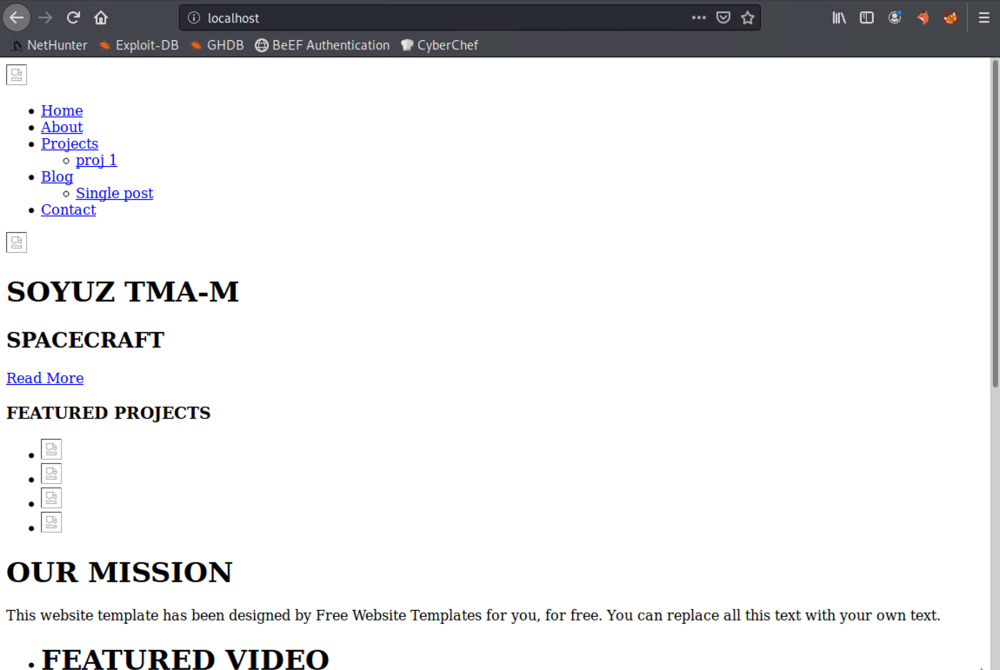

## Activity File: BEeF

- In this activity, you will play the role of a security analyst tasked with detecting vulnerabilities on your organization's network.

- Your organization only uses Firefox browsers.

- At the end of your test, you will have to include three mitigation strategies along with your results.

### Instructions

This activity use the Kali VM as both the attacker and the victim. 

1. Acting as the attacker,  open a terminal window in Kali and run `sudo beef-xss`.
- Make sure to copy the `>` line from the beef-xss startup. 
   
     This window contains the malicious JavaScript that you will use to hook victim's browser.

     - What is the script?
            
2. Return to your terminal window, start the Apache web server.
      

3. Open the `/var/www/html/index.html` file and paste the malicious JavaScript. 
   
     
4. Open a web browser and click the **BeEF Authentication** shortcut in the shortcut toolbar. Sign in with:
      
      - Username: `beef`
      - Password: `cybersecurity`

   
5. Acting as the victim open Firefox browser on your Kali machine and navigate to `localhost` using the URL. 
  - If you have done this correctly you should see the landing page for the Apache2 template. 
  

      
After the page loads, return to the BeEF framework.
   
6. Acting as the attacker, click on **Commands** and perform at least three successful exploits of your choosing.
   
      - Document your findings and be prepared to share with the class.   
            
7. What mitigation strategies would you suggest to the client to defend against client-side attacks?

 
#### Bonus

Perform an attack that displays the message "You've been hacked!" when the victim revisits the malicious webpage.

---
© 2020 Trilogy Education Services, a 2U, Inc. brand. All Rights Reserved.  
