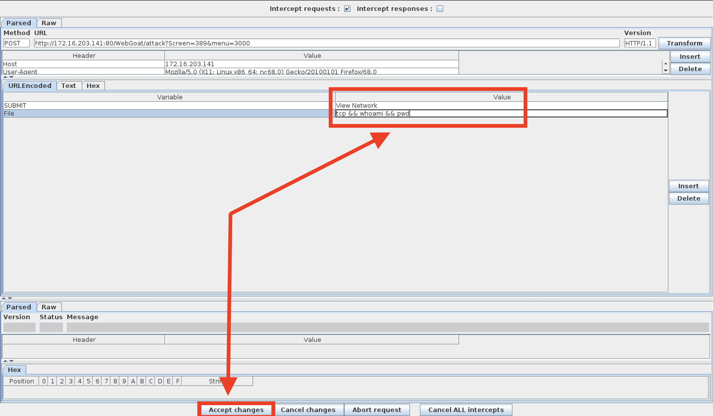

## Solution Guide: The Challenge

### Challenge #1

Your first mission is to break the authentication scheme. There are a number of ways to accomplish this task.

- Method 1

   - Go to `http://172.16.203.141/WebGoat/source?source=true`

   -  Notice that we added the `source?source=true`, which reveals the underlying JavaScript code for this webpage.

      - The username and password appear in this code starting on line 121.

      - Username: `youretheweakestlink` 
      - Password: `goodbye`

- Method 2

   - At the top of the browser, click on **Hack the Form** (the dolphin icon).

   - You will notice a previously hidden box revealed at the bottom of the screen that contains the username `youretheweakestlink`.

   - Use this username to brute-force the password field with a password cracker such as John the Ripper or Hydra. 

### Challenge #2

Steal all of the credit card numbers from the database. 

- After completing the first challenge, you will be provided with an option to continue to the next challenge.

- Start Tamper Data and click the **Buy now!** button to intercept the request.

- Click **OK** in the Tamper Data Request box.

- In the next Tamper Data window, scroll down to the Authorization box and copy the user value from the cookie section (everything between the double quotes).

- Decode the user value using CyberChef's base64 decoder.

   - The decoded value will be `youretheweakestlink`.

- Next, we'll perform an injection attack using the original decoded user value.

- Encode the following: `youretheweakestlink' OR '1'='1` using CyberChef's base64 encoder.

- Go back to Tamper Data and paste the newly injected encoded value into the user cookie value field (between the double quotes).

- Forward the request in Tamper Data to the server.

- Go back to the page and click the dropdown menu. You will notice that all credit card numbers are now revealed.

### Challenge #3

Your final act is to deface the website.

- After completing the second challenge, you will be provided with an option to continue to the next challenge.

   

- There should be two webpages at the bottom of the window. The one on top is the original, and the one on the bottom is the defaced webpage.

    

- Start Foxy Proxy (Scab) to send all GET/POST requests from Firefox to the WebScarab proxy intercept.

   

- Click **TCP** and then the **View Network** button and send the request to WebScarab.

   

- The WebScarab window will open. 

   - In the **URL Encoded** tab, find the **File** and **Value** form fields. 
   - This is where you will perform your command injection.
   
    

- Next, perform a test and see if this shell is vulnerable to command injection. 

   - Type the following command into the Value field: `tcp && whoami && pwd`.
   
       - **Note:** Windows users can type `tcp && dir`. `dir` will return the directory as proof of vulnerability.
   
   - Click **Accept Changes**.
   
     
   
   - On the next window, click **Accept Changes** twice.
   
     
 
- Scroll to the bottom of the **Current Network Status** window and observe the results for both of the `whoami` and `pwd` commands.

    

   - The results show that we are the root user and our current working directory is `/var/lib/tomcat6`.

   - This verifies the vulnerability, so proceed to the next step.

- Next, we'll locate the `webgoat_challenge_guest.jsp` file. 

   - Type the following command: `tcp && cd / && find . -iname webgoat_challenge_guest.jsp`.
   
      - **Note**: Windows users will need to type: `tcp && dir /s 'webgoat_challenge_guest.jsp'`
   
   
   
   - The absolute path is: `./owaspbwa/owaspbwa-svn/var/lib/tomcat6/webapps/WebGoat/webgoat_challenge_guest.jsp`.
   
   
   
   - Remember, our present working directory is `/var/lib/tomcat6`. Therefore, the relative path is `webapps/WebGoat/webgoat_challenge_guest.jsp`.

- Now that we know where the webpage is, let's inject some text and deface it.

   - Click **TCP**, then click the **View Network** button to send the request to WebScarab.
   
   - Modify the Value field with the following command injection:
   
      - `tcp && cd webapps/WebGoat && echo you_have_been_hacked > webgoat_challenge_guest.jsp`
      
        - **Note**: Window users, type the following: `tcp && echo 'test' >; C:\Users\user\Downloads\.extract\webapps\WebGoat\webgoat_challenge_guest.jsp`
      
   - Click **Accept Changes** in WebScarab.
      
        
      
   - In the next window, click **Accept Changes** two more times.
      
        

- You should get a message that says "Congratulations - You have defaced the site!"

   

- Scroll to the bottom to see the defaced webpage.

   

___

© 2020 Trilogy Education Services, a 2U, Inc. brand. All Rights Reserved.  
