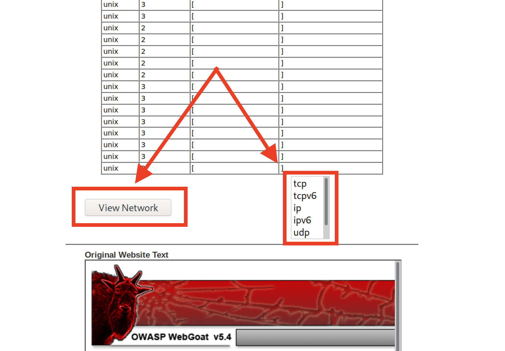
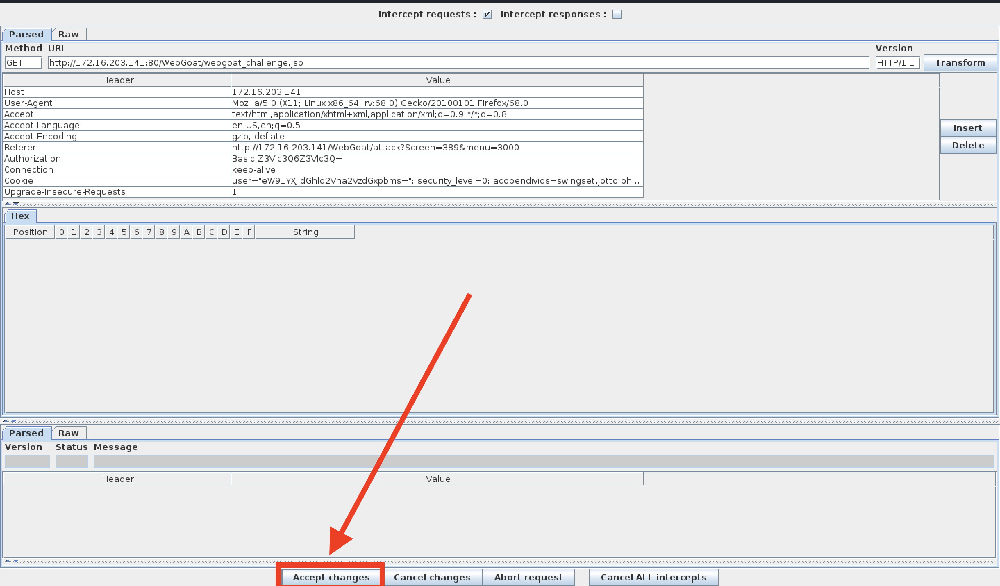

## Activity File: The Challenger

*This activity is part of the homework assignment for Unit 15. It does not have to be finished by the end of class, but it should be submitted with the homework.*

- In this activity, you will play the role of a pentester hired by a bank to test the security of the bank’s authentication scheme, sensitive financial data, and website interface.

- You will use many of the techniques you have learned so far.

### Setup

- You may work alone or in small groups to complete the challenge.

- If you are working with a team, every team member must participate and work on at least one task.

### Lab Environment   

We'll use the **Web Vulns** lab environment. To access it: 
  - Log in to the Azure Classroom Labs dashboard. 
  - Find the card with the title **Web Vulns** or **Web Vulnerability and Hardening**.
  - Click the monitor icon in the bottom-right. 
  - Select **Connect with RDP**.
  - Use the following credentials:
      - Username: `azadmin`
      - Password: `p4ssw0rd*`

- The lab should already be started, so you should be able to connect immediately. 

- Refer to the [lab setup instructions](https://cyberxsecurity.gitlab.io/documentation/using-classroom-labs/post/2019-01-09-first-access/) for details on setting up the RDP connection.

Once the lab environment is running, open the Hyper-V manager and make sure that the owaspbwa and Kali are running.

- Log into the Kali VM and navigate to the IP address of the owaspbwa machine.

- Click the option for WebGoat and start the WebGoat app.

On the bottom left-hand side of the screen, click **Challenge** and choose **The Challenge**.

### Instructions

#### Challenge #1

Your first mission is to break the authentication scheme. There are a number of ways to accomplish this task.

**Hints:**
- Sometimes form fields are shy!
- Find the hidden JavaScript.
- You can appened `source?source=true` to the URL to read the source code. 

#### Challenge #2

Steal all of the credit card numbers from the database. 

**Hints:**
- Sometimes cookies wear different clothes to change their appearance.
- Break into the conversation and inject your own ideas.

#### Challenge #3

Your final act is to deface the website using command injection. Follow the walkthrough below to help you get started. 

- After completing the second challenge, you will be provided with an option to continue to the next challenge.

   

- There should be two webpages at the bottom of the window. The one on top is the original, and the one on the bottom is the defaced webpage.

   

- Start Foxy Proxy (WebScarab) to send all GET/POST requests from Firefox to the WebScarab proxy intercept.

   

- Click **TCP** and then the **View Network** button and send the request to WebScarab.

   

- The WebScarab window will open. 

   - In the **URL Encoded** tab, find the **File** and **Value** form fields. 
   - This is where you will perform your command injection.
   
    

- Next, perform a test and see if this shell is vulnerable to command injection. 

   - Type the following command into the Value field: `tcp && whoami && pwd`.
   
       - **Note:** Windows users can type `tcp && dir`. `dir` will return the directory as proof of vulnerability.
   
   - Click **Accept Changes**.
   
     
   
   - On the next window, click **Accept Changes** twice.
   
     
 
- Scroll to the bottom of the **Current Network Status** window and observe the results for both of the `whoami` and `pwd` commands.

    

   - The results show that we are the root user and our current working directory is `/var/lib/tomcat6`.

   - This verifies the vulnerability, so proceed to the next step.

- Next, we'll locate the `webgoat_challenge_guest.jsp` file. 

   - Type the following command: `tcp && cd / && find . -iname webgoat_challenge_guest.jsp`.
   
      - **Note**: Windows users will need to type: `tcp && dir /s 'webgoat_challenge_guest.jsp'`
   
   
   
   - The absolute path is: `./owaspbwa/owaspbwa-svn/var/lib/tomcat6/webapps/WebGoat/webgoat_challenge_guest.jsp`.
   
   
   
   - Remember, our present working directory is `/var/lib/tomcat6`. Therefore, the relative path is `webapps/WebGoat/webgoat_challenge_guest.jsp`.
   
**Now it's your turn**   

- Now that we know where the webpage is, your task will be to deface the website. Keep in mind the following:
  * Use **WebScarab** to perform command injection.
  * When performing command injection, you will need to select a field that WebScarab can return commands to. These fields are typically located in a drop down. 
  * You will also need to locate and edit the the webpage's source code: `webgoat_challenge_guest.jsp`
  * Your final command will:
    * Change to the location of the `webgoat_challenge_guest.jsp` file.
    * **and** echo `You've been hacked.` to the `webgoat_challenge_guest.jsp` file.

---
© 2020 Trilogy Education Services, a 2U, Inc. brand. All Rights Reserved.  
