## 15.3 Student Guide: Broken Authentication and Session Management 
 
### Overview

Today's class will continue to cover OWASP Top 10 exploits, with a focus on broken authentication and session management, followed by a review of the unit. 


### Class Objectives

By the end of today's class, you will be able to:

- Exploit broken access controls by executing a client-side JavaScript validation bypass attack. 

- Exploit broken authentication by executing attacks on insecure login forms, logout management, and administrative portals. 

- Use WebScarab and CyberChef to manipulate cookies and execute command injection.

- Provide mitigation strategies for all executed attacks. 


### Slideshow

The lesson slides are available on Google Drive here: [15.3 Slides](https://docs.google.com/presentation/d/1r1sSLXbPTwaiPTiDVieY44dJZzYjLNcz1LaoLg66-0U/edit#slide=id.g4789b2c72f_0_6)


### Code of Conduct

Throughout this unit, we will act out examples of malicious attacks to show how various hacks and exploits work and how we can better defend against them. It is important to emphasize that the skills we learn in offensive security units should only be used ethically and with permission. 

The actions and intents of  hacktivists, criminal hackers, and other malicious actors that we mimic for demonstrations are in no way condoned or encouraged. 

---

### 01. Welcome and Overview 

In this lesson, we will continue our exploration of the OWASP Top 10 with a focus on broken authentication and session management. 

We'll look at the origins of these vulnerabilities, learn how to exploit them, and discuss various mitigation strategies. 

Consult the OWASP Top 10: owasp.org/www-project-top-ten and refer to it as we discuss the various vulnerabilities in class. 


### 02. Client-Side JavaScript Validation Bypass (

The first vulnerability we will look at is **validation bypass**. 

- Validation bypass is one form of **broken access control**, which OWASP lists as the fifth most commonly used attack vector.

- According to [OWASP Top 10](https://owasp.org/www-project-top-ten/):  

   "Restrictions on what authenticated users are allowed to do are often not properly enforced. Attackers can exploit these flaws to access unauthorized functionality and/or data, such as access other users’ accounts, view sensitive files, modify other users’ data, change access rights, etc."  

Access controls enforce policies that dictate what users can and cannot do, depending on their permission level and what they need to know. We've enforced principles of access control in our Linux, system administration, and Windows units. 


#### Vulnerability Detection

Any actor or group can be a threat agent for exploiting access controls. 

- Security code analysis tools and vulnerability scanning tools can detect an absence of access control. However, they lack the ability to verify the functionality of existing security controls. 

- We can use automated detection mechanisms to overcome these limitations.

Weak access control mechanisms result from a lack of automated detection and a lack of proper testing by application developers.

- Not all access control detection can be automated. Therefore, manual testing is the preferred way to detect missing or non-functional access controls, such as proper HTTP GET and PUT methods.

Some common access control vulnerabilities include bypassing access control checks by:

   - Manipulating the URL web address.
   - Modifying the HTML code on a webpage.
   - Using a custom API attack tool.
   - Manipulating hidden form fields or cookies.

Validation bypass exploits mostly affect the confidentiality and integrity pillars of the CIA triad.

- Attackers can use validation bypass breaches to assume the identity of users or administrators with escalated privileges, allowing them to create, access, update, or delete data.
   
   - Command vulnerability bypass attacks can also result in a complete takeover. The degree of impact depends on the business needs of the data and application it runs on.


####  Client-Side JavaScript Validation Bypass Demonstration

Now we will demonstrate how to exploit access control vulnerabilities on client-side Javascript. 

1. In owaspbwa, identify the IP address of the vulnerable web application.

   - Launch terminal and run `ifconfig`. 

   In your Kali VM, launch firefox, enter the IP address in the browser and navigate to the following webpages:  
   - Mutillidae II > Others > JavaScript Validation Bypass > User Info SQL

   - Set security level to **1 - Client Side Security**, a slightly elevated level of security that activates the JavaScript validation process. To do this, click **Toggle Security** button in the navigation bar.

   - You will be presented with a window that says **User Lookup (SQL)**.

      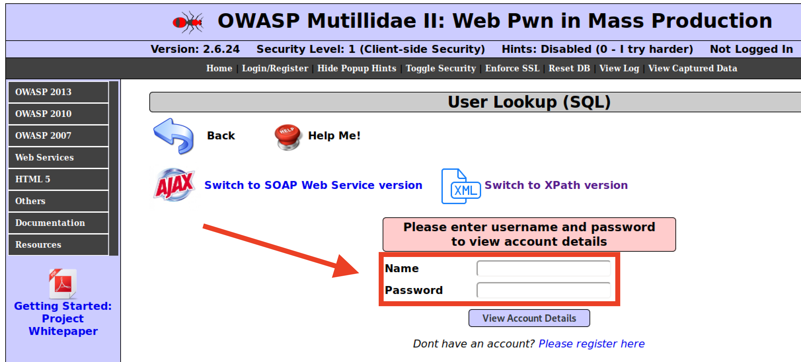

2. Perform a SQLi attack on both the username and password fields.

   Type the following command into both fields: 

   - `' OR 1=1 --'`

   This command will inject code into the back-end database.
   
      - The `' OR 1=1'` condition is always true because one equals one, so the password verification never happens. If vulnerable, the back-end database will accept this "always true" command and dump the contents of the database.

   - An error box indicates that the code injection was unsuccessful. Click **OK**.

    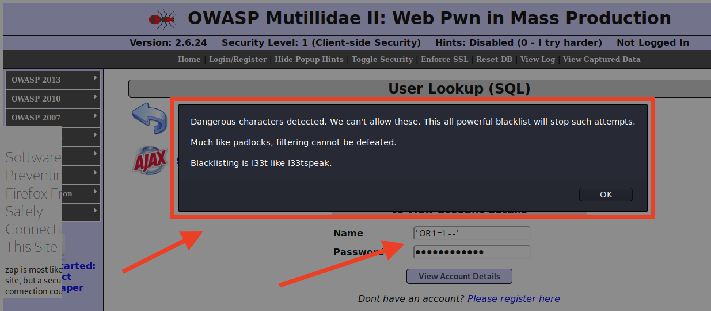

3. Since the code injection was unsuccessful, we'll need to disable JavaScript from performing the client-side validation.

   Open a new tab and enter the following into the URL:

   - `about:config`

   Press Enter. This will open the Firefox options window.

   - Type "JavaScript" in the search box.

   - Double-click the **JavaScript.enabled** line to toggle the value from **true** to **false**, indicating that JavaScript has been disabled.

   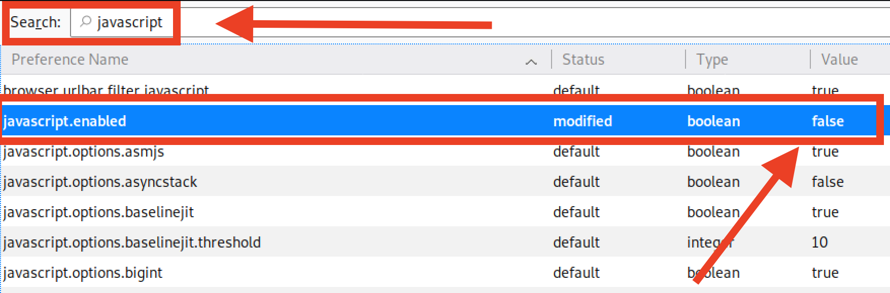

   - Click **OK** and then reload the page.

4. Now we can inject the code again. 

   - Inject `' OR 1=1 --'` into each form field for username and password, then click **View account details**.


   - You should see the username, password, and signature fields  returned from the back-end database.

     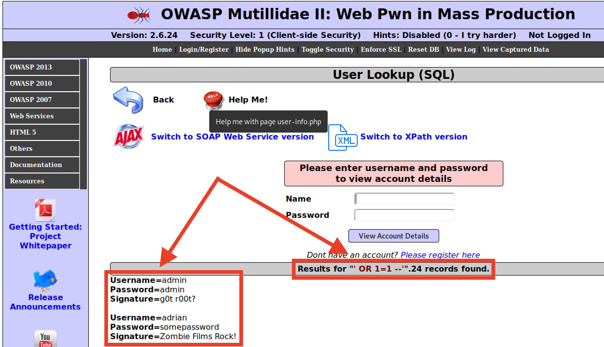
     
5. For the upcoming activities we'll need to have javascript turned back on. 

   Open a new tab and enter the following into the URL:

   - `about:config`

   Press Enter. This will open the Firefox options window.

   - Type "JavaScript" in the search box.

   - Double-click the **JavaScript.enabled** line to toggle the value from **false** to **true**, indicating that JavaScript has been enabled.

     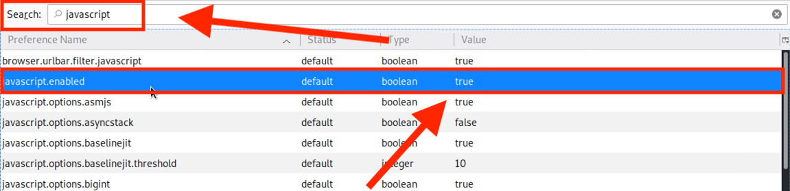
   
#### Mitigation Strategies

Access controls are only effective on the server-side, where attackers cannot modify control checks and metadata.

Alternative mitigation strategies include:

- Implicitly deny all (except public resources).
- Reuse access control mechanisms after implementation.
- Disable web server directory listings and ensure backup files are not present in web roots.
- Ensure logging of all access control failures and immediate generation of alerts.

### 03. Client-Side JavaScript Validation Bypass 

- [Activity File: JavaScript Validation Bypass](Activities/03_Javascript_Validation_Bypass/Unsolved/Readme.md)

### 04.  Review Client-Side JavaScript Validation Bypass Activity

- [Solution Guide: JavaScript Validation Bypass](Activities/03_Javascript_Validation_Bypass/Solved/Readme.md)

### 05. Instructor Do: Broken Authentication and Session Management 

Now, we will look at **broken authentication**, listed as the second most common attack vector on the OWASP Top 10. 

According to [OWASP Top 10](https://owasp.org/www-project-top-ten/):  

   "Application functions related to authentication and session management are often implemented incorrectly, allowing attackers to compromise passwords, keys, or session tokens, or to exploit other implementation flaws to assume other users’ identities temporarily or permanently."

- Flaws in the implementation of user authentication and session management have serious implications for businesses. A security breach can expose confidential information and create backdoors.

#### Consequences for Web Vulnerabilities

The following inadequacies in web development and server deployment can lead to vulnerable web applications and infrastructure:

- Automated attacks that allow attackers to perform brute force or credential stuffing (i.e., use of previously stolen user authentication data).
- Allowing use of well-known passwords, or weak or default passwords.
- Inefficient password recovery mechanisms.
- Unencrypted passwords or weak hashes.
- Absence of multifactor authentication.
- Exposure of session ID in the URL.
- Non-rotation of session IDs after each use.
- Improper session invalidation or timeouts.
- Inadequate security built into web application software.

One specific broken authentication attack is a **watering hole attack**.

- Attackers observe or guess the websites that users from a targeted organization visit most often. They will then try to infect that site with malware in order to infect as many users as possible, leading to a network breach. 

The next demonstration will take advantage of a few web vulnerabilities that are the result of insecure web application programming.

#### Broken Authentication and Session Management Demo Setup

We'll demonstrate how to perform a broken authentication and session management attack with the following scenario:

- You will play the role of a junior security administrator working at FireFly Inc., a web application software developer.

- You’ve been asked by the lead project development engineer to perform a few white hat penetration tests against their website and provide recommendations. 

#### Broken Authentication and Session Management Demo

We'll use two VMs for this demo: 
- Attacker: Kali Linux 
- Vulnerable Web Database: owaspbwa

In owaspbwa, identify the IP address of the vulnerable web application.

   - Launch terminal and run `ifconfig`. Take note of the IP. 

- In Kali, launch Firefox and navigate to the owaspbwa website.

- Create a user account with the following credentials:

   - Username: `hacker`
   - Password: `exploit`

Enter fake info for the other fields.

#### Insecure Login Forms

In the first demo, we'll explore a web vulnerability that exploits insecure login forms. These exist in webpage forms as a result of insecure web application programming.  

1. In Kali, launch Firefox and avigate to the IP address of the OWASP BWA machine. Complete the following:
   - On the landing page, select the **bWAPP** module. 
   - Log in with the credentials `bee:bug`. 
   - On the drop down menu in the top right, sroll down and select **Broken Authentication - Insecure Login Forms**. 
   - Click on **Hack**.
   - Make sure the security level is set to Low.

- Login with the following credentials:
  - Username: `hacker`
  - Password: `exploit`

2. You should receive an “Invalid Credentials” error message. Now we'll exploit this insecure login form.

   To get the username and passwords:
   
   - Right-click on the page. 
   - In the dropdown menu, select **View Page Source**. 
   - Scroll down to the `<form action=` section.
   - Notw the following HTML lines. They reveal the username `tonystark` and the password `I am Iron Man`. 

   ```html
   <p><label for="login">Login:</label><font color="white">tonystark</font><br />

   <p><label for="password">Password:</label><font color="white">I am Iron Man</font><br />

   ```

   - Return to the login page and drag your mouse over the login fields to highlight this hidden text.

3. Attempt to log in using the stolen user credentials: `tonystark`:`I am Iron Man`.

   - You should receive a response that says, `“Successful login! You really are Iron Man :)”`
   
While this seems simple and perhaps impractical in the real world, it is a very serious security flaw that still exists, though it's not as common as it used to be.


#### Logout Management

In this next demo, we'll explore a web vulnerability that exploits insecure logout management. This vulnerability allows you to reauthenticate a user session after a logout by pressing the Back button. 

1. On the bWAPP homepage, click the **Choose your Bug** dropdown and select **Broken Auth – Logout Management**.

   - Click **Hack**.

   You should still be logged in from the last activity as `bee`. 

   - Select **Click here to Logout**.

2. Click the Back button in the browser. This will log the authenticated session back in, despite having just logged out. 
   

#### Administrative Portals

In this next demo, we'll explore a web vulnerability that exploits insecure web application programming to reveal authentication mechanisms within the URL. This is a form of parameter tampering. 

1. In the **Choose your Bug** dropdown menu, select **Session Management – Administrative Portals**.

   - Click **Hack**.
   
      - You will see a message stating "This page is locked."
   
2. To gain administrative access to this webpage:

   - Look at the URL and note the `admin=0`.

   - In boolean logic, `0` represents "false" and `1` represents "true." 
   
   - In other words, `admin=0` means that the user who tried to access this page is not an admin and is therefore denied access. 

   But improperly configured authentication and session management allow us to perform parameter tampering: 

      - In the URL, change the `admin=0` to `admin=1` and then press Enter.
      
      - We should now have access to this webpage.


#### Mitigation Strategies

It’s absolutely essential that security flaws are addressed during the application development lifecycle. It’s cheaper and less time-consuming to build security into the application while it's being developed than to implement it in reaction to a breach. 

- The best strategies for preventing and mitigating broken authentication and session management flaws will depend on the particular scope of the application.

- Supplementary mitigation tools include credential management systems like LastPass and OneLogin provide features for using and storing credentials in a secure and controllable way. 

Some general best practices include:

- **Multifactor authentication** requires validating multiple factors in order to authenticate your identify. Factors can include: 

   - Standard login inputs (password, PIN, cognitive questions)
   - Physical keys (smartcard, hard token)
   - Biometrics (iris/retina scan, hand geometry)
   - Location (GPS detection, callback to a home phone number)
      
- **Constrained user interface** restricts what users can see and do based on their privileges. 
      
   - This can result in grayed-out or missing menu items or other interface changes. 
   - Context-dependent controls regulate activity-based functions, such as limiting your ability to perform certain tasks, like editing a document.
   - Content-dependent controls regulate the content of an object, such as grayed-out menu items. 
      
- **Polyinstantiation** "scrambles" the storage of information at different classification levels, preventing hackers from understanding the information without the missing pieces. 

- **API keys**, like passwords, should be treated as very sensitive information. 
   - They should always be stored in secure locations and transmitted only over encrypted communications channels. 
   - If someone gains access to your API key, they can interact with a web service as if they were you. 
      
- Alternative mitigation strategies include:

   - Random generation of session IDs makes it difficult for an attacker to brute force or guess valid session IDs.

   - Enforce session timeouts or session ID expirations based on a predetermined amount of time.

   - Use robust password recovery mechanisms.
   
   - Enforce complex passwords.

Once authenticated, the session still needs to remain secure from exploitation.

   - This requires various access controls for proper session management control. 
 


### 06. Broken Authentication and Session Management Activity


- [Activity File: Broken Authentication and Session Management](Activities/06_Broken_Authentication_Session/Unsolved/README.md)


### 07.  Review Broken Authentication and Session Management Activity 

- [Solution Guide: Broken Authentication and Session Management](Activities/06_Broken_Authentication_Session/Solved/README.md)


### 08. Cookies Crumble 

#### Base64

Cookies are typically sent using a type of encoding called base64. Once encoded, a username or password can be transmitted inside the URL in an ASCII string format, which is what the underlying HTTP protocol expects to see.

Base64 is an encoding scheme that represents a binary set of data in an ASCII format. 

- Base64 encoding schemes are most common when data needs to be stored and transferred over media that is designed to deal with ASCII characters.

- This encoding ensures that data remains intact during transmission, without being modified. 

- It is commonly used in a variety of applications, including web-based data streams such as URLs.

The cookie example below shows a username that's been encoded in base64:

`user="eW91YXJldGhld2Vha2VzdGxpbms="; security_level=0; JSESSIONID=A77E31270D12B1FF01F773F8575B4D64; acopendivids=swingset,jotto,phpbb2,redmine; acgroupswithpersist=nada`

- We can decode this cookie using an online tool called CyberChef. 

**CyberChef** is a free online (or downloadable) tool that we'll use to encode and decode cookies to and from base64.

- CyberChef works using a cookbook-style format that comes preloaded with various conversion modules. 

#### CyberChef Demonstration (with Class Participation)

We will use CyberChef on the Chromium Web Browser, since traffic on browsers like Firefox is intercepted by WebScarab, which disrupts CyberChef.

We'll use the Kali VM for this demonstration. 

- On your VM, click on the **App** menu in the top-left corner and search for Chromium. 

- Hit **Cancel** if prompted for a password. 

- Navigate to `gchq.github.io/CyberChef/`. It should be the first result from a "CyberChef" Google search.

   - Expand the webpage to see all the fields.

- When a cookie is sent to a web server, it is read as base64, decoded, and decrypted if necessary.

- There will be times when we will have to decode and encode a cookie value, append our SQLi command to it, and then re-encode it back to base64 before forwarding the request to the web server.

Review the layout of CyberChef using the image below:
  - Sometimes CyberChef will minimize itself if left in the idle state for too long. If this happens, close your web browser and navigate back to gchq.github.io/CyberChef/. 

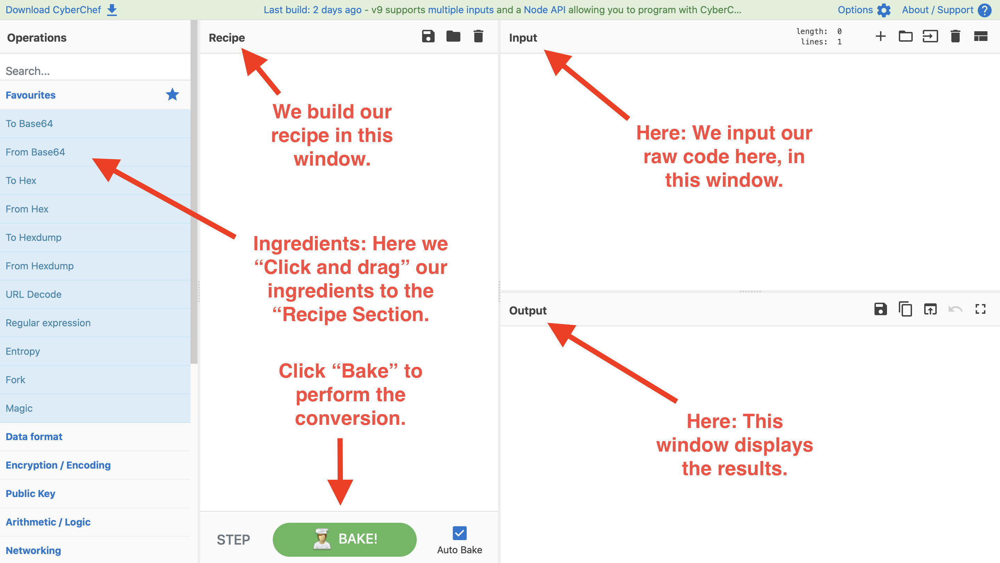

- First, select "ingredients" (operators) from the **Operations** pane to the left. 
- Drag and drop the operator to the **Recipe** pane. In this case, we'll select **From Base64**.
- Next, we'll copy and paste our encoded cookie value into the **Input** window pane.
- Finally, our decoded result is displayed in the **Output** window pane.

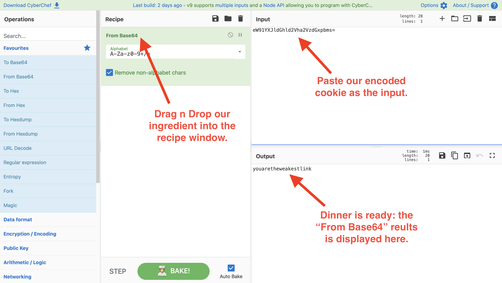

#### WebScarab

**WebScarab** is a proxy intercept application that allows for both cookie manipulation and command injection. 

- In the Kali VM, search for WebScarab in the **App** dropdown. 

- Inside WebScarab, click on the **Proxy** tab and click the checkbox titled **Intercept requests**.

All web traffic must be forwarded to WebScarab through a proxy called Foxy Proxy. 

- Foxy Proxy is accessed through an icon located on the Firefox toolbar in the upper-left-hand corner, between the Hack this Form and Tamper Data icons.
   
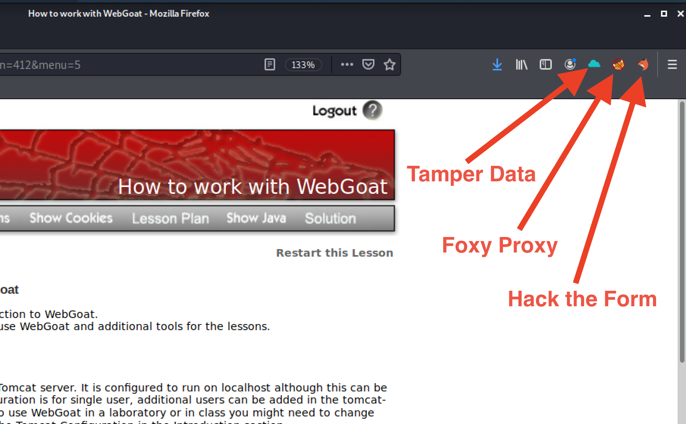


In Firefox, navigate to the owaspbwa page and choose `OWASP WebGoat` from the list.

- Log in with the following credentials:
   - Username: `guest`
   - Password: `guest`

- In Webgoat, click through Injection Flaws > LAB: SQL Injection > Stage 2: Parameterized Query #1.

 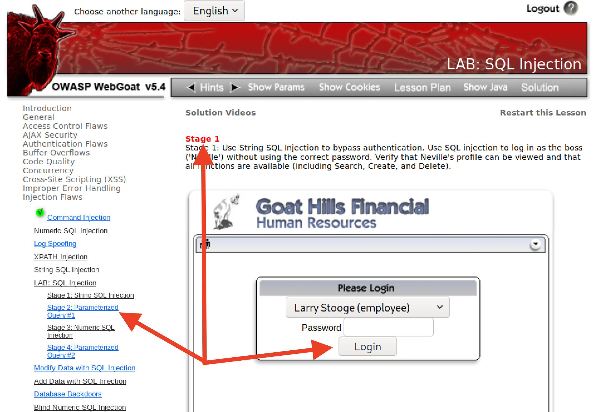

- Click on Foxy Proxy and choose the WebScarab option to activate it. This will forward all web requests to WebScarab.

   - **Note:** WebScarab automatically opens a listener at `127.0.0.1:8008`, and Foxy Proxy is preconfigured to forward to `127.0.0.1:8008`.
   
- In WebGoat, click the **Login** button and observe the WebScarab popup window.
   
   - In the **URL Encoded** section, there are three things to note:
      - **Variable** column: Displays the type of data that can be manipulated.
      - **Value** column: Where you perform command injection.
      - **Accept changes**: Forwards the request to the server.

   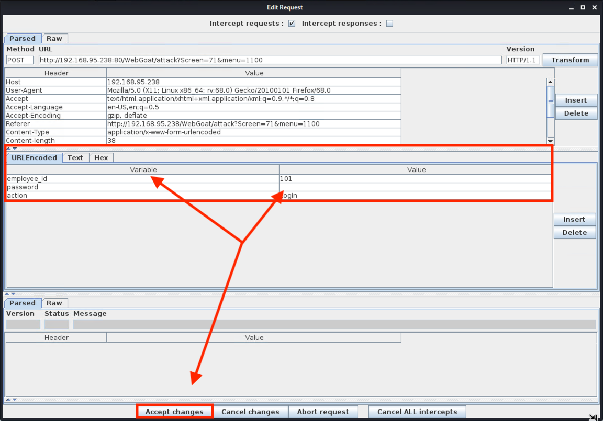
   
            
- For this example, we'll type the following SQLi command into the password value form field:
   
   - `user' OR '1'='1` 
   
   Click **Accept Changes**.
         
   - **Note**: If a second WebScarab window pops up, click **Accept Changes** until the the window disappears.

WebScarab forwarded the request to the server and was accepted.  

- Return to your Firefox browser. Notice that we have now successfully logged in as Larry. 

    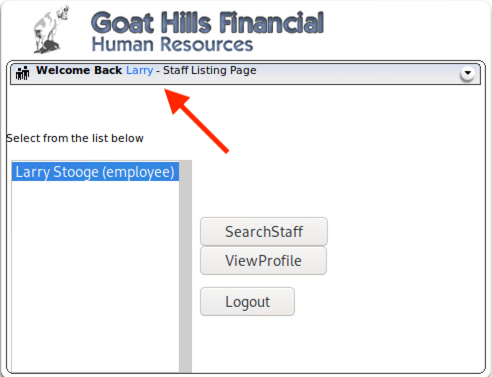

- Close WebScarab and turn off Foxy Proxy.


___

### 09.  Code Quality (0:15)


Developers often make notes such as `TODO` and `FIXME` within the application code during the software development life cycle (SDLC).

- Since these notes identify flaws within the code, they can give attackers clues about vulnerabilities.  Therefore, when code developers forget to remove `TODO` and `FIXME` notes, they are putting an organization's web infrastructure at risk. 

#### Code Quality Demo Setup 

We'll demonstrate how to perform a code quality attack with the following scenario:

- You're a hacktivist looking to hack into a web server to deface an organization's home page.

- You've done some research and discovered that the organization's developers have a reputation for leaving evidence of code quality flaws in their web applications.

- You will exploit these flaws by examining the underlying HTML code for any orphaned web developer notes.

#### Code Quality Demo

For this demo we'll be using the following VM setup:

- Attacker: Kali Linux
- Vulnerable Web App: WebGoat

1. In Kali Linux, launch Firefox and navigate to the WebGoat homepage.

   - Click **Code Quality** on the left-side panel. In the dropdown, click **Discover Clues in HTML**.
   
   - As noted before, developers sometimes leave statements like `FIXME`, `TODO`, `Code Broken`, `Hack`, etc. inside the source code.  
   
   - We'll review the source code for any comments about  passwords, backdoors, or things that don't work correctly. Below is an example of a authentication form. We'll look for clues to help you log in.
   
    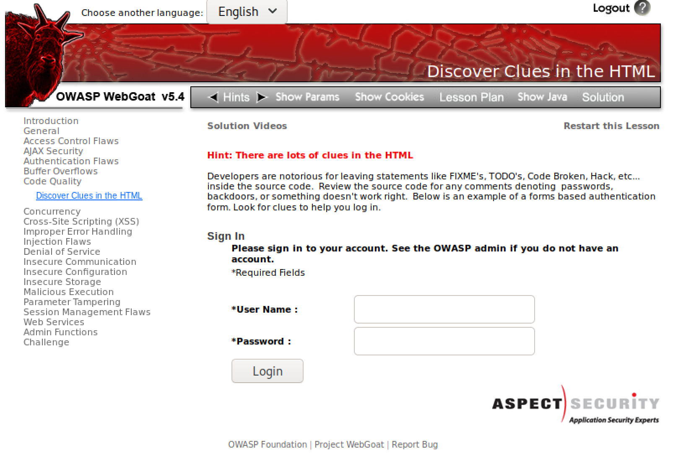
   
   
2. Uncover the underlying HTML code:

   - Right-click on the webpage and select **View Page Source**.
   
   - Type Control+F to open the search box at the bottom.
   
   - Type "FIXME" in the search box. Move through the entries until you find a note indicating admin credentials: `admin:adminpw` .
   
     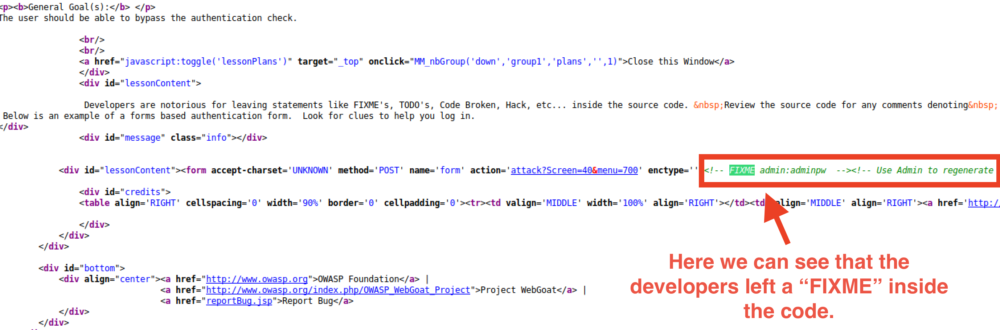
   
3. Return to the login window and type the following credentials:

   - Username: `admin`  
   - Password: `adminpw`
   
   Success!
   
    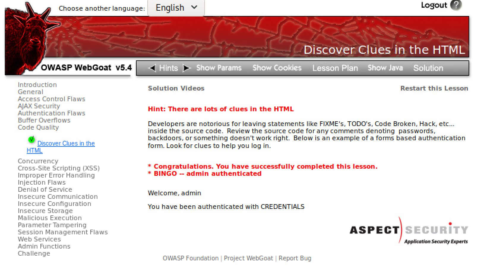
   
   This demo emphasizes why web developers need to be proactive about ensuring that security is considered throughout the development process. 
   
4. There may be cases when web application developers accidentally leave the username and password in the JavaScript itself.

   - Web app developers do this during web app development to avoid having to retype the username and password every time while working on the code.

   Return to our example webpage:
   
   - Click on **Restart this lesson**.
   
   Next we have to modify the section of URL after the `/WebGoat/` section.
   
   - Change the URL from:
   
      - `http://172.16.203.141/WebGoat/attack?Screen=40&menu=700&Restart=40` (Your URL may differ after `/WebGoat/`)
   
      to: 
      - `http://172.16.203.141/WebGoat/source?source=true`
   
   We added the `source?source=true`, which reveals the underlying JavaScript code for this web page.
   
   - The fact that this command worked tells us that the web developer had `source?source` set to "false" in an effort to obscure the code.
   

   - Re-iterate that while it seems like a careless mistake, there may be times when the username and password will appear within this code. It's always worth checking.
   
   - These vulnerabilities are the result of insecure web application development practices that could have been avoided through enforcement of a secure SDLC program.
   
   - Emphasize that developer code can be found in a variety of places. Developer code is publicly available on the internet at sites like GitHub, an online code collaboration platform. Developer code shared in these places may accidentally share sensitive data.


### 10. Basic Authentication 

In the last class, we learned that insecure code plays a critical role in web infrastructure security. 

- In this class, our goal is to understand how basic authentication and poorly implemented session management can create unnecessary risks to an organization.

Basic authentication is used to protect server-side resources as follows: 

- The web server sends a 401 authentication request with the response for the requested resource. 

- The client-side browser prompts the user for a username and password using a browser-supplied dialog box. 

- The browser base64 encodes the username and password and sends those credentials back to the web server. 

- The web server validates the credentials and returns the requested resource if the credentials are correct. 

- These credentials are automatically reset for each page protected with this mechanism, without requiring the user to enter their credentials again.

Can you can think of where a vulnerability might arise?

- In the next demonstration, we'll extract passwords that are sent to server during a 401 authentication request. 

- Even though the passwords are base64 encoded, we'll use CyberChef to decode them into human-readable text.


#### Basic Authentication Demo Setup 

We'll demonstrate how to perform a basic authentication attack with the following scenario:

- An organization recently experienced a large number of unauthorized logins outside of business hours.

- You were hired as a pentester to identify the origin of these user authentication issues.

- From past experience, you believe this may be related to how cookies are handled during user authentication. 

#### Basic Authentication Demo

For this demo, we'll use the following VM setup:

- Attacker: Kali Linux
- Vulnerable Web App: WebGoat

If these machines have been running for a while, restart them now.


1. In Kali Linux, launch WebGoat and navigate to Authentication Flaws > Basic Authentication.
     - Start the Tamper Data Firefox plugin.
         
First we'll need to start the `Tamper Data` Firefox plugin. 

- Open your web browser and navigate to about:addons in the search bar, and scroll down to and click `Tamper Data for FF Quantum`. 

- Explain that because Kali has is running private windows, we'll need to allow Tamper Data to run in private Windows. 

- Click **Allow** and point out that we now have the Tamper Data extention icon, next to FoxyProxy. 


    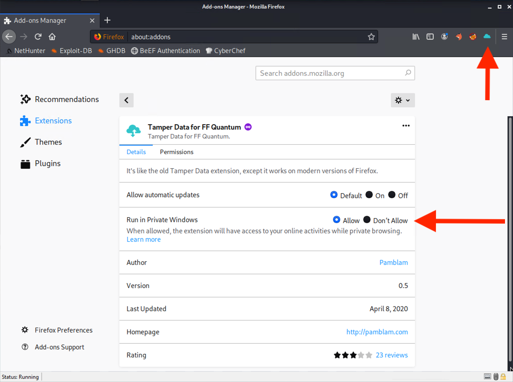
   
    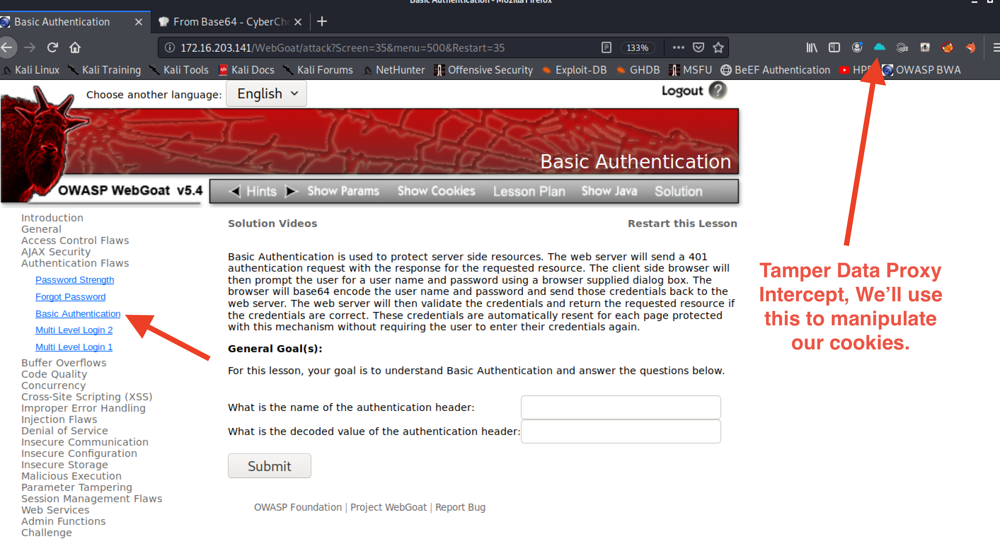
   
  **Tamper Data** is a proxy interceptor that will allow us to intercept and manipulate cookie and session ID information before forwarding it to the web server for processing.
   
   -  Tamper Data is a popular Firefox browser extension that's been used in the hacker community for several years.
   
2. In the Tamper Data window, check the box for **Tamper requests only from this tab**.
   
   - Click **Yes** for **Start Tamper Data?**
   
   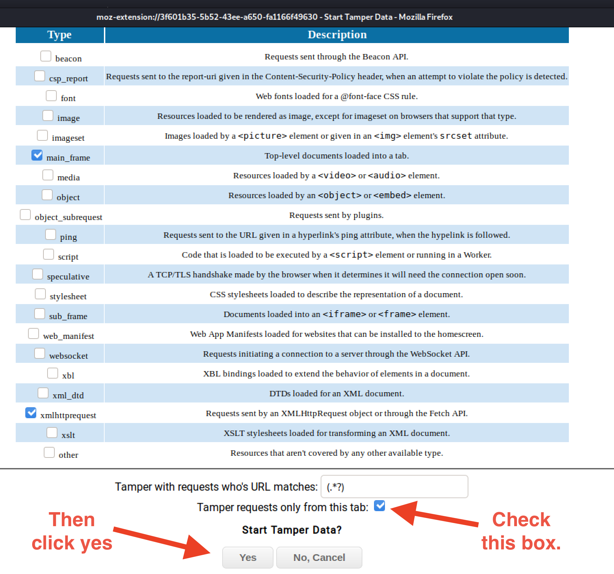
   
3. Click **Submit** on the WebGoat form.

   - Click **OK** in the Tamper Data Request box.
   
   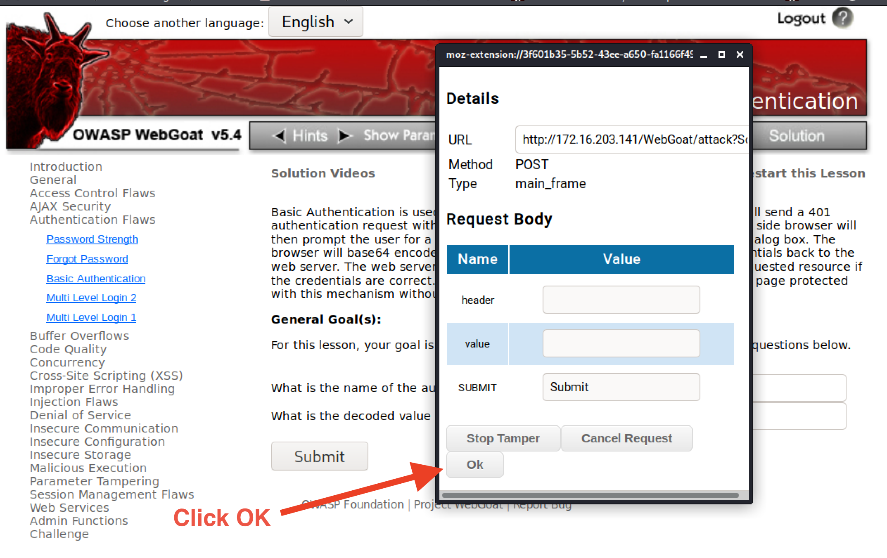
   
4. In the next Tamper Data window, scroll down to the **Authorization** section.

   - Copy the value from the Authorization section.
      - If the Authorization section is missing, try restarting both the owaspbwa and Kali VMs from the Hyper-V manager.
   
   - Then, click the **OK** button to release and forward the request.
   
   - Close the Tamper Data popup.

   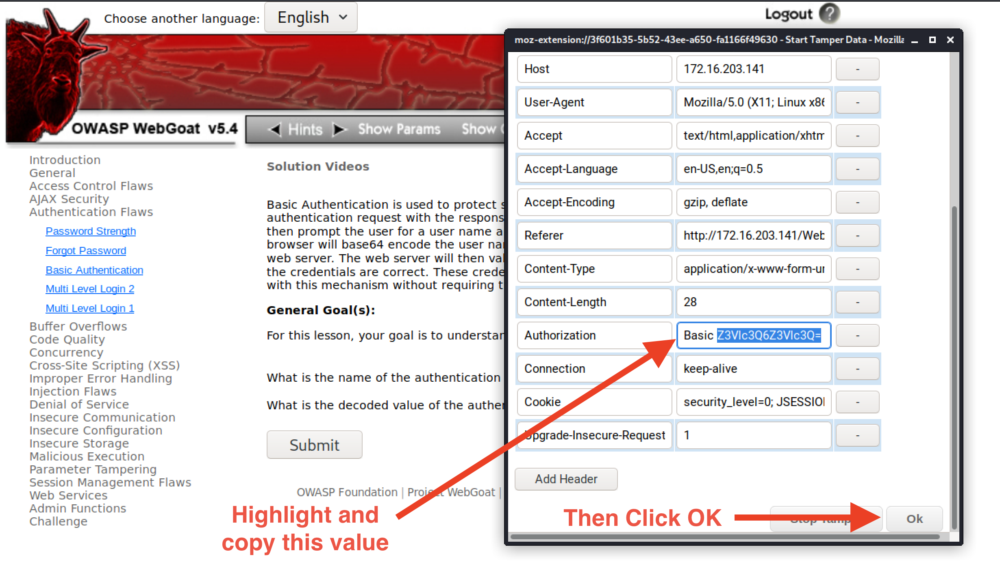

5. Next, open CyberChef.

   - Paste the value from your clipboard into the **Input** window.
   
   - Here, we are presented with the password: `guest:guest`.
   
   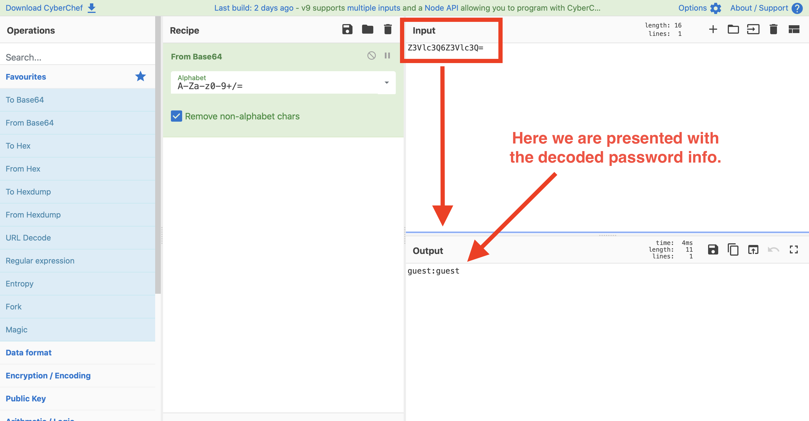

6. Lets verify that these credentials are correct:

   - For the username, type `Authorization`.
   - For the password, type `guest:guest`.
   - Click **Submit**.

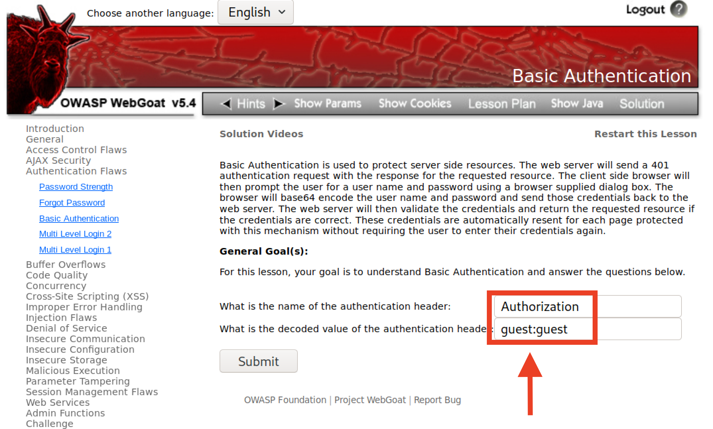

7. Success! The hack worked.

   This hack was the result of the password being sent along with the POST request during the login process. 
   
   Even though the password was base64 encoded, we were able to decode it into human-readable text using CyberChef.
   
   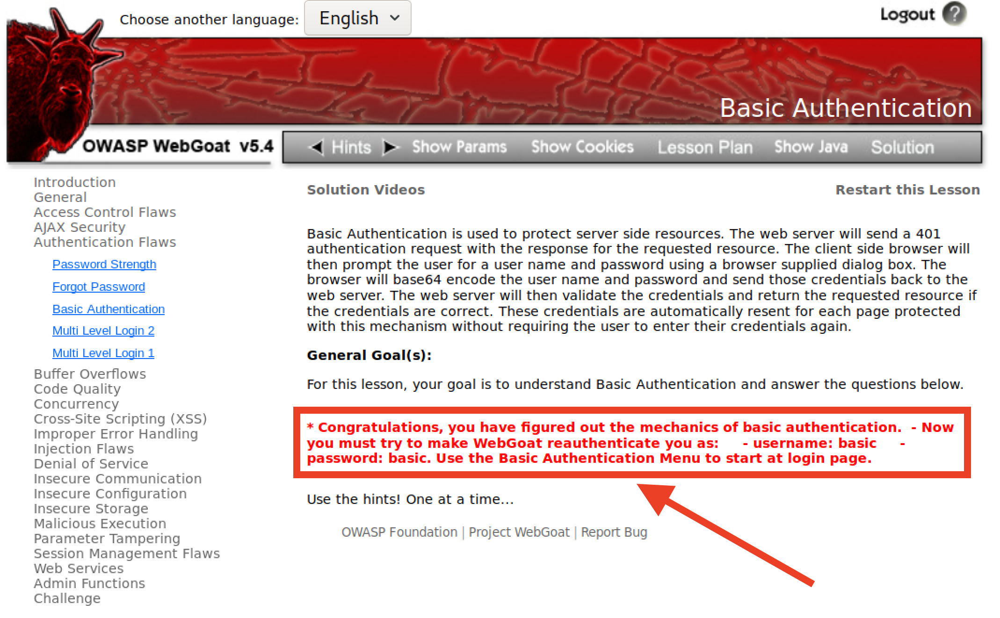


### 11. The Challenge 

- [Activity File: Web Vulnerability Challenge](Activities/11_The_Challenge/Unsolved/README.md)


___


© 2020 Trilogy Education Services, a 2U, Inc. brand. All Rights Reserved.  
