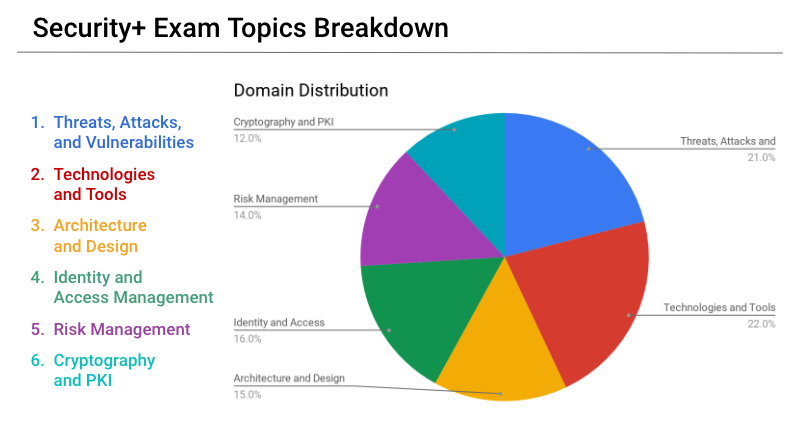

## 22.2 Student Guide: Security+

### Overview

In today's class, we will dive deeper into the domains covered by the Security+ exam. 

### Class Objectives

By the end of class, you will be able to:

- Explain how each domain is divided across the Security+ exam.

- Prepare for Security+ questions from domains we have not explored in the curriculum, such as Architecture and Design and Identity and Access Management.

- Correctly answer Security+ practice questions. 

### Slideshow

The lesson slides are available on Google Drive here: [22.2 Slides](https://docs.google.com/presentation/d/1ddYaI28VGghm0V5_ys7Yskn1Gm1hsrmn5T6HgXG2Aqs/edit#slide=id.g480f0dd0a7_0_1803)

-------

### 01. Welcome and Overview 

Today we will continue to prepare for the Security+ exam.

- There are over 300 information security certifications from over 40 issuing organizations.

- These certifications are broken into three types: beginner certifications, advanced certifications, and specialized certifications.

- Information security professionals take different certification paths depending on what they are interested in.  
- One of the most popular beginner certifications is Security+.

  - One of the best methods to prepare for the Security+ exam is the CertMaster Practice tool, which you will have access to.

### 02. Security+ Identity and Access Management Domain

The Security+ exam consists of the following six domains:
  - Threats, Attacks and Vulnerabilities
  - Technologies and Tools
  - Risk Management
  - Cryptography and PKI
  - Architecture and Design
  - Identity and Access Management


 

Our course has focused on many topics within four of these domains:  
  - Threats, Attacks and Vulnerabilities
  - Technologies and Tools
  - Risk Management
  - Cryptography and PKI
  
While there were some topics that were covered from the Architecture and Design and Identity and Access Management domains, other parts of these domains were outside the scope of this boot camp. 


#### Identity and Access Management

The Identity and Access Management (IAM) domain makes up 16% of the exam's questions.

Identity and Access Management covers the security policies that ensure an organization's resources are only accessible by the right people, for the right reasons, at the right times.
  
There are significant risks to incorrectly assigning access to resources.
  - For example, if an organization gives all staff access to payroll databases, they would be able to view PII and other private data of the organization and its employees. 

Within the Identity and Access Management domain, there are four subdomains that you should be familiar with:

1. **Compare and contrast identity and access management concepts.**

    - This subdomain focuses on the basic terms and concepts associated with IAM such as:
      - **Authentication, Authorization, and Accounting (AAA)**: The framework to best control access to an organization's resources.
      
        - Types of authentication factors:

          - Something you are: This includes biometrics, such as retina scanning or facial recognition.

          - Something you have: Such as tokens or key cards.
          
          - Something you know: Such as PINs and passwords.
      
   
    Example question:

      ``` 
      Of the following authentication factors, which one is a  different factor than a retina scan?
      
        (A) Hand geometry recognition
        (B) Voice recognition
        (C) Fingerprint recognition
        (D) Proximity cards 
      ```
  
    - The correct answer is D.
      - Proximity cards are "something you have" while the other options are all biometric factors ( "something you are").

  
2. **Given a scenario, install and configure identity and access services.**

    - This subdomain focuses on the the application of the concepts associated with IAM, such as authentication protocols like Kerberos, CHAP, and PAP.
        - **Kerberos** is an authentication protocol developed at MIT that uses tickets.

        - **Password Authentication Protocol (PAP)** uses a standard username and password to authenticate to a remote system. It is considered insecure. 

        - **Challenge-Handshake Authentication Protocol (CHAP)** uses a three-way handshake, making it more secure than PAP.

    
    Example question:    
      ```
      Which of the following authentication protocols is considered insecure due to its lack of encryption?
        
        (A) EAP
        (B) SAP
        (C) PAP
        (D) CHAP
      ```
    
      - The correct answer is C. PAP is insecure and unencrypted. 


3. **Given a scenario, implement identity and access management controls.**

   - This subdomain focuses on the management decisions to make sure the right people have access to the right resources for the right reasons. 
    - Various types of access controls include:
      - **Mandatory Access Control (MAC)**
      - **Discretionary Access Control (DAC)**
      - **Role Based Access Control (RBAC)**

   - This topic also focuses on selecting the most optimal access controls based on your organization's environment.

      - For example, voice recognition is an appropriate biometric control if your office environment is relatively quiet.
    
    Example question: 

      ```
      For the following biometric controls, which would you select if you have a noisy office with good lighting and need a cost-efficient solution?
          
        (A) Voice recognition
        (B) DNA analysis
        (C) Fingerprint recognition
        (D) Speech recognition
      ```
  
      - The correct answer is C. A and D would not be optimal in a noisy office and B would likely be an expensive biometric solution.

        - Voice recognition detects speakers based on the characteristics specific to the person, while speech recognition detects the words, absent of any unique accents, inflections, or characteristics of the speaker. 

        - Speech recognition is "what was said" and voice recognition is "who said it." 

4. **Given a scenario, differentiate common account management practices.**


   - This subdomain focuses on how user accounts are managed, such as the concept of least privilege, which you should be familiar with. 
      - This is the principle that an individual or system should be given the minimum access rights needed to complete their tasks.

    - Account types:
      - User accounts: The basic, standard account type of users at your organization. These accounts are usually limited in privileges.

      - Guest accounts: Allow non-employees to have limited access to your organizations resources.

      - Privileged accounts: Have greater access than user accounts and are provided to managers and system administrators.
    
    Example question: 
      
      ```
      You have an an external auditor that needs limited access to your organization. What type of account should you provide them?
          
        (A) Guest Account
        (B) User Account
        (C) Sudo Account
        (D) Service Account
      ```  
        
      - The correct answer is A. You would provide a guest account to a non-employee who needed limited access.
      

### 03. Security+ Identity and Access Management 

- [Google Form: Identity and Access Management Quiz](https://forms.gle/wxtZpELtv33i5StV8)


### 04. Activity Review: Security+ Identity and Access Management Activity

- [Solution Guide: Identity and Access Management Quiz](https://docs.google.com/forms/d/e/1FAIpQLSd6_wq4RgCBffUs8FQp1Knp_W_MeWi8wM6eGPMqkmBO9Ql9Ig/viewscore?viewscore=AE0zAgA3OlnOmtOjFrNlAbvN-tCOgMwrB2_CsM2R3HNQiEjSY9jBDH9FqhRZDkiVeHt9Qu8)

  
### 05. Security+ Architecture and Design Domain 

In this section we will look at the Security+ Architecture and Design domain, which constitutes 15% of the exam's questions.

#### Security+ Architecture and Design

Architecture and Design covers the processes and controls used to protect the confidentiality, integrity, and availability of an organization's data.

Within the Architecture and Design domain are nine subdomains: 

1. Explain use cases and purpose for frameworks, best practices, and secure configuration guides.

2. Given a scenario, implement secure network architecture concepts.

3. Given a scenario, implement secure systems design.

4. Explain the importance of secure staging deployment concepts.

5. Explain the security implications of embedded systems.

6. Summarize secure application development and deployment concepts.

7. Summarize cloud and virtualization concepts.

8. Explain how resiliency and automation strategies reduce risk.

9. Explain the importance of physical security controls.

While it is important to be familiar with all nine subdomains, this section will focus on four subdomains that have not been covered in our course: #5, #6, #8, and #9.


#### Subdomain 5: Explain the security implications of embedded systems.

  - This subdomain focuses on the security of systems that have hardware with software embedded within them.

    - A smart refrigerator is an example of an embedded system. A smart refrigerator has hardware and software embedded within it to complete specific tasks, such as monitoring temperature and determining if a filter needs replacing.


  - You should become familiar with the following terms:
    -  **Supervisory Control and Data Acquisition (SCADA)**: A system used to control technical equipment in industries such as energy, oil, and water management.

    - **Internet of Things (IoT)**: The network of devices that are connected to the internet, which are considered an extension of the internet itself. These devices include smart light bulbs, smart refrigerators, printers, and door locks.
      - IoT is an expansive term relevant to many areas, such as smart houses, research and monitoring in the healthcare industry, wearable devices such as step counters, data collection in agriculture, manufacturing, and city management, and many, many more. 
    
    Example question:
    ``` 
    To protect their data, which type of systems are usually not connected to the internet?
      
      (A) Linux servers
      (B) Apache web servers
      (C) SCADA systems
      (D) Home office networks
    ```
  
       - The correct answer is C. While there are some SCADA systems that have limited connection to the internet, because they run high impact systems they usually are not connected.
  
#### Subdomain 6: Summarize secure application development and deployment concepts.

  - This subdomain focuses on the concepts and processes relevant to developing secure applications for organizations and their users.
  - Some terms that you should be familiar with include:
    - **Input Validation**: Restricts what data can be input to application fields, such as limiting non-ASCII characters.

    - Software development methodologies:
      - **Agile**: A flexible development method that allows changes to the development requirements.

      - **Waterfall**: A structured and rigid development method where each step of development cycle is dependent on the previous steps.
    

    Example question:

      ```  
      What is the biggest risk of outputting detailed application errors with coding details?
          
        (A) There is no risk, and it is recommended.
        (B) Coding details could provide the developer's name.
        (C) Coding details could illustrate vulnerabilities in the application code, which a hacker can then exploit.
        (D) Coding details could show when the code was written.
      ```
  
    - The correct answer is C. Displaying the code details, such as the coding language, version, and structure, could provide vulnerability information for hackers to exploit.


#### Subdomain 8: Explain how resiliency and automation strategies reduce risk.

  - This subdomain focuses on the processes associated with maintaining a business's services when there are disruptions.

  - Example terms include:
    - **High availability**: A concept describing a system that is available for a long period of time, typically as close to 100% as possible.

    - **Scalability**: The ability for your organization's technology to easily grow and manage increased demand.

    - **Snapshot**: The state of a virtual machine at a certain point in time.
  
    Example question:

      ```
      Which of the following is the process of constantly checking systems for attacks, threats, vulnerabilities, and other risks?
        
        (A) Continuous monitoring
        (B) Redundancy
        (C) Fault tolerance
        (D) RAID
      ```
  
      - The answer is A. Continuous monitoring is the process of constantly checking systems for attacks, threats, vulnerabilities, and other risks.

#### Subdomain 9: Explain the importance of physical security controls.

  - This subdomain focuses on concepts associated with physical security processes and controls.

  - Terms you should become familiar with include:
    - **Environmental controls**: For example, HVAC systems and fire suppression systems.
    
    - **Physical access controls**: For example, man traps and security guards.
    
    - **Physical control types**: For example:
      - **Deterrents**, such as alarms.
      - **Preventions**, such as locks or gates.
    
    Example question:  
      ```
      What type of risk can a bollard protect against?

        (A) Fire
        (B) Flooding
        (C) Vehicle access
        (D) Script kiddies
      ```
      
      - The answer is C. A bollard is a short post built into the ground to protect areas from vehicle access.
     
 

### 06. Security+ Architecture and Design Quiz 


- [Google Form: Architecture and Design Quiz](https://forms.gle/1AT2r9qY2xsyAcJj7)
- [Solution Guide: Architecture and Design Quiz](https://docs.google.com/forms/d/e/1FAIpQLScL0jWlQxPsspGh-GZc2N6RojNi2lVyTn4NpNJ8Mk_tID_m2Q/viewscore?viewscore=AE0zAgCv-C-rr7shzIGnfWGg0iFonZ1zTIa99MwBq1ma1YPM16lGg5WJIqp6Ndyc8bYwYHY)


  
### 08. Break


### 09. Security+ Kahoot Competition

### 10. Activity: Security+ Kahoot Challenge 
 
 - Access the [Kahoot Security+ Challenge](https://create.kahoot.it/share/security-battle-part-1/6c400f82-d6ba-4028-95c6-6a63fa31fbf9) to practice the quiz again on your own time.
  
-------
© 2020 Trilogy Education Services, a 2U, Inc. brand. All Rights Reserved.  

