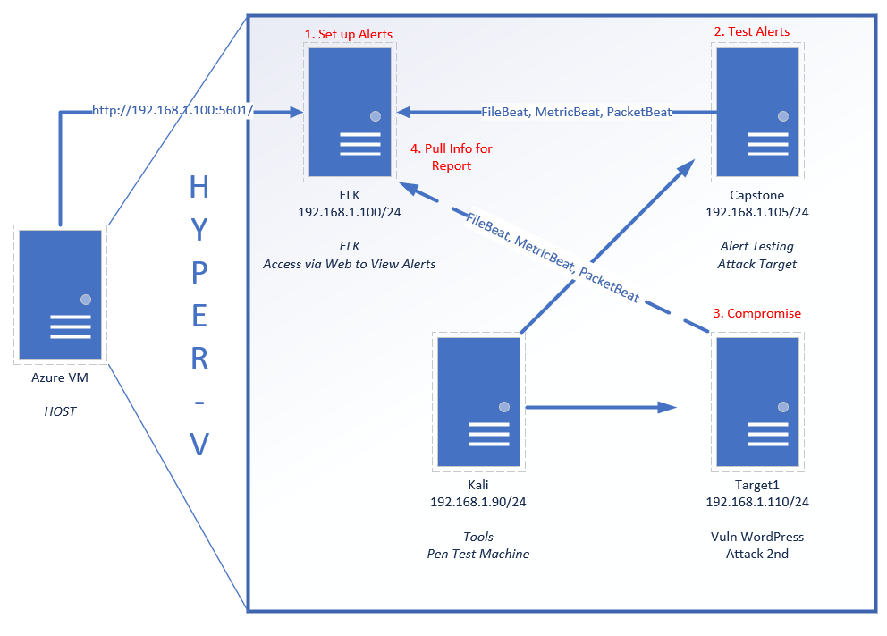

## Student Guide: Final Project Week

### Overview

You are working as a Security Engineer for X-CORP, supporting the SOC infrastructure. The SOC Analysts have noticed some discrepancies with alerting in the Kibana system and the manager has asked the Security Engineering team to investigate. 

You will start by confirming that newly created kibana alerts are working, after which you will monitor live traffic on the wire to detect any abnormalities that aren't reflected in the alerting system. 

You are to report back all your findings to both the SOC manager and the Engineering Manager with appropriate analysis.

### Instructions

This week, you will work on your final project by completing the following tasks individually:

- **Defensive Security**: Implement the alerts and thresholds you determined would be effective in Project 2.

- **Offensive Security**: Assess a vulnerable VM and verify that the kibana rules work as expected.

- **Network Forensics**: Use Wireshark to analyze live malicious traffic on the wire.

- **Group Presentation**: Once the alerting, attacking and forensics portions are complete, you will work in groups of three to six to develop presentations for the final day of class. 

In addition to the above, you will be assigned to a group by your instructor on Day 1. While you will complete each step of the project on your own, you will choose one of the following report templates to fill out together:
- [Defensive Report Template](Resources/DefensiveTemplate.md)
- [Offensive Report Template](Resources/OffensiveTemplate.md)
- [Network Report Template](Resources/NetworkTemplate.md)

You will fill out only _one_ of these templates. Your presentation will be based on the template that you choose.

### Lab Environment 

This week's lab environment is an Azure Classroom Lab containing a modified version of the Project 2 network. In particular, it includes the following machines:

- **Capstone** (`192.168.1.105`): Filebeat and Metricbeat are installed and will forward logs to the ELK machine. 
   - Please note that this VM is in the network solely for the purpose of testing alerts.

- **ELK** (`192.168.1.100`): The same ELK setup that you created in Project 1. It holds the Kibana dashboards.

- **Kali** (`192.168.1.90`): A standard Kali Linux machine for use in the penetration test on Day 1. 
   - Credentials are `root`:`toor`.

- **Target 1** (`192.168.1.110`): Exposes a vulnerable WordPress server.

- **Target 2** Should be ignored until you have completed all other parts of the project. If you have completed the project and would like to integrate Target 2 into your presentation, ask your teacher for the Target 2 instructions. 

This is a diagram of the network:

### Demo Day Interview Questions

As in previous projects, you will have an opportunity to use this week's experience to prepare responses to a set of domain-specific interview questions.

Your responses to these questions will _not_ be graded. Instead, you are expected to use their answers to bolster the presentations that you deliver on Demo Day, following graduation. 

Because you will need the entirety of class to complete the project, you should expect to work on these questions only after completing project work.

The questions themselves are located in [Activities/Day-3/Interview-Questions/README.md](Activities/Day-3/Interview-Questions/README.md). 

### Task Breakdown

The following breakdown describes the tasks you will be assigned and a recommended timeline for achieving each milestone. 

#### Day 1: Target 1

After your instructor reviews the project overview and demonstrates how to use `wpscan` to assess a WordPress target, you will configure alerts in Kibana and test them by repeating attacks against the Capstone VM. Then you will begin your assessment of the first vulnerable VM: Target 1.

- [Activity File: Attacking Targets 1 and 2](Activities/Day-1-and-2/Unsolved/ReadMe.md)

#### Day 2: Target 1

On Day 1, you will complete an assessment of Target 1. Those of you who complete this task may move on to the Wireshark analysis.

- [Activity File: Attacking Targets 1 and 2](Activities/Day-1-and-2/Unsolved/ReadMe.md)

#### Day 3: Analysis

After assessing the Target 1, you will use the Kali VM to capture and analyze traffic on the virtual network with Wireshark. You will analyze the traffic to explain what users are doing on the network. After analyzing Wireshark traffic, you will spend the remainder of class completing summaries of your work. 

If all of the above is complete, you may complete an assessment of Target 2 and add the results to your presentation. Instructions are available from your instructor once you complete the project.

- [Activity File: Wireshark Strikes Back](Activities/Day-3/Unsolved/ReadMe.md)

#### Day 4: Presentations

You will work in groups, complete the deliverables of the project, and present your findings to the class in short presentations. 

- [Activity File: Final Group Presentations](Activities/Day-4/Group-Presentations.md)

### Report and Presentation Templates

To complete the project, you will need to fill out the reports and slide decks linked below. The templates are on Google Drive (you must make a copy of each).   

- **Reports:** The Defensive Report and the Offensive Report relates to the Days 1 and 2, and the Network Report relates to Day 3. You can complete these as you work through the activites, outside of class, or on Day 3, during the time reserved for completing the project deliverables. The reports must be completed individually.

    - [Offensive Report Template](https://docs.google.com/document/d/1QBlLFY5yHU1oGn_zxxJWUBuR1BqEGHShx6R9Leyj670/edit#)
     - [Defensive Report Template](https://docs.google.com/document/d/1-BqgAVle0B1ZIBcAtyle2Qi-19-uodmEE96zUKvFzhw/edit)
   - [Network Report Template](https://docs.google.com/document/d/109JqFQrFcftu1AdSqoecA7CU45q4aKsEQb1FN7AbfS0/edit#)

- **Presentations:** On Day 3, you will work in groups of three to six to complete the three slide decks below, and present them as a group: 

   - [Offensive Presentation Template](https://docs.google.com/presentation/d/19ouk_AS16V-f1KiJ3FTnNpJ4SJn1QQG3vkKukEN1NvU/edit#slide=id.g630a814dc5_0_53)
   - [Defensive Presentation Template](https://docs.google.com/presentation/d/1LP9TBdUYlWut3Qu4Czf618i-kg_qjjxkbnWLNTSdJBk/edit#slide=id.g630a814dc5_0_53)
   - [Network Presentation Template](https://docs.google.com/presentation/d/1LLh9dyrXNkWLqcsOnu5C_LOFDm_1EuKSf7y-Z7DwXn8/edit#slide=id.g630a814dc5_0_53)

### 04. (Optional) Student Do: Domain-Specific Interview Questions

As emphasized in the previous project, the ability to communicate the achievements of this project and relate them to different domains is a valuable skill to have when networking and interviewing. 

You will once again have the option to respond to interview questions and relate the specific work they did to areas and domains of interest. 

**Please note** that, as the entirety of your time today will be dedicated to presentations, you should answer these questions only _after_ completing the project class. 

Your responses will not be graded as homework, but they will use them to bolster their Demo Day presentations after graduation.

In this optional activity, you will choose a domain that you are interested in pursuing as a career. For this project, you will choose from the following domains:
- Network Security
- Logging & Monitoring
- Offensive Security
- Defensive Security: Incident Response Phases I & II

If you are unsure of which domain you would like to focus on, that's ok! You can either choose the one that you are the most comfortable discussing, or you can also complete the tasks in two or three domains.
 
For each domain, you will be provided a set of interview questions.  For each question, you will be prompted to think about specific aspects or tasks you completed in Project 3 that you can use to answer the question.
​
Refer to the following activity file for the questions themselves:
- [Activity File: Project 3 Extension Questions](Activities/Day-3/Interview-Questions/README.md)

---

© 2020 Trilogy Education Services, a 2U, Inc. brand. All Rights Reserved.  
