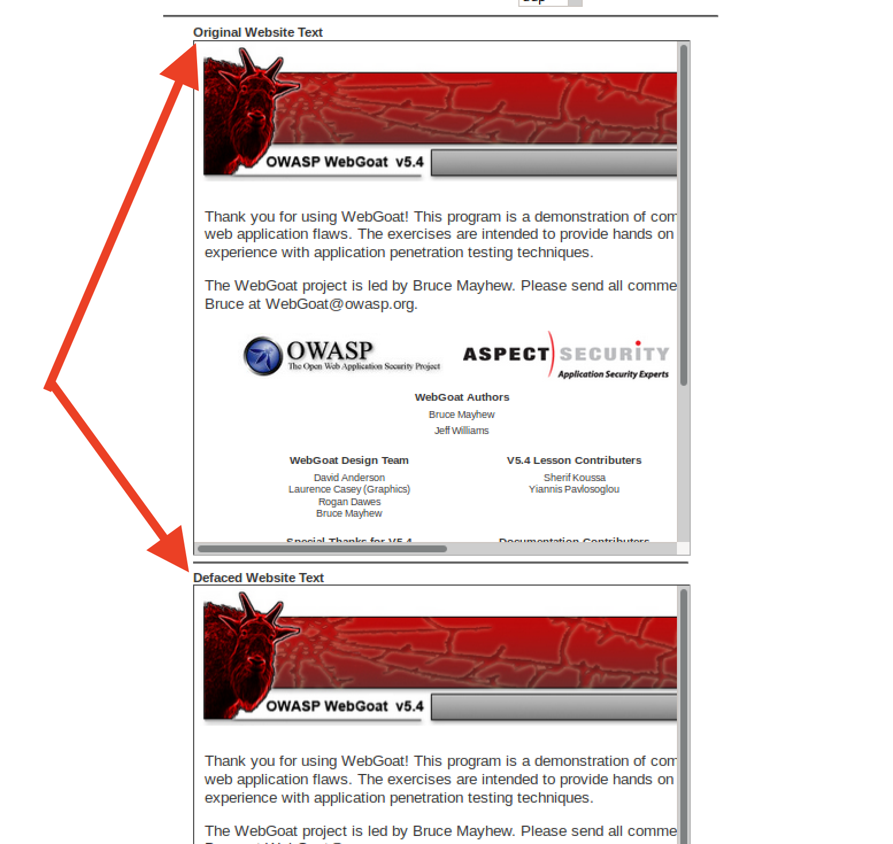
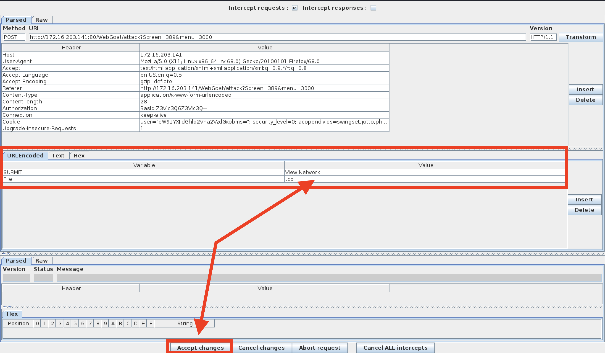
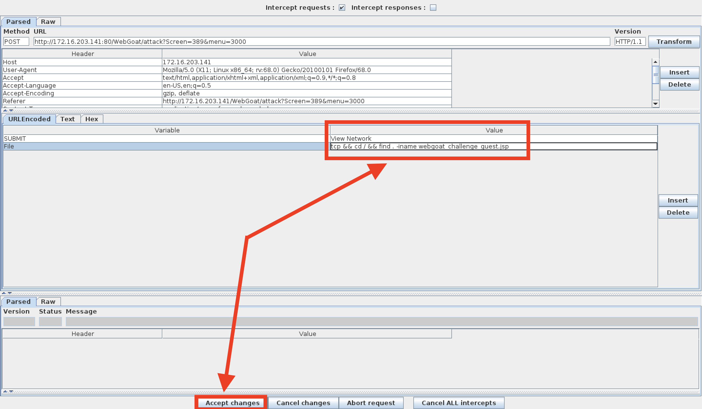

## Unit 15 Homework: Web Vulnerabilities and Hardening

### Overview

This week, you continued your journey towards enhancing your technical acuity through a deeper understanding of web vulnerabilities and system hardening used to help protect and defend critical web infrastructure.

- The homework is divided into two parts:

   - Part 1: Conceptual based Q&A.
   - Part 2: Technical activity called The Challenge.

- This homework is a condensed review of what you've learned in this unit. Points to consider:

   - It's critical to have a clear understanding of the concepts taught throughout this course. 
   
   - It's also important that you to have a clear understanding of "INFOSEC" terminology when interacting with other Cybersecurity professionals. Not only does this make you look professional, it also helps avoid miscommunication.
   

Some of the highlights of the things that you've learned include:

- An deep understanding of the underlying mechanics behind how web attacks are constructed from both a conceptual and practical standpoint.

- The ability to determine which mitigation strategies are most effective against various forms of web vulnerabilities.

- An understanding of how the principles of `offense informs defense` are utilized to inform security decisions by performing attacks and exploiting various web vulnerabilities from OWASP's Top 10.

The Unit 15 Homework revisits topics covered throughout the lesson. It's recommended that you re-visit the student guide and practice the activities again to strengthen your grasp on the concepts taught during the unit.

For submission, create a a file containing the answers to the questions.

### Part 1: Q&A

#### The URL Cruise Missile

The URL is the gateway to the web, providing the user with unrestricted access to all available online resources. In the wrong hands can be used as a weapon to launch attacks.

Use the graphic below to answer the following questions:

| Protocol         | Host Name                 | Path                   | Parameters               |
| ---------------- | :-----------------------: | ---------------------- | ------------------------ |
| **http://**      | **`www.buyitnow.tv`**     | **/add.asp**           | **?item=price#1999**     |

1. Which part of the URL can be manipulated by an attacker to exploit a vulnerable back-end database system? 

2. Which part of the URL can be manipulated by an attacker to cause a vulnerable web server to dump the `/etc/passwd` file? Also, name the attack used to exploit this vulnerability.

   
3. Name three threat agents that can pose a risk to your organization.

4. What kinds of sources can act as an attack vector for injection attacks?

5. Injection attacks exploit which part of the CIA triad?

6. Which two mitigation methods can be used to thwart injection attacks?

____

#### Web Server Infrastructure

Web application infrastructure includes  sub-components and external applications that provide  efficiency, scalability, reliability, robustness, and most critically, security.

- The same advancements made in web applications that provide users these conveniences are the same components that criminal hackers use to exploit them. Prudent security administrators need to be aware of how to harden such systems.

Use the graphic below to answer the following questions:

| Stage 1        | Stage 2             | Stage 3                 | Stage 4              | Stage 5          |
| :------------: | :-----------------: | :---------------------: | :------------------: | :--------------: |
| **Client**     | **Firewall**        | **Web Server**          | **Web Application**  | **Database**     |
   
   
1. What stage is the most inner part of the web architecture where data such as, customer names, addresses, account numbers, and credit card info, is stored?

2. Which stage includes online forms, word processors, shopping carts, video and photo editing, spreadsheets, file scanning, file conversion, and email programs such as Gmail, Yahoo and AOL.

3. What stage is the component that stores files (e.g. HTML documents, images, CSS stylesheets, and JavaScript files) that's connected to the Internet and provides support for physical data interactions between other devices connected to the web?

4. What stage is where the end user interacts with the World Wide Web through the use of a web browser?

5. Which stage is designed to prevent unauthorized access to and from protected web server resources?

----

#### Server Side Attacks

In today’s globally connected cyber community, network and OS level attacks are well defended through the proper deployment of technical security controls such as, firewalls, IDS, Data Loss Prevention, EndPoint and security. However, web servers are accessible from anywhere on the web, making them vulnerable to attack.

1. What is the process called that cleans and scrubs user input in order to prevent it from exploiting security holes by proactively modifying user input.

2. Name the process that tests user and application-supplied input. The process is designed to prevent malformed data from entering a data information system by verifying user input meets a specific set of criteria (i.e. a string that does not contain standalone single quotation marks).

3. **Secure SDLC** is the process of ensuring security is built into web applications throughout the entire software development life cycle. Name three reasons why organization might fail at producing secure web applications.

4. How might an attacker exploit the `robots.txt` file on a web server?

5. What steps can an organization take to obscure or obfuscate their contact information on domain registry web sites?

   
6. True or False: As a network defender, `Client-Side` validation is preferred over `Server-Side` validation because it's easier to defend against attacks.

   - Explain why you chose the answer that you did.

____

#### Web Application Firewalls

WAFs are designed to defend against different types of HTTP attacks and various query types such as SQLi and XSS.

WAFs are typically present on web sites that use strict transport security mechanisms such as online banking or e-commerce websites.

1. Which layer of the OSI model do WAFs operate at?

2. A WAF helps protect web applications by filtering and monitoring what?

3. True or False: A WAF based on the negative security model (Blacklisting) protects against known attacks, and a WAF based on the positive security model (Whitelisting) allows pre-approved traffic to pass.

____

#### Authentication and Access Controls

Security enhancements designed to require users to present two or more pieces of evidence or credentials when logging into an account is called multi-factor authentication.

- Legislation and regulations such as The Payment Card Industry (PCI) Data Security Standard requires the use of MFAs for all network access to a Card Data Environment (CDE).

- Security administrators should have a comprehensive understanding of the basic underlying principles of how MFA works.

1. Define all four factors of multifactor authentication and give examples of each:

   - Factor 1

   
   - Factor 2
   
   
   - Factor 3

   
   - Factor 4

   
2. True or False: A password and pin is an example of 2-factor authentication.

   
3. True or False: A password and `google authenticator app` is an example of 2-factor authentication.

   
4. What is a constrained user interface? 

----
____

### Part 2: The Challenge 

In this activity, you will assume the role of a pen tester hired by a bank to test the security of the bank’s authentication scheme, sensitive financial data, and website interface.

#### Lab Environment   

We'll use the **Web Vulns** lab environment. To access it: 
  - Log in to the Azure Classroom Labs dashboard. 
  - Find the card with the title **Web Vulns** or **Web Vulnerability and Hardening**.
  - Click the monitor icon in the bottom-right. 
  - Select **Connect with RDP**.
  - Use Credentials (azadmin:p4ssw0rd*)

- The lab should already be started, so you should be able to connect immediately. 

- Refer to the [lab setup instructions](https://cyberxsecurity.gitlab.io/documentation/using-classroom-labs/post/2019-01-09-first-access/) for details on setting up the RDP connection.

Once the lab environment is running, open the HyperV manager and make sure that the OWASPBWA and Kali box is running.

- Then, login to the Kali VM and navigate to the IP address of the OWASPBWA machine.

- Click the option for 'WebGoat' and start the WebGoat app.

- Use the credentials: `guest`:`guest`

On the bottom of the left side of the screen, click on `Challenge` and then choose `The Challenge`.

**Note:** A common issue with this lab is the Challange activity failing to start successfully. Hit the `Restart the Lesson` button in the top right if you get an error starting the activity.

### The Challenge Instructions

#### Challenge #1

Your first mission is to break the authentication scheme. There are a number of ways to accomplish this task.

- **Hint #1**: Sometimes, form fields are shy!

- **Hint #2**: Find the hidden JavaScript.

- **Hint #3**: You can appened `source?source=true` to the URL to read the source code. 

Please include a screenshot here of the hidden JavaScript:

After completing the first challenge, you will be provided with an option to continue to the next challenge.

#### Challenge #2

Next, steal all of the credit card numbers from the database. 

- **Hint #1**: Sometimes cookies wear different clothes to change their appearances.

- **Hint #2**: Break your way into the conversation and inject your own ideas.

Please include a screenshot here of all the credit card numbers from the database. 

After completing the second challenge, you will be provided with an option to continue to the next challenge.

#### Challenge #3

Your final act is to deface the website using command injection. Follow the walkthrough below to help you get started. 

- After completing the second challenge, you will be provided with an option to continue to the next challenge.

   

- There should be two webpages at the bottom of the window. The one on top is the original, and the one on the bottom is the defaced webpage.

   

- Start Foxy Proxy (WebScarab) to send all GET/POST requests from Firefox to the WebScarab proxy intercept.

   

- Click **TCP** and then the **View Network** button and send the request to WebScarab.

   

- The WebScarab window will open. 

   - In the **URL Encoded** tab, find the **File** and **Value** form fields. 
   - This is where you will perform your command injection.
   
    

- Next, perform a test and see if this shell is vulnerable to command injection. 

   - Type the following command into the Value field: `tcp && whoami && pwd`.
   
       - **Note:** Windows users can type `tcp && dir`. `dir` will return the directory as proof of vulnerability.
   
   - Click **Accept Changes**.
   
     
   
   - On the next window, click **Accept Changes** twice.
   
     
 
- Scroll to the bottom of the **Current Network Status** window and observe the results for both of the `whoami` and `pwd` commands.

    

   - The results show that we are the root user and our current working directory is `/var/lib/tomcat6`.

   - This verifies the vulnerability, so proceed to the next step.

- Next, we'll locate the `webgoat_challenge_guest.jsp` file. 

   - Type the following command: `tcp && cd / && find . -iname webgoat_challenge_guest.jsp`.
   
      - **Note**: Windows users will need to type: `tcp && dir /s 'webgoat_challenge_guest.jsp'`
   
   
   
   - The absolute path is: `./owaspbwa/owaspbwa-svn/var/lib/tomcat6/webapps/WebGoat/webgoat_challenge_guest.jsp`.
   
   
   
   - Remember, our present working directory is `/var/lib/tomcat6`. Therefore, the relative path is `webapps/WebGoat/webgoat_challenge_guest.jsp`.
   
**Now it's your turn**   

- Now that we know where the webpage is, your task will be to deface the website. Keep in mind the following:
  * Use **WebScarab** to perform command injection.
  * When performing command injection, you will need to select a field that WebScarab can return commands to. These fields are typically located in a drop down. 
  * You will also need to locate and edit the the webpage's source code: `webgoat_challenge_guest.jsp`
  * Your final command will:
    * Change to the location of the `webgoat_challenge_guest.jsp` file.
    * **and** echo `You've been hacked by...` followed by your name, to the `webgoat_challenge_guest.jsp` file.

---
© 2020 Trilogy Education Services, a 2U, Inc. brand. All Rights Reserved.  
