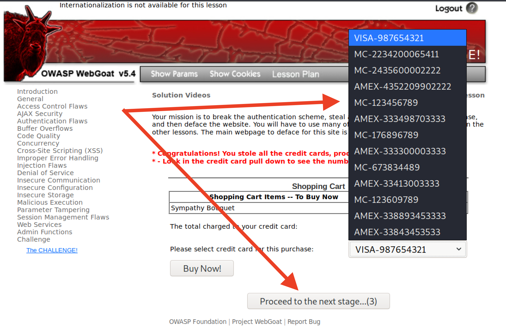
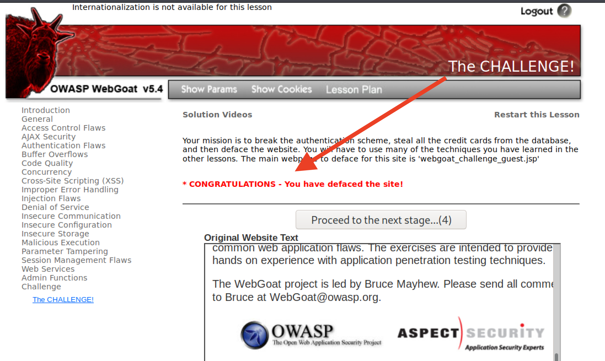
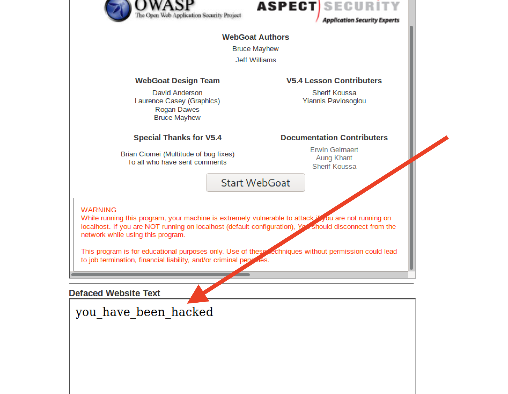

## Unit 15 Homework Solution Guide: Web Vulnerabilities and Hardening

### Part 1: Q&A

#### The URL Cruise Missile

The URL is the gateway to the web, providing the user with unrestricted access to all available online resources. In the wrong hands can be used as a weapon to launch attacks.

Use the graphic below to answer the following questions:

| Protocol         | Host Name                 | Path                   | Parameters               |
| ---------------- | :-----------------------: | ---------------------- | ------------------------ |
| **http://**      | **`www.buyitnow.tv`**     | **/add.asp**           | **?item=price#1999**     |

1. Which part of the URL can be manipulated by an attacker to exploit a vulnerable back-end database system? 

    - **Solution**: Parameters

2. Which part of the URL can be manipulated by an attacker to cause a vulnerable web server to dump the `/etc/passwd` file? Also, name the attack used to exploit this vulnerability.

    - **Solution**: Path. The attack is referred to as Path or Directory Traversal.
   
3. Name three threat agents that can pose a risk to your organization.

    - **Solution**: An individual, group, organization, or government that exploits or intends to exploit a vulnerability.

4. What kinds of sources can act as an attack vector for injection attacks?

    - **Solution**: If it has the capability, any source can act as an attack vector.

5. Injection attacks exploit which part of the CIA triad?

    - **Solution**: Confidentiality

6. Which two mitigation methods can be used to thwart injection attacks?

    - **Solution**: Input Sanitation/Validation
____

#### Web Server Infrastructure

Web application infrastructure includes  sub-components and external applications that provide  efficiency, scalability, reliability, robustness, and most critically, security.

- The same advancements made in web applications that provide users these conveniences are the same components that criminal hackers use to exploit them. Prudent security administrators need to be aware of how to harden such systems.

Use the graphic below to answer the following questions:

| Stage 1        | Stage 2             | Stage 3                 | Stage 4              | Stage 5          |
| :------------: | :-----------------: | :---------------------: | :------------------: | :--------------: |
| **Client**     | **Firewall**        | **Web Server**          | **Web Application**  | **Database**     |
   
   
1. What stage is the most inner part of the web architecture where data such as, customer names, addresses, account numbers, and credit card info, is stored?

    - **Solution**: Stage 5

2. Which stage includes online forms, word processors, shopping carts, video and photo editing, spreadsheets, file scanning, file conversion, and email programs such as Gmail, Yahoo and AOL.

    - **Solution**: Stage 4

3. What stage is the component that stores files (e.g. HTML documents, images, CSS stylesheets, and JavaScript files) that's connected to the Internet and provides support for physical data interactions between other devices connected to the web?

    - **Solution**: Stage 3

4. What stage is where the end user interacts with the World Wide Web through the use of a web browser?

    - **Solution**: Stage 1

5. Which stage is designed to prevent unauthorized access to and from protected web server resources?

    - **Solution**: Stage 2

----

#### Server Side Attacks

In today’s globally connected cyber community, network and OS level attacks are well defended through the proper deployment of technical security controls such as, firewalls, IDS, Data Loss Prevention, EndPoint and security. However, web servers are accessible from anywhere on the web, making them vulnerable to attack.

1. What is the process called that cleans and scrubs user input in order to prevent it from exploiting security holes by proactively modifying user input.

    - **Solution**: Input Sanitation

2. Name the process that tests user and application-supplied input. The process is designed to prevent malformed data from entering a data information system by verifying user input meets a specific set of criteria (i.e. a string that does not contain standalone single quotation marks).

    - **Solution**: Input Validation

3. **Secure SDLC** is the process of ensuring security is built into web applications throughout the entire software development life cycle. Name three reasons why organization might fail at producing secure web applications.

    - **Solution**: Any of the following. 

        Implementation costs are high.

        Insufficient support from upper management.

        Insufficient standardization within organization.

        Poor or no quality management.

        Reactive security posture (If it ain’t broke don’t fix it mentality).

       Reliance upon a false sense of security that Web Application Firewalls provide absolute protection.

4. How might an attacker exploit the `robots.txt` file on a web server?

    - **Solution**: The robots.txt file contains sensitive web server information such as a list of files and web server directories that web site owners keep hidden from web crawlers. Experienced criminal hackers will attempt to harvest the robots.txt file using the URL and try to retrieve private data such as content management system information and the root directory structure.

5. What steps can an organization take to obscure or obfuscate their contact information on domain registry web sites?

    - **Solution**: Through the use of a proxy service or private domain registration.
   
6. True or False: As a network defender, `Client-Side` validation is preferred over `Server-Side` validation because it's easier to defend against attacks.

    - **Solution**: False. Client-side validation can be bypassed more easily than server-side validation because access controls are only effective on the server-side, where attackers cannot modify access control checks and metadata.

____

#### Web Application Firewalls

WAFs are designed to defend against different types of HTTP attacks and various query types such as SQLi and XSS.

WAFs are typically present on web sites that use strict transport security mechanisms such as online banking or e-commerce websites.

1. Which layer of the OSI model do WAFs operate at?

    - **Solution**: Layer 7: Application Layer

2. A WAF helps protect web applications by filtering and monitoring what?

    - **Solution**: HTTP traffic between web applications and the Internet

3. True or False: A WAF based on the negative security model (Blacklisting) protects against known attacks, and a WAF based on the positive security model (Whitelisting) allows pre-approved traffic to pass.

    - **Solution**: True
____

#### Authentication and Access Controls

Security enhancements designed to require users to present two or more pieces of evidence or credentials when logging into an account is called multi-factor authentication.

- Legislation and regulations such as The Payment Card Industry (PCI) Data Security Standard requires the use of MFAs for all network access to a Card Data Environment (CDE).

- Security administrators should have a comprehensive understanding of the basic underlying principles of how MFA works.

1. Define all four factors of multifactor authentication and give examples of each:
    
   - Factor 1: Standard login inputs (Password, Pin, Cognitive Questions)
   - Factor 2: Physical keys (Smartcard, Hard Token)
   - Factor 3: Biometrics (Iris / Retina scan, Hand Geometry)
   - Factor 4: Location (GPS detection, callback to a home phone number)

   
2. True or False: A password and pin is an example of 2-factor authentication.

    - **Solution**: False
   
3. True or False: A password and `google authenticator app` is an example of 2-factor authentication.

    - **Solution**: True
   
4. What is a constrained user interface? 

    - **Solution**: A constrained user interface restricts what users can see or do based on their privileges such as grayed-out or missing menu items, interface changes, and activity-based controls.

____

### Part 2: The Challenge 

In this activity, you will assume the role of a pen tester hired by a bank to test the security of the bank’s authentication scheme, sensitive financial data, and website interface.

#### Lab Environment   

We'll use the **Web Vulns** lab environment. To access it: 
  - Log in to the Azure Classroom Labs dashboard. 
  - Find the card with the title **Web Vulns** or **Web Vulnerability and Hardening**.
  - Click the monitor icon in the bottom-right. 
  - Select **Connect with RDP**.
  - Use Credentials (azadmin:p4ssw0rd*)

- The lab should already be started, so you should be able to connect immediately. 

- Refer to the [lab setup instructions](https://cyberxsecurity.gitlab.io/documentation/using-classroom-labs/post/2019-01-09-first-access/) for details on setting up the RDP connection.

Once the lab environment is running, open the HyperV manager and make sure that the OWASPBWA and Kali box is running.

- Then, login to the Kali VM and navigate to the IP address of the OWASPBWA machine.

- Click the option for 'WebGoat' and start the WebGoat app.

On the bottom of the left side of the screen, click on `Challenge` and then choose `The Challenge`.

### Challenge #1

- Your first mission is to break the authentication scheme. There are a number of ways to accomplish this task.

#### Method 1:

`http://172.16.203.141/WebGoat/source?source=true`

- Notice that we added the `source?source=true`, which reveals the underlying JavaScript code for this web page.

- The `username/password` appears within this code starting on line 121.

- Username: `youaretheweakestlink`, password: `goodbye`

#### Method #2

- At the top of the browser, click on `Hack this Form` (The Dolphin Icon).

- You will notice a previously hidden box reveal itself at the bottom that contains the `username` of **youaretheweakestlink**.

- Use this `username` to brute-force the password field with `John the Ripper`, `Hydra`, etc... 

### Challenge #2

Steal all of the credit card numbers from the database. 

**Solution**: 

 - Start **Tamper Data** and click the "Buy now!" button to intercept the `request`.

    - After completing the first challenge, you will be provided with an option to continue to the next challenge.

- Start **Tamper Data** and click the "Buy now!" button to intercept the `request`.

  - Click `OK` in the `Tamper Data` Request box.

- In the next Tamper Data window, scroll down to the "Authorization" box: Copy the user value from the cookie section. (Everything in-between the double quotes)

- Decode the `user` value using CyberChef's base64 decoder.

- The decoded value will be `yourtheweakestlink`.

- Next, we'll perform an injection attack using the original decoded user value.

- Encode the following: `yourtheweakestlink' OR '1'='1` using CyberChefs base64 encoder.

- Return to `Tamper Data` and paste the newly injected encoded value into the user cookie value field. (in-between the double quotes).

- Forward the request in Tamper Data to the server.

- Return to the page and click on the "Drop Down" menu. You will notice that all credit card numbers are now revealed.

#### Challenge #3

Your third and final mission is no easy feat. Your final act is to deface the website. This requires multiple skill sets, all of which you’ve learned and will need for this final act.

Two clues:

1. You will need to use command injection.

2. You will need to locate the `webgoat_challenge_guest.jsp` file and inject it with code in order to deface the website.

**Solution**:

- After completing the second challenge, you will be provided with an option to continue to the next challenge.

    

- At the bottom of the window, you will notice two web pages, the original on top and the defaced one on the bottom. 

    

- Open the WebScarab app in Kali Linux. 

   - Click on the Proxy tab in the WebScarab window and check the box for `Intercept Requests`.

- Start `FoxyProxy (Scab)` to send all GET/POST requests from Firefox to the Webscarab proxy intercept.

    

- Click `TCP`, then click the View Network button and send the request to Webscarab.

    

- The WebScarab window will pop open. 

   - In the `URL Encoded` tab, find the `File` then `Value` form field. 
   - This is where you will perform your command injection.
   
     

- Next, perform a test and see if this shell is vulnerable to command injection. 

   - Type the following command into the form `value` field: 
   
      `tcp && whoami && pwd`.
   
   - **Note:** Windows users can type `tcp && dir`. `dir` will return the directory as proof of vulnerability.
   
   - Click `Accept Changes`.
   
    
   
   - On the next window, click `Accept Changes` twice.
   
     

- Scroll to the bottom of the `Current Network Status` window and observe the results for both of the `whoami` and `pwd` commands.

    

   - We can see the results show that we are the root user and our present working directory is `/var/lib/tomcat6`.

   - Vulnerability verified. 

- Now we need to locate the `webgoat_challenge_guest.jsp` file. 

   - Run: `tcp && cd / && find . -iname webgoat_challenge_guest.jsp`.
   
   - **Note:** Windows users, type: `tcp && dir /s 'webgoat_challenge_guest.jsp'`
   
      
   
   - The absolute path is `./owaspbwa/owaspbwa-svn/var/lib/tomcat6/webapps/WebGoat/webgoat_challenge_guest.jsp`.
   
     
   
   - Since the present working directory is `/var/lib/tomcat6`, the relative path is `webapps/WebGoat/webgoat_challenge_guest.jsp`.  

- Now that we know where the webpage is located, let's inject some text and deface it.

   - Click TCP and then click the "View Network" button to send the request to Webscarab.
   
   - Modify the **File Value Field** with the following command injection:
   
      - `tcp && cd webapps/WebGoat && echo you_have_been_hacked > webgoat_challenge_guest.jsp`
      
      - Then click `Accept Changes` in Webscarab.
      
       
      
      - On the next window, click `Accept Changes` two more times.
       
       

- You should get a message that says, `* Congratulations - You have defaced the website!`.

  

- Scroll to the bottom to observe the defaced webpage.

  

---

© 2020 Trilogy Education Services, a 2U, Inc. brand. All Rights Reserved.  

